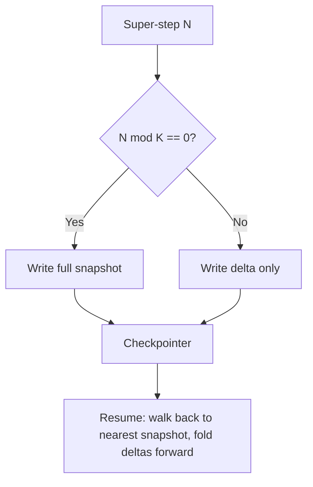

# Delta Channels: Bounded Checkpoint Storage for Append-Only Agent State

> A checkpoint primitive that stores only the per-step diff of append-only agent state and writes a full snapshot every K steps — so long-session storage stays O(N) instead of O(N²) and resume latency is bounded by K.

## The O(N²) Checkpoint Problem

Long-running agent runtimes write a checkpoint at every super-step so any worker can resume the run from any point. Under the default model, each checkpoint serialises the **full** value of every state field. Fields like `messages` and `files` are append-only accumulators — they only grow. At step N the runtime writes everything from steps 1 through N, so total bytes across the session sum to roughly N²/2. For a Deep Agents coding session running 200 turns this hits 5.3 GB; a lighter workload still hits ~4 GB at 500 turns ([Runkle, LangChain, 2026-05-12](https://blog.langchain.com/delta-channels-evolving-agent-runtime/)).

The cost shows up in three places: serialisation time per step, write amplification on the checkpointer, and redundant storage retained for the lifetime of the thread.

This is a **server-side storage** concern, not a streaming concern. Resumable streaming to subscribers is a different primitive — `Last-Event-ID` reconnect on SSE — and is covered in [Deep Agent Runtime](deep-agent-runtime.md) §Streaming Primitives.

## The Pattern

Split the checkpoint write into two cases per state field:

- **Delta step** — serialise only the writes added that step. Tiny payload, linear cumulative cost.
- **Snapshot step** — every `snapshot_frequency=K` steps, serialise the full accumulated value. Bounds the work needed to reconstruct state on resume.

Resume walks back to the nearest snapshot and folds the deltas forward. At most K deltas are replayed, so reconstruction time is bounded regardless of session length ([Runkle, LangChain, 2026-05-12](https://blog.langchain.com/delta-channels-evolving-agent-runtime/)).



## Mechanism

The growth maths is the point. With per-step deltas of size d and snapshots of size proportional to N at step N, total bytes are O(N) for deltas plus O(N²/K) for snapshots. The delta term dominates at practical session lengths; the snapshot term scales with 1/K of the baseline coefficient. LangChain reports a 41× reduction at 200 turns on a multi-file coding workload (5.3 GB → 129 MB), with the ratio still climbing toward a `snapshot_frequency`-bounded ceiling ([Runkle, LangChain, 2026-05-12](https://blog.langchain.com/delta-channels-evolving-agent-runtime/)).

The pattern is not new — Fowler's event-sourcing model already specifies "a system in use during a working day could be started... from an overnight snapshot... [and] replays the events from the overnight store" ([Fowler, EventSourcing](https://martinfowler.com/eaaDev/EventSourcing.html)). The agent-runtime adaptation is applying it to graph-state channels keyed by a reducer that folds deltas into the prior state.

## The Reducer Contract

The new correctness obligation is **batching-invariance** on the reducer that folds deltas into state. The reducer signature changes from `(state, update) -> state` to `(state, list[writes]) -> state`, and must satisfy:

```python
reducer(reducer(state, [w1, w2]), [w3, w4]) == reducer(state, [w1, w2, w3, w4])
```

This is the algebraic property monoid-based incremental computation relies on. If a custom reducer violates it, state reconstructed from a snapshot plus replayed deltas will diverge from a full-snapshot baseline — silently, and only on sessions that span a snapshot boundary ([Runkle, LangChain, 2026-05-12](https://blog.langchain.com/delta-channels-evolving-agent-runtime/)).

For the defaults shipped by LangGraph (`messages`, `files`) the reducer is just list concatenation, which is trivially batching-invariant. Custom delta-backed fields need property-based tests that fuzz batch boundaries before relying on the optimisation.

## When This Backfires

The pattern adds correctness obligations and replay logic. Stay with full-snapshot checkpointing when:

- **Short or medium sessions** — under ~50 turns with small per-turn state, full-snapshot storage is small in absolute terms and the savings ratio is modest (6× at 10 turns on the lighter LangChain workload) ([Runkle, LangChain, 2026-05-12](https://blog.langchain.com/delta-channels-evolving-agent-runtime/)).
- **Custom reducers on domain state fields** — batching-invariance must hold; teams without property-based test coverage on the reducer are trading storage for a silent-corruption risk.
- **Point-in-time audit requirements** — auditors who need every checkpoint to be a self-describing artifact (readable without delta replay) must keep `snapshot_frequency` low — closer to 1 — which erodes the savings.
- **Non-LangGraph runtimes** — `DeltaChannel` is a LangGraph 1.2 primitive ([LangGraph Persistence docs](https://docs.langchain.com/oss/python/langgraph/persistence)). Temporal, Cursor Cloud Agents, and Anthropic Managed Agents need to translate the delta-plus-snapshot pattern, not the API.

## Example

In `langgraph 1.2`, `DeltaChannel` is wired through a `TypedDict` annotation. Both `messages` and `files` are delta-backed by default in `deepagents v0.6` ([Runkle, LangChain, 2026-05-12](https://blog.langchain.com/delta-channels-evolving-agent-runtime/)).

```python
from typing_extensions import Annotated, TypedDict
from langgraph.channels.delta import DeltaChannel

def append(state: list[str], writes: list[list[str]]) -> list[str]:
    return state + [item for batch in writes for item in batch]

class MyAgentState(TypedDict):
    items: Annotated[
        list[str],
        DeltaChannel(reducer=append, snapshot_frequency=50),
    ]
```

`append` flattens all batched writes in one call; its result is the same regardless of how callers chunk the writes, satisfying batching-invariance. `snapshot_frequency=50` matches the Deep Agents default — full snapshot every 50 super-steps, deltas in between. Existing pre-delta threads continue to work: when `DeltaChannel.from_checkpoint` encounters a plain state value, it uses it as the base state for subsequent deltas, so no data migration is required ([Runkle, LangChain, 2026-05-12](https://blog.langchain.com/delta-channels-evolving-agent-runtime/)).

## Key Takeaways

- Append-only agent state (messages, files) under full-snapshot checkpointing grows at O(N²); long-session checkpoint storage becomes the binding cost before any other runtime limit ([Runkle, LangChain, 2026-05-12](https://blog.langchain.com/delta-channels-evolving-agent-runtime/)).
- Delta-plus-periodic-snapshot drops storage to O(N) plus O(N²/K) and bounds resume latency by K — the same shape Fowler's event-sourcing has used for decades, adapted to graph-state channels ([Fowler, EventSourcing](https://martinfowler.com/eaaDev/EventSourcing.html)).
- The new correctness obligation is batching-invariance on the reducer: `reducer(reducer(s, xs), ys) == reducer(s, xs + ys)`. Violations corrupt state silently across snapshot boundaries.
- This is a server-side storage primitive — not the same thing as resumable streaming to consumers, which is the `Last-Event-ID` SSE-reconnect concern covered in [Deep Agent Runtime](deep-agent-runtime.md).
- The trade-off is real for short sessions and custom reducers; default `messages`/`files` channels in `deepagents v0.6` are safe out of the box.

## Related

- [Deep Agent Runtime](deep-agent-runtime.md) — the runtime layer this primitive sits inside; covers SSE reconnect and durable runs
- [Long-Running Agents](long-running-agents.md) — operational shape that makes O(N²) checkpoint growth a binding constraint
- [Event Sourcing for Agents](../observability/event-sourcing-for-agents.md) — append-only event log with replay; the conceptual ancestor of delta channels
- [Trajectory Logging via Progress Files and Git History](../observability/trajectory-logging-progress-files.md) — filesystem-side trajectory record that complements runtime-side checkpoints
- [Durable Interactive Artifacts](durable-interactive-artifacts.md) — workspace state that survives sessions, complementary to delta-checkpointed graph state
