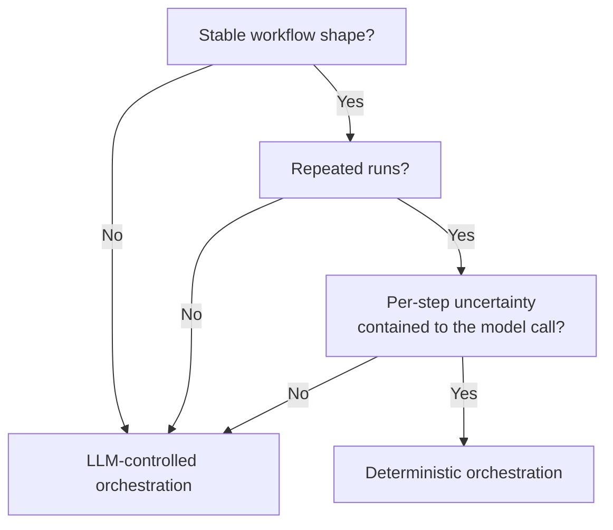

# Deterministic Orchestration for Structured Modernization

> When the modernization workflow has a stable shape, encoding orchestration in code reserves the LLM for translation choices — comparable accuracy at up to 3.5x lower token cost with better worst-case behaviour.

## The Decision

Two orchestration strategies sit at opposite ends of a control axis:

- **LLM-controlled** — the model decides which tool to call next, when to validate, when to retry, when to stop. The model holds execution control across the entire workflow.
- **Deterministic** — the surrounding code decides the step sequence; the model is called only at the steps that require translation, classification, or judgement.

[Anthropic's workflows-vs-agents framing](https://www.anthropic.com/engineering/building-effective-agents) describes the same split: workflows orchestrate LLMs and tools through predefined code paths, agents let LLMs dynamically direct their own processes. Anthropic's guidance is to default to workflows for well-defined tasks and reserve agents for cases where required steps cannot be predicted.

The empirical case for deterministic orchestration on structured tasks comes from [Lwin and Kumar's controlled study](https://arxiv.org/abs/2605.09894) of COBOL-to-Python modernization. Holding constant models, prompts, tools, and source programs — varying only execution control — deterministic orchestration achieved comparable computational accuracy, improved worst-case robustness across repeated runs, and reduced token consumption by up to 3.5x across multiple models.

## When the Pattern Applies

The pattern wins on tasks with all of:

- **Stable workflow shape** — the step sequence is enumerable in code (parse, translate per construct, validate, integrate). Branches exist but are knowable.
- **Repeated execution** — the workflow runs many times over a corpus, so the cost of encoding the orchestration amortises.
- **Per-step uncertainty bounded to the LLM call** — the genuinely uncertain decision is *what does this construct translate to*, not *what should the agent do next*.

Legacy modernization fits the profile when source corpora share structural conventions: COBOL-to-Python, Cobol-to-Java, Java 8-to-17 upgrades, framework migrations.



## Why It Works

Two mechanisms explain the cost and robustness gap.

**Token amplification.** An LLM-controlled orchestrator consumes context — instructions, tool registry, prior tool calls, reasoning traces — on every step, even when the next step is mechanical. A deterministic orchestrator invokes the model only on the steps that need a model, replacing N full-context turns with K << N targeted prompts. The 3.5x token reduction reported by [Lwin and Kumar](https://arxiv.org/abs/2605.09894) is consistent with this mechanism.

**Variance reduction.** LLM-controlled orchestration introduces a stochastic branch at every decision point — which tool, what arguments, when to stop. These compound across steps, widening the outcome distribution. Fixing branches in code collapses that distribution to the variance of the model call itself, which is why worst-case robustness improves without average-case accuracy dropping.

The same mechanism explains the [Agentless result on SWE-bench Lite](https://arxiv.org/abs/2407.01489): a fixed localization-and-repair workflow beat autonomous agents at lower cost. Different task, same pattern.

## What Stays in the Model

Deterministic orchestration is not "no LLM." The model still owns:

- **Translation choices** — mapping a COBOL `PERFORM VARYING` to a Python `for` loop with the correct iteration semantics
- **Disambiguation** — resolving identifier shadowing, type inference, or business-logic intent in comments
- **Validation interpretation** — explaining why a test failed in terms a downstream step can act on

The orchestrator owns:

- Step sequencing
- Parsing and AST traversal
- File I/O and integration
- Retry policy with bounded attempts
- Validation harness invocation

## Failure Conditions

The pattern backfires on workloads that violate its preconditions.

- **Heterogeneous corpora.** When source programs share little structure — embedded JCL, vendor extensions, undocumented business logic in comments — the deterministic orchestrator becomes a switch statement that costs more to maintain than the tokens it saves. The branch count grows faster than the corpus does.
- **Evolving workflow.** Deterministic orchestration encodes the workflow in code. Iterating on the workflow itself requires code changes, code review, and redeploy. LLM-controlled orchestration iterates by editing the prompt, which is faster for early exploration.
- **Mid-execution discovery.** If the workflow's shape depends on findings only revealed at runtime — "this program calls an undocumented vendor library" — the deterministic orchestrator hits a path it doesn't have. An LLM-controlled agent can re-plan; a deterministic one needs a code change.
- **One-off jobs.** The orchestration code only pays back across many runs. For a single migration, the engineering cost of building the scaffold exceeds the token cost of an agentic run.

## Example

A COBOL program contains a `PERFORM VARYING` loop, a `COMPUTE` statement, and a file write. The orchestration decides the steps; the model handles only translation.

```python
# Deterministic orchestrator — the workflow shape is in code
def modernize_program(cobol_path: str) -> str:
    ast = parse_cobol(cobol_path)                          # no LLM
    python_units = []
    for node in ast.iter_constructs():                     # no LLM
        prompt = render_translation_prompt(node)           # no LLM
        translated = llm.translate(prompt)                 # LLM: translation only
        python_units.append(translated)
    program = assemble(python_units)                       # no LLM
    if not run_validation_harness(program, ast.tests):     # no LLM
        report = llm.explain_failure(program, ast.tests)   # LLM: interpretation only
        raise ModernizationError(report)
    return program
```

Compare to the LLM-controlled equivalent, where the model decides whether to parse first, when to validate, whether to retry, and what to retry with — incurring full context cost on every step. The deterministic path makes two model calls per program on the happy path. The LLM-controlled path makes one call per decision, and there are decisions at every node.

## Key Takeaways

- Encode orchestration in code when the workflow shape is stable and runs many times; reserve LLM control for genuinely open-ended tasks
- The mechanism is token amplification and variance reduction, not "LLMs are bad at orchestration" — the model is still load-bearing for the translation step
- Empirical evidence: comparable accuracy, improved worst-case robustness, up to 3.5x lower tokens on COBOL-to-Python ([Lwin & Kumar, 2026](https://arxiv.org/abs/2605.09894))
- The pattern breaks on heterogeneous corpora, evolving workflows, mid-execution discovery, and one-off jobs — match orchestration strategy to task structure, not to fashion
- For exploratory or open-ended tasks, [Anthropic recommends LLM-controlled agents](https://www.anthropic.com/engineering/building-effective-agents); the two strategies are complementary, not competing

## Related

- [Agentless vs Autonomous](agentless-vs-autonomous.md) — The same pattern applied to bug fixing on SWE-bench: a constrained two-phase workflow beats autonomous agents at lower cost
- [Cognitive Reasoning vs Execution Separation](cognitive-reasoning-execution-separation.md) — Two-layer architecture where typed tool interfaces enforce the boundary between deciding and acting
- [Discrete Phase Separation](discrete-phase-separation.md) — Running phases in isolated contexts so only distilled artifacts cross the boundary
- [Agents vs Commands](agents-vs-commands.md) — When command-style fixed execution beats full agent autonomy
- [Harness Engineering](harness-engineering.md) — The broader discipline of constraining agent environments to reliably produce correct outputs
- [Cost-Aware Agent Design](cost-aware-agent-design.md) — Matching model capability and orchestration strategy to task complexity
- [Stochastic vs Deterministic Boundary](stochastic-deterministic-boundary.md) — Where the LLM call hands off to deterministic code, and how to design that interface
