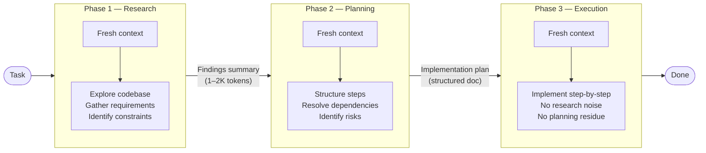

<!-- source: nibzard/awesome-agentic-patterns (Apache 2.0, https://github.com/nibzard/awesome-agentic-patterns) — retain attribution per license -->

# Discrete Phase Separation

> Each phase — research, planning, execution — runs in its own conversation. Only distilled artifacts cross boundaries, not full history.

## The Problem with Mixed Phases

When an agent researches, plans, and implements in a single context window, three things compete for the model's attention simultaneously. The result is degraded output in all three directions: exploration cuts short because the model is already thinking about the plan; the plan is distorted by implementation details the model pre-cached; execution is contaminated by the reasoning traces from research that no longer apply.

Sam Stettner's formulation: *"Don't make Claude do research while it's trying to plan, while it's trying to implement."* ([nibzard/awesome-agentic-patterns](https://github.com/nibzard/awesome-agentic-patterns/blob/main/patterns/discrete-phase-separation.md))

## The Three Phases

Each phase runs in a dedicated conversation with a clean context window:

| Phase | Context Input | Artifact Output |
|---|---|---|
| **Research** | Task description + codebase access | Distilled findings summary (1–2K tokens) |
| **Planning** | Findings summary only | Structured implementation plan |
| **Execution** | Plan only | Code changes, commits |

Raw conversation history never moves between phases. Only the compact artifact does.

## Why Conversation Boundary Matters

Prompt-level separation — using section headers or instruction clauses within one conversation — does not achieve the same result. The model has already processed earlier content and its attention spans the full context. Distraction and crosstalk persist.

Conversation boundary resets everything: KV cache, attention state, and implicit prior reasoning. The execution agent literally cannot see what the research agent concluded except through the artifact you pass it.

[Anthropic's context engineering documentation](https://www.anthropic.com/engineering/effective-context-engineering-for-ai-agents) confirms this behavior for sub-agents: detailed search context remains isolated within sub-agents; only distilled summaries return to the orchestrator.

## Distilled Artifacts as the Transfer Medium

The handoff artifact is the mechanism that makes isolation possible without losing continuity. Effective artifacts are:

- **Structured** — numbered steps, not prose narrative
- **Self-contained** — the receiving agent needs no access to phase history
- **Opinionated** — conclusions, not raw findings; a plan, not a list of options

[Claude Code best practices](https://code.claude.com/docs/en/best-practices) formalizes a four-phase sequence (Explore → Plan → Implement → Commit) where [Plan Mode](../workflows/plan-mode.md) enforces read-only context during research and planning, preventing premature file writes. This is the same isolation enforced mechanically rather than by conversation boundary.

## Model Selection Per Phase

The separation enables workload-appropriate model routing. Research and planning benefit from deeper reasoning; execution benefits from speed and throughput. The nibzard catalog uses Opus for research/planning phases and Sonnet for execution ([nibzard/awesome-agentic-patterns](https://github.com/nibzard/awesome-agentic-patterns/blob/main/patterns/discrete-phase-separation.md)).

## Trade-offs

- **Latency**: ~35% latency increase from separate conversation setup overhead ([Parisien et al., ICLR 2024](https://arxiv.org/abs/2403.05441))
- **Tool use accuracy**: 72% → 94% in deliberation-first approaches ([Parisien et al., ICLR 2024](https://arxiv.org/abs/2403.05441))
- **Artifact quality ceiling**: If the research summary omits a critical finding, the plan cannot recover it. The distillation step is a lossy compression.
- **Orchestration overhead**: Requires a harness to spawn phases, pass artifacts, and handle phase-level failures.

## Distinction from Related Patterns

- **[Cognitive Reasoning vs Execution Separation](cognitive-reasoning-execution-separation.md)** — enforces the boundary via typed tool interfaces within an architecture, not conversation resets. This pattern is structural; discrete phase separation is temporal.
- **[Research-Plan-Implement Workflow](../workflows/research-plan-implement.md)** — describes the three-phase shape as a workflow; this page covers the isolation enforcement mechanism — why conversation boundary is stronger than prompt-level separation.
- **[Loop Strategy Spectrum](loop-strategy-spectrum.md)** — addresses when to use fresh-context loops vs accumulated context; discrete phase separation is a specific application of fresh-context isolation.

## Key Takeaways

- Three phases in three conversations — not three prompts in one.
- Only distilled artifacts (summaries, plans) cross boundaries — not raw history.
- Conversation boundary eliminates attention crosstalk; prompt-level separation does not.
- The distillation step is lossy: artifact quality sets the ceiling for all downstream phases.
- ~35% latency overhead is the primary cost; deliberation-first approaches improve tool use accuracy from 72% to 94% ([Parisien et al., ICLR 2024](https://arxiv.org/abs/2403.05441)).

## Related

- [Cognitive Reasoning vs Execution Separation](cognitive-reasoning-execution-separation.md)
- [Loop Strategy Spectrum](loop-strategy-spectrum.md)
- [Agent Harness: Initializer and Coding Agent](agent-harness.md)
- [Three Reasoning Spaces: Plan, Bead, and Code](three-reasoning-spaces.md)
- [Reasoning Budget Allocation: The Reasoning Sandwich](reasoning-budget-allocation.md)
- [Task-Specific Agents vs Role-Based Agents](task-specific-vs-role-based-agents.md)
- [Cost-Aware Agent Design](cost-aware-agent-design.md)
- [Separation of Knowledge and Execution](separation-of-knowledge-and-execution.md)
