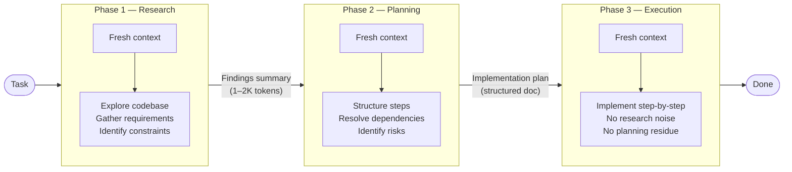

<!-- source: nibzard/awesome-agentic-patterns (Apache 2.0, https://github.com/nibzard/awesome-agentic-patterns) — retain attribution per license -->

# Discrete Phase Separation

> Each phase — research, planning, execution — runs in its own conversation. Only distilled artifacts cross boundaries, not full history.

Related lesson: [Reasoning Budget — The Sandwich](https://learn.agentpatterns.ai/harness-engineering/reasoning-budget/) — this concept features in a hands-on lesson with quizzes.

## The problem with mixed phases

When an agent researches, plans, and implements in one context window, all three compete for the model's attention. Output degrades in every direction. Exploration cuts short because the model is already thinking about the plan. The plan is distorted by implementation details the model cached early. Execution is contaminated by research reasoning that no longer applies.

Sam Stettner's formulation: *"Don't make Claude do research while it's trying to plan, while it's trying to implement."* ([nibzard/awesome-agentic-patterns](https://github.com/nibzard/awesome-agentic-patterns/blob/main/patterns/discrete-phase-separation.md))

## The three phases

Each phase runs in a dedicated conversation with a clean context window:

| Phase | Context Input | Artifact Output |
|---|---|---|
| Research | Task description + codebase access | Distilled findings summary (1–2K tokens) |
| Planning | Findings summary only | Structured implementation plan |
| Execution | Plan only | Code changes, commits |

Raw conversation history never moves between phases. Only the compact artifact does.

```mermaid
flowchart LR
    T([Task]) --> P1

    subgraph P1["Phase 1 — Research"]
        direction TB
        R1[Fresh context] --> R2[Explore codebase<br>Gather requirements<br>Identify constraints]
    end

    P1 -->|"Findings summary<br>(1–2K tokens)"| P2

    subgraph P2["Phase 2 — Planning"]
        direction TB
        PL1[Fresh context] --> PL2[Structure steps<br>Resolve dependencies<br>Identify risks]
    end

    P2 -->|"Implementation plan<br>(structured doc)"| P3

    subgraph P3["Phase 3 — Execution"]
        direction TB
        E1[Fresh context] --> E2[Implement step-by-step<br>No research noise<br>No planning residue]
    end

    P3 --> D([Done])
```

## Why conversation boundary matters

Prompt-level separation — using section headers or instruction clauses within one conversation — does not work the same way. The model has already processed the earlier content, and its attention spans the full context. Distraction and crosstalk persist — the [distractor-interference](../anti-patterns/distractor-interference.md) failure mode.

A conversation boundary resets everything: the KV cache, attention state, and implicit prior reasoning. The execution agent cannot see what the research agent concluded, except through the artifact you pass it.

[Anthropic's context engineering documentation](https://www.anthropic.com/engineering/effective-context-engineering-for-ai-agents) confirms this behavior for sub-agents: detailed search context remains isolated within sub-agents; only distilled summaries return to the orchestrator.

## Distilled artifacts as the transfer medium

The handoff artifact makes isolation possible without losing continuity. Effective artifacts share three traits:

- Structured — numbered steps, not prose narrative
- Self-contained — the receiving agent needs no access to phase history
- Opinionated — conclusions, not raw findings; a plan, not a list of options

[Claude Code best practices](https://code.claude.com/docs/en/best-practices) formalizes a four-phase sequence (Explore → Plan → Implement → Commit) where [Plan Mode](../tools/claude/plan-mode.md) enforces read-only context during research and planning, preventing premature file writes. This is the same isolation enforced mechanically rather than by conversation boundary.

## Model selection per phase

Separate phases let you route each phase to a different model. Research and planning benefit from deeper reasoning. Execution benefits from speed and throughput. The nibzard catalog uses Opus for research and planning, and Sonnet for execution ([nibzard/awesome-agentic-patterns](https://github.com/nibzard/awesome-agentic-patterns/blob/main/patterns/discrete-phase-separation.md)).

## Trade-offs

- Latency: spinning up a fresh conversation per phase adds setup overhead compared to continuing one session.
- Artifact quality ceiling: if the research summary omits a critical finding, the plan cannot recover it. The distillation step is a lossy compression.
- Orchestration overhead: it needs an [agent harness](agent-harness.md) to spawn phases, pass artifacts, and handle phase-level failures.
- Loss of implicit context: intuitions the model formed during research (for example, which files looked suspicious) do not survive the boundary unless written into the artifact.

## Distinction from related patterns

- [Cognitive Reasoning vs Execution Separation](cognitive-reasoning-execution-separation.md) — enforces the boundary via typed tool interfaces within an architecture, not conversation resets. That pattern is structural; discrete phase separation is temporal.
- [Research-Plan-Implement Workflow](../workflows/research-plan-implement.md) — describes the three-phase shape as a workflow; discrete phase separation is the isolation enforcement mechanism — why a conversation boundary is stronger than prompt-level separation.
- [Loop Strategy Spectrum](../loop-engineering/loop-strategy-spectrum.md) — addresses when to use fresh-context loops versus accumulated context; discrete phase separation is a specific application of fresh-context isolation.

## Key Takeaways

- Three phases in three conversations — not three prompts in one.
- Only distilled artifacts (summaries, plans) cross boundaries — not raw history.
- Conversation boundary eliminates attention crosstalk; prompt-level separation does not — contrast the structural boundary in [cognitive reasoning vs execution separation](cognitive-reasoning-execution-separation.md).
- The distillation step is lossy: artifact quality sets the ceiling for all downstream phases.
- Costs are higher orchestration overhead and lost implicit context — whatever the research agent noticed but did not write down is gone.

## Related

- [Cognitive Reasoning vs Execution Separation](cognitive-reasoning-execution-separation.md)
- [Loop Strategy Spectrum](../loop-engineering/loop-strategy-spectrum.md)
- [Agent Harness: Initializer and Coding Agent](agent-harness.md)
- [Three Reasoning Spaces: Plan, Bead, and Code](three-reasoning-spaces.md)
- [Reasoning Budget Allocation: The Reasoning Sandwich](reasoning-budget-allocation.md)
- [Cost-Aware Agent Design](../token-engineering/cost-aware-agent-design.md)
- [Separation of Knowledge and Execution](separation-of-knowledge-and-execution.md)
- [Domain-Scoped Parallel Exploration for Multi-File Change Localization](domain-scoped-parallel-localization.md)
- [Context Engineering: The Discipline of Designing Agent Context](../context-engineering/context-engineering.md)
