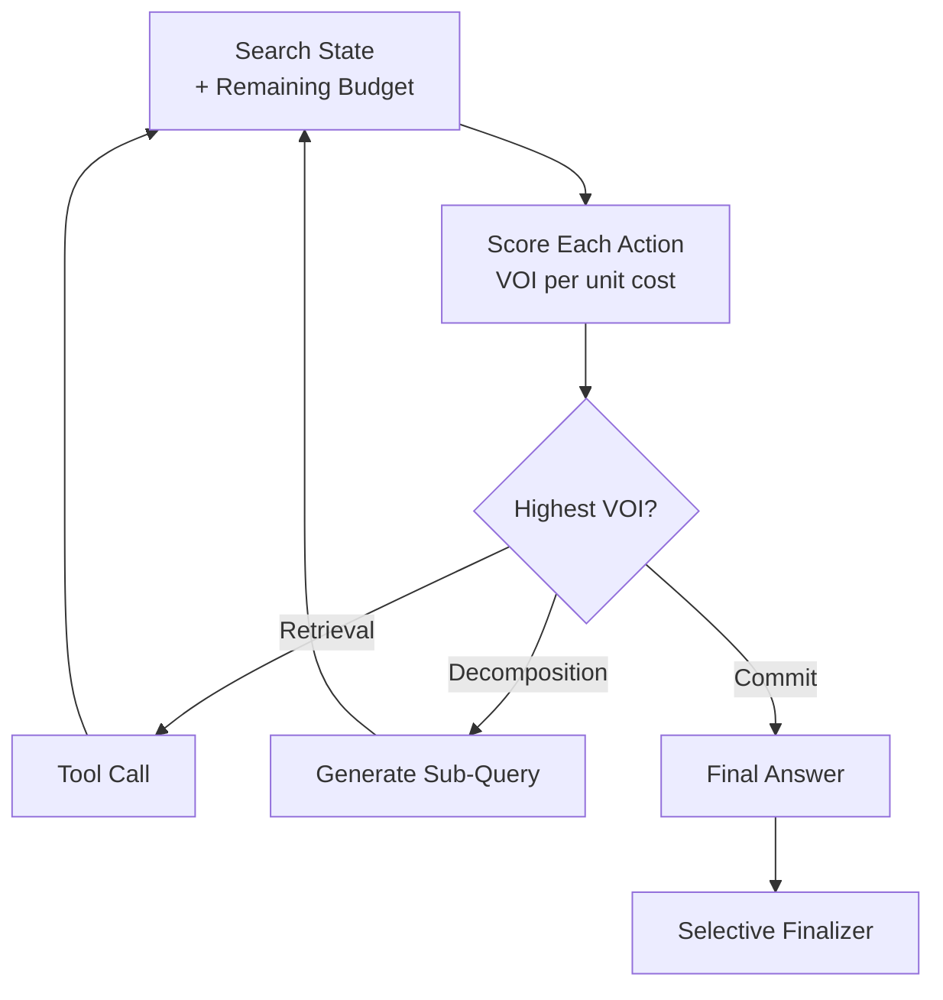

# Dual-Budget Control for Search Agents

> Dual-budget control lets a search agent under tool-call and token caps score each action by Value-of-Information per unit budget, spending next on the highest-ranking one.

## The Two-Budget Problem

Search agents operate under two hard limits at inference time: a cap on tool calls and a cap on generated tokens. Both bind. Better answers do not come from a stronger model alone — they come from explicit control over which action receives the next budget unit and when accumulated evidence is sufficient to commit ([Fang et al., 2026](https://arxiv.org/abs/2605.05701)).

Three action classes compete for the same budget:

- **Retrieval** — call a tool, spend a tool-call unit and the tokens for the result.
- **Decomposition** — break the question into sub-queries, spend tokens but no tool call.
- **Commit** — emit the final answer and stop.

A naive policy fires retrievals greedily until the tool-call cap or the token cap hits zero. A dual-budget controller picks differently: it ranks actions by expected marginal task value per unit budget consumed, then spends greedily on the highest-ranking option.

## Value-of-Information Scoring

Each candidate action gets a Value-of-Information (VOI) score: an operational estimate of marginal task value per unit budget under the current search state and remaining dual budget ([Fang et al., 2026](https://arxiv.org/abs/2605.05701)). The action with the highest VOI/cost ratio fires next.



The score depends on remaining budget, not just current state. A retrieval that looks valuable with 10 tool calls left may score below a commit when only 1 remains — because the marginal value of one more retrieval is bounded above by the probability it changes the answer, while the cost of running out of budget mid-trajectory is the whole task.

[Snell et al. (2024)](https://arxiv.org/abs/2408.03314) report the same causal structure for test-time compute scaling more broadly: a compute-optimal allocation that adapts per prompt improves test-time-compute efficiency by more than 4x over a best-of-N baseline. The pattern in both cases is *difficulty-conditioned allocation beats uniform when budgets bind*.

## Selective Evidence-Grounded Finalizer

After the search trajectory ends, a finalizer compares the trajectory answer with a refined candidate. It rewrites only when the residual error appears to be a low-risk answer-form error — formatting, unit conversion, name disambiguation — not when retrieval was incomplete ([Fang et al., 2026](https://arxiv.org/abs/2605.05701)).

This guard matters because post-hoc rewriting can degrade near-ceiling outputs. The [self-critique paradox](https://snorkel.ai/blog/the-self-critique-paradox-why-ai-verification-fails-where-its-needed-most/) shows critics drop accuracy from ~98% to ~57% on tasks where the base agent is already correct — see the [inference-time tool-call reviewer](inference-time-tool-call-reviewer.md) for the same constraint applied to pre-dispatch review. The finalizer's "rewrite only on answer-form errors" rule is exactly the mitigation needed to keep the rewriter from overwriting correct retrievals with hallucinated revisions.

Ablations attribute the bulk of measured gains to the search-time controller (especially the budget-dependent penalty); the finalizer mainly helps when the retrieval path is already adequate ([Fang et al., 2026](https://arxiv.org/abs/2605.05701)).

## What Belongs Where

| Pattern | Allocates | Unit |
|---------|-----------|------|
| [Reasoning budget allocation](reasoning-budget-allocation.md) | Reasoning compute by phase | Per workflow phase (plan / execute / verify) |
| [Context budget allocation](../context-engineering/context-budget-allocation.md) | Tokens within the window | Per loaded artifact |
| Dual-budget control (this page) | Remaining tool calls + tokens | Per candidate action |
| [Inference-time tool-call reviewer](inference-time-tool-call-reviewer.md) | Approve/reject decisions | Per provisional tool call |

These patterns are composable, not substitutes. A harness can run reasoning-budget allocation across phases, dual-budget control within the search phase, and a tool-call reviewer on each provisional dispatch — they operate at different slots in the loop.

## When This Pattern Backfires

The pattern is valuable specifically when budgets bind. Skip it when:

- **Slack budgets.** Agents that routinely complete tasks below the cap don't benefit — without binding constraints, VOI scoring is overhead. The optimisation surface only exists under tight budgets.
- **Single-hop or single-tool tasks.** With one action class available, allocation collapses to early-stopping. Simpler heuristics already cover that.
- **Strong base models on light search.** Answer-time control mainly helps when the retrieval path is already adequate ([Fang et al., 2026](https://arxiv.org/abs/2605.05701)) — when the base model rarely makes answer-form errors, the finalizer adds latency without revenue.
- **Hidden cost variance.** VOI/cost ratios assume cost is observable. Retrieval calls with stochastic tail latency (rate limits, cold caches) make the score noisy and can mis-rank actions.
- **Harnesses without budget accounting.** The controller needs `(remaining_tool_calls, remaining_tokens)` exposed every step. Harnesses that hide this state need instrumentation work before the pattern is implementable.

## Example

A research agent answers multi-hop questions over a corpus with `max_tool_calls=8` and `max_tokens=4000`. Three feasible actions at step 4 with `(remaining_tool_calls=4, remaining_tokens=2200)`:

```text
Action            Est. value gain   Est. cost      VOI / cost
retrieval(q3)     0.35              1 call + 400t  0.35 / (1/4 + 400/2200) = 0.81
decompose(q3)     0.20              0 calls + 200t 0.20 / (200/2200) = 2.20
commit(answer)    0.10              0 calls + 80t  0.10 / (80/2200) = 2.75
```

The controller fires `commit` because its VOI/cost ratio is highest given how little budget remains. With `remaining_tool_calls=8` at step 0, the same retrieval would score above commit — the budget conditioning is what changes the ordering. A fixed greedy policy ignoring remaining budget would fire `retrieval(q3)` and risk hitting the cap before reaching a confident answer.

## Key Takeaways

- Search agents under hard caps on both tool calls and tokens face a per-action allocation problem, not a single-budget problem.
- Score each candidate action by VOI per unit budget under current state and remaining budget; greedy selection on this score is the controller.
- A selective finalizer should rewrite only on answer-form errors, never to overwrite a complete retrieval — otherwise it degrades correct outputs.
- The pattern pays back where budgets bind. Slack budgets, single-hop tasks, and harnesses without budget accounting do not benefit.

## Related

- [Reasoning Budget Allocation](reasoning-budget-allocation.md)
- [Context Budget Allocation](../context-engineering/context-budget-allocation.md)
- [Inference-Time Tool-Call Reviewer](inference-time-tool-call-reviewer.md)
- [Cost-Aware Agent Design](cost-aware-agent-design.md)
- [Heuristic-Based Effort Scaling](heuristic-effort-scaling.md)
