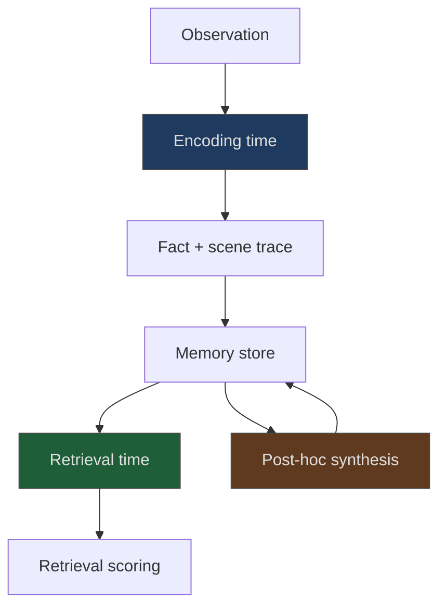

# Dual-Trace Memory Encoding

> Pair every stored fact with a narrative scene trace of the moment it was learned. The extra context at write time improves cross-session, temporal, and knowledge-update recall — and does nothing for single-session retrieval.

## The Encoding Gap

Most agent memory systems store facts as flat records: a sentence, an embedding, optionally a timestamp. The record answers *what* but erases *when and where* the fact was learned. Queries that depend on that context — "has the rate limit changed since last quarter?", "what was true before the refactor?" — fail because the signal was discarded at write time.

Dual-trace encoding stores two traces per entry:

- a **factual trace** — the extractable claim, as in a conventional memory system
- a **scene trace** — a short narrative reconstruction of the moment the fact was learned: session, surrounding topic, prompting decision, temporal position

The agent commits to the contextual detail *at encoding time*, not retrieval. Retrieval over both traces lets temporal and cross-session queries condition on the scene ([Stern & Nadel, 2026](https://arxiv.org/abs/2604.12948)).

## What the Benchmark Shows

On LongMemEval-S (4,575 sessions, 500 recall questions), dual-trace encoding reached 73.7% accuracy against a fact-only baseline of 53.5% — a +20.2 percentage-point gain, 95% CI [+12.1, +29.3], p < 0.0001 ([Stern & Nadel, 2026](https://arxiv.org/abs/2604.12948)). The gain concentrates in cross-session categories:

| Category | Gain over fact-only |
|----------|---------------------|
| Temporal reasoning | +40pp |
| Multi-session aggregation | +30pp |
| Knowledge-update tracking | +25pp |
| Single-session retrieval | No benefit |

The null result on single-session retrieval confirms the mechanism: scene context helps only when retrieval needs to disambiguate *when* a fact was learned. When encoding and retrieval share a session, the extra trace adds no signal.

LongMemEval itself covers five long-term memory abilities: information extraction, multi-session reasoning, temporal reasoning, knowledge updates, and abstention. Commercial assistants drop ~30% in accuracy on long histories on this benchmark ([Wu et al., 2024](https://arxiv.org/abs/2410.10813)) — the regime dual-trace targets.

## Where This Sits in the Memory Cluster

Dual-trace is an *encoding-time* technique. It composes with retrieval-time and post-hoc strategies rather than replacing them:



| Technique | Phase | Unit of storage |
|-----------|-------|-----------------|
| [Episodic memory retrieval](episodic-memory-retrieval.md) | Retrieval-time | Problem-solving arc (attempts, outcomes, lesson) |
| [Generative agents memory stream](generative-agents-memory-stream.md) | Retrieval + reflection | Scored observation nodes with importance |
| [Memory synthesis from execution logs](memory-synthesis-execution-logs.md) | Post-hoc | Structured lessons extracted from traces |
| **Dual-trace encoding** | **Encoding-time** | **Fact + scene trace pair** |

Episodic retrieval stores whole problem-solving episodes; dual-trace pairs individual facts with their learning moment. They are orthogonal — an episode record can itself be dual-trace encoded at the fact level.

## When This Pays Off

The pattern targets memory workloads where retrieval depends on *when* or *in what context* a fact was learned:

- **Cross-session aggregation.** "Summarize every decision the team made about auth across the last five planning sessions."
- **Knowledge updates.** "Has the deployment target changed since the Q2 review?"
- **Temporal reasoning.** "What was our rate-limit policy before the January incident?"
- **Per-user context retention.** Long-running assistants accumulating facts about a user across sessions.

The pattern does not pay off for:

- **Single-session bounded tasks** — the benchmark null result is decisive; scene trace is wasted encoding overhead.
- **Context-independent facts** — stable infrastructure (`build uses pnpm`, `rate limit is 100/min`) does not improve with scene context because retrieval never conditions on learning-moment.
- **High-frequency observation streams** — scene-trace generation is an extra LLM call per fact write; at full tool-output density this compounds. Reserve it for facts the agent judges worth persisting.
- **Fast-moving codebases** — scene traces embed contextual detail that decays as the codebase evolves; without invalidation on refactor, stale traces mislead retrieval the same way stale facts do.

## Caveats

The published evidence is one paper on one benchmark with no independent replication yet. The headline +20pp number comes from a synthetic long-memory benchmark; transfer to production agent workloads is plausible but not proven. The paper sketches an architecture for coding agents with "preliminary pilot validation" — treat the coding-agent transfer as preliminary until further evidence lands ([Stern & Nadel, 2026](https://arxiv.org/abs/2604.12948)).

The abstract reports no token overhead at retrieval against the fact-only baseline. Write-time cost — the LLM call that generates the scene trace — is a real addition and should factor into the decision to encode.

## Example

A coding assistant tracking a long-running project across weeks. A fact-only memory entry stores a correction in isolation:

```json
{
  "fact": "Billing reconciliation runs at 02:00 UTC, not 00:00."
}
```

Six weeks later the user asks, "When did the billing job move to 02:00?" Fact-only retrieval surfaces the claim but has no signal on when or why it was learned. The agent answers "I'm not sure" or hallucinates a date.

A dual-trace entry stores the fact plus a scene trace of the moment it was learned:

```json
{
  "fact": "Billing reconciliation runs at 02:00 UTC, not 00:00.",
  "scene_trace": "During the post-incident review for the Oct 14 duplicate-charge bug, the on-call engineer noted the cron had been moved to 02:00 UTC six months earlier to avoid a DST rollover race. The original 00:00 schedule is documented in the runbook but obsolete."
}
```

The scene trace answers the temporal query directly ("six months before Oct 14") and the knowledge-update query ("the runbook entry is stale"). Both traces index into retrieval, so the question matches even when phrased around the incident rather than the cron.

## Key Takeaways

- Store a fact and its scene trace at encoding time, not just the fact — the extra commit resolves cross-session and temporal queries that fact-only storage cannot.
- Expect gains on temporal reasoning, multi-session aggregation, and knowledge-update tracking; expect no gain on single-session retrieval.
- Scene-trace generation is a write-time LLM cost — reserve dual-trace encoding for facts worth the overhead, not every observation.
- Dual-trace is an encoding-time technique that composes with episodic retrieval and memory-stream reflection; adopt it alongside, not instead of, existing memory strategies.

## Related

- [Agent Memory Patterns: Learning Across Conversations](agent-memory-patterns.md)
- [Episodic Memory Retrieval](episodic-memory-retrieval.md)
- [Generative Agents Memory Stream](generative-agents-memory-stream.md)
- [Memory Synthesis from Execution Logs](memory-synthesis-execution-logs.md)
- [Subtask-Level Memory for SE Agents](subtask-level-memory.md)
- [Session Initialization Ritual](session-initialization-ritual.md)
- [AST-Guided Agent Memory for Repository-Level Code Generation](ast-guided-agent-memory.md)
