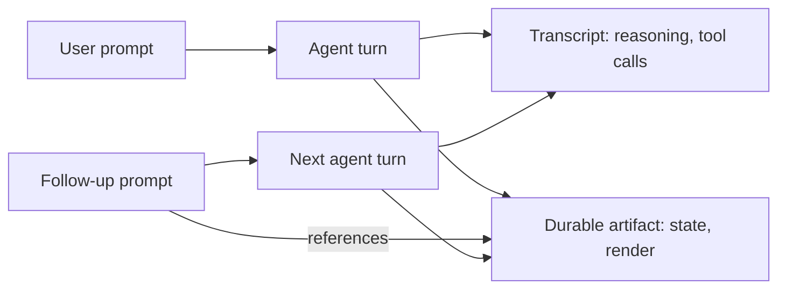

# Durable Interactive Artifacts: Agent Output Outside the Transcript

> A durable interactive artifact is an agent-produced workspace object — a canvas, dashboard, diagram, or structured view — that survives the session, can be re-opened and re-run against fresh data, and serves as a context anchor for follow-up prompts.

## Artifact vs Transcript

Most agent output collapses into transcript scrollback — hard to revisit, impossible to manipulate directly. A durable artifact separates two concerns the transcript conflates:

| Surface | What it holds | Lifetime |
|---------|---------------|----------|
| Transcript | Reasoning trace, tool calls, decisions (append-only) | Session, often compacted |
| Durable artifact | Current state of the work product (re-rendered, re-run, edited) | Cross-session |

The transcript is audit trail. The artifact is the thing you came back for. Cursor's Canvases docs make this concrete: "Cursor saves the canvas so you can reopen and rerun it later with fresh data" ([Cursor Canvas docs](https://cursor.com/docs/agent/tools/canvas)).

## What Qualifies as Durable

Four properties separate the primitive from a transcript message, a static file, or a one-off chart:

1. **Persistent outside the chat** — survives compaction and process restart. Cursor Canvases live in the Agents Window side panel alongside terminal, browser, and source control ([Cursor changelog, 2026-04-15](https://cursor.com/changelog/04-15-26)).
2. **Re-openable as workspace state** — the user returns directly, not by scrolling the transcript.
3. **Re-runnable against fresh data** — the artifact captures a *definition* (layout, query, data source), not only a render.
4. **Addressable as context** — a named object a human or another agent can point to in a follow-up prompt.

A PR description is persistent but not re-runnable. A chart is a render with no definition. A file is persistent but not interactive. The primitive is the intersection.

## Context Anchoring

In a transcript-only model, each refinement re-describes the prior output: "take the chart you just made and add error bars." In the artifact model, the artifact is the handle — the prompt anchors to a named object the agent can read, diff, and re-render.

Cursor implements this: when the agent creates a canvas, a card appears at the end of the response; clicking it reopens the canvas ([Cursor Canvas docs](https://cursor.com/docs/agent/tools/canvas)). The anchor is bidirectional — transcript references artifact, artifact points back to its request.

The transcript grows linearly; the artifact converges toward current state.

## Packaging as a Skill

A canvas shape a team regenerates against fresh data is a reusable pattern. Cursor canvases can be packaged as skills containing trigger description, layout spec, data sources, and formatting rules, so teammates regenerate the same shape with new data ([Cursor Canvas docs](https://cursor.com/docs/agent/tools/canvas)). The artifact — not the prompt — becomes the unit the team reasons about.

## When to Use an Artifact Over a File

Plain-text artifacts in git — PRs, markdown, tests, specs — are already durable, diff-able, and portable. Reach for a durable interactive artifact only when the data is multi-dimensional and benefits from exploration, the output will be re-run against new data rather than produced once, the human interacts with the output directly instead of re-prompting, or the artifact outlives a single session. Otherwise prefer a plain-text artifact — markdown, JSON, and SQL cross tool boundaries that canvas objects do not.

## Failure Modes

- **Polished render over unverified analysis.** The chart looks right; the query was wrong. A canvas adds visual confidence the reasoning has not earned. Verification precedes canvas fidelity.
- **Tool-lock-in through the render layer.** A Cursor canvas is rendered by Cursor's UI runtime; it does not port to another harness, terminal, or CI. Canvases fit where the workspace is the delivery surface, not where output must cross tool boundaries.
- **Stale canvas definitions.** Re-running against fresh data assumes the *definition* — queries, data sources, layout — still matches current schema. Long-lived canvases drift like dashboards; treat the definition as code.
- **Bias toward visualising non-visual data.** Some information is denser in prose, a diff, or a log snippet than in a chart. Canvas capability biases the agent toward visual framing; "is this better as text?" still applies.

## Implementations

| Tool | Mechanism | Cross-session | Edit model |
|------|-----------|---------------|------------|
| Cursor Canvases (3.1, 2026-04-15) | React UI library — tables, boxes, diagrams, charts; skill-packaged | Saved in workspace, reopen and rerun | Conversational refinement |

Source: [Cursor Canvas docs](https://cursor.com/docs/agent/tools/canvas) and [Cursor changelog 2026-04-15](https://cursor.com/changelog/04-15-26). Multi-agent concurrent editing of a shared canvas is not documented; third-party products advertise shared canvases on different render layers, so do not assume the pattern generalises from single-agent canvas features.

## Key Takeaways

- A durable interactive artifact is persistent, re-openable, re-runnable, and addressable as context — a workspace object, not a transcript message
- The transcript holds reasoning; the artifact holds the current state of the work product
- Context anchoring via the artifact replaces re-describing prior output in follow-up prompts
- Failure mode: visual polish masks unverified analysis — verification precedes canvas fidelity
- Prefer plain-text artifacts in git when portability, diff-ability, or CI use matter more than interactive exploration

## Related

- [Agent Memory Patterns: Learning Across Conversations](agent-memory-patterns.md)
- [Plan Files as Resumable Artifacts](../frameworks/team-os/plan-files-resumable-artifacts.md)
- [Session Recap: Goal-Shaped Handoff at Context Boundaries](session-recap.md)
- [Externalization in LLM Agents](externalization-in-llm-agents.md)
- [Trajectory Logging and Progress Files](../observability/trajectory-logging-progress-files.md)
