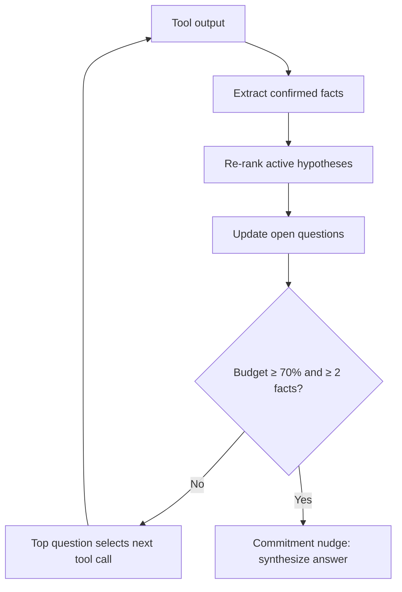

# Epistemic Working Memory for Multi-Hop Reasoning (SLEUTH)

> An explicit ledger of confirmed facts, ranked hypotheses, and open questions that drives the next action, so multi-hop reasoning stops degrading as context fills.

Epistemic working memory is a typed record of an agent's investigative state, updated after every tool call, that replaces the implicit state buried in a growing transcript. The SLEUTH method maintains three components and lets the highest-priority open question select the next tool call, coupling what the agent knows to what it does next ([Track, Rank, Crack — arXiv:2607.12267](https://arxiv.org/abs/2607.12267)).

## The three components

The agent keeps three typed structures and refreshes them after each tool interaction ([arXiv:2607.12267](https://arxiv.org/abs/2607.12267)):

- Confirmed facts — verified statements extracted from tool outputs, each grounded to its source. They accumulate monotonically, so an early discovery cannot be lost to later retrievals.
- Active hypotheses — candidate answers ranked by evidentiary support, each carrying a confidence level and explicit links to the facts that support or contradict it.
- Open questions — prioritized uncertainties. The top-ranked question determines the next tool call, which keeps retrieval goal-directed instead of drifting.

The method is prompting-only, with no fine-tuning. After each call the agent extracts new facts, re-scores hypothesis confidence against the evidence, drops resolved questions, and generates new ones that target the remaining uncertainty ([arXiv:2607.12267](https://arxiv.org/abs/2607.12267)).

## The commitment nudge

Long-horizon agents often find the answer but fail to commit under a bounded turn budget. SLEUTH adds a nudge that fires when two conditions hold: the agent has consumed at least 70% of its turn budget, and at least two confirmed facts exist. The nudge forces synthesis from the accumulated evidence rather than continued searching ([arXiv:2607.12267](https://arxiv.org/abs/2607.12267)).



## Why it works

The failure it targets is context dilution: in a plain reason-act loop the agent's investigative state lives only implicitly in a lengthening transcript, so early findings get buried and the model re-derives what it knows from thousands of tokens each turn ([arXiv:2607.12267](https://arxiv.org/abs/2607.12267)). This is the same [lost-in-the-middle](../context-engineering/lost-in-the-middle.md) effect that degrades retrieval as context grows. Externalizing the state into a typed, monotonic structure turns re-attention into a lookup, and binding the top open question to the next call keeps retrieval on target.

The paper isolates the mechanism with ablations. Tracking sourced facts alone (facts-only) recovers 79% of the full gain on four-hop questions, which pins most of the benefit on preventing evidence loss. The commitment nudge helps only when structured evidence already exists: the identical nudge added to a plain reason-act agent yields +0.2 points, versus +4.0 points inside SLEUTH ([arXiv:2607.12267](https://arxiv.org/abs/2607.12267)). Gains scale with difficulty — around +11 points on the harder MuSiQue multi-hop splits, and a four-hop timeout rate cut from 17.8% to 11.1% ([arXiv:2607.12267](https://arxiv.org/abs/2607.12267)).

## When this backfires

The structure adds cost and risk, and pays back only on genuinely long investigative chains:

- Short-horizon tasks. On one- or two-hop questions the gain is small, and the ledger costs 1.3 to 1.5 times the tokens of a plain loop ([arXiv:2607.12267](https://arxiv.org/abs/2607.12267)). When [native function-calling already handles state implicitly](ledger-agent-structured-task-state.md), the added scaffold buys latency, not accuracy.
- Open-domain or time-sensitive sources. The monotonic fact policy assumes a closed context. It cannot retract a confirmed fact, so an early wrong or stale "fact" becomes entrenched and cannot be revised as new evidence arrives ([arXiv:2607.12267](https://arxiv.org/abs/2607.12267)).
- Tight compute budgets. The method needs headroom for roughly 2.5 times the baseline reasoning depth, and the 70% nudge threshold was tuned on these benchmarks; a different task structure may need re-tuning ([arXiv:2607.12267](https://arxiv.org/abs/2607.12267)).
- Weak models without enforcement. Protocol adherence drops on weaker models unless prompt adaptation and validation hold it near 99%; without that, the ledger decays into unstructured notes ([arXiv:2607.12267](https://arxiv.org/abs/2607.12267)).

## Example

A research agent answering "Which studio produced the debut film of the director of *Heat*?" runs three hops. Its epistemic memory after the second tool call:

```
Confirmed facts:
  F1: Heat (1995) was directed by Michael Mann   [src: tool call 1]
  F2: Mann's debut feature was Thief (1981)       [src: tool call 2]
Active hypotheses:
  H1: Studio = United Artists    (confidence: low; supported by F2, unverified)
Open questions:
  Q1 (top): Which studio released Thief (1981)?   -> drives tool call 3
```

The top open question, not the model's running prose, selects tool call 3. When the budget threshold trips with F1 and F2 already confirmed, the nudge forces the agent to answer from the ledger instead of opening a fourth line of search.

## Key Takeaways

- Epistemic working memory externalizes investigative state into three typed structures — confirmed facts, ranked hypotheses, open questions — refreshed after every tool call.
- The top-ranked open question selects the next tool call, so retrieval stays goal-directed as context grows.
- Preventing evidence loss drives most of the gain (facts-only recovers 79%); the commitment nudge only helps when structured evidence already exists.
- Reserve it for long multi-hop chains — on short tasks the 1.3 to 1.5 times token cost and the non-retractable fact policy outweigh the benefit.

## Related

- [Structured Task-State Ledger for Tool-Calling Agents (LedgerAgent)](ledger-agent-structured-task-state.md) — sibling ledger that gates write authorization on codified policy; this one drives investigative retrieval instead.
- [Hypothesis-Driven Debugging: Instrument Before You Patch](hypothesis-driven-debugging.md) — ranks competing hypotheses by runtime evidence; the same falsification discipline applied to finding a bug.
- [ReAct (Reason + Act): Interleaved Reasoning-Action Loops](react-pattern.md) — the reason-act baseline whose implicit-state dilution this technique targets.
- [Lost in the Middle: The U-Shaped Attention Curve](../context-engineering/lost-in-the-middle.md) — the attention failure that context dilution exploits and that externalized state sidesteps.
- [Three Reasoning Spaces: Plan, Bead, and Code](three-reasoning-spaces.md) — another explicit-state discipline that gates transitions between reasoning modes.
