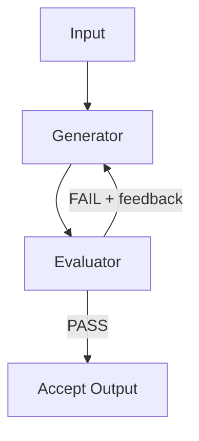

# Evaluator-Optimizer Pattern

> Two distinct LLM roles in a loop: a generator produces output and an evaluator critiques it, feeding structured feedback back to the generator until a quality threshold is met.

## Structure

The pattern has two roles and a termination condition:

- **Generator** — produces the initial output and revisions on each loop iteration
- **Evaluator** — applies defined criteria to the generator's output and returns structured feedback (verdict + specific issues)
- **Termination condition** — a programmatic quality gate that ends the loop when the evaluator returns PASS

Per [Anthropic's effective agents post](https://www.anthropic.com/engineering/building-effective-agents), the evaluator-optimizer is appropriate when there are clear evaluation criteria and iterative refinement provides measurable value.

## Evaluator Design

The evaluator role can be:

- **Same model, different system prompt** — lower cost, but the evaluator may inherit some of the generator's blind spots
- **Different model** — higher cost, but fully independent perspective; useful when the generator and evaluator require different strengths

Evaluation criteria should be explicit and ideally machine-checkable: tests pass, lint is clean, the specification is satisfied. The evaluator returns structured output — a JSON verdict with specific issues — so the generator can act on precise feedback rather than parsing prose.

## Termination Condition

Every loop needs a clear termination condition to prevent runaway iteration and cost:

- **Primary:** evaluator returns PASS
- **Fallback:** maximum round limit reached; escalate or return best-effort output. Anthropic's [reference implementation](https://github.com/anthropics/anthropic-cookbook/blob/main/patterns/agents/evaluator_optimizer.ipynb) ships an unbounded `while True:` loop that only exits on PASS, so production callers must impose their own cap. A starting limit of 3 is common, but the right cap depends on task complexity and cost budget.

Without a round limit, a loop where the evaluator and generator have conflicting assumptions will run until budget exhaustion. The fallback is not a failure; it is a signal that the criteria or the generator need adjustment.

## When to Apply

The pattern produces measurable improvement when:

- "Good output" can be described precisely enough that the evaluator can score it
- Iterative refinement genuinely improves quality (the generator can act on the evaluator's feedback)
- The task does not have a single correct answer that would make iteration redundant

For coding tasks, the pattern maps naturally: generator produces code → evaluator runs tests → failures feed back to generator → repeat. Tests provide a machine-checkable termination condition, making the loop predictable and auditable.

## When This Backfires

The pattern degrades or fails in five conditions:

- **Shared blind spots** — when the generator and evaluator are the same model with only a prompt swap, both may miss the same class of errors. The evaluator returns PASS on output that violates the intent, not because criteria are met but because neither role can detect the violation. Mitigation: use a different model for evaluation, or replace the LLM evaluator with a deterministic checker (tests, lint, type checker).
- **Vague criteria** — subjective prose ("is it high quality?") makes the PASS/FAIL signal noisy and the termination condition unpredictable. Iteration continues past the point of improvement, burning tokens without converging.
- **Non-actionable feedback** — if the evaluator cannot identify *specific* issues, the generator has no surface to act on. Each iteration produces cosmetic variation rather than substantive improvement, hitting the round limit without resolution.
- **Tasks with a single correct answer** — when the output is either right or wrong (e.g., a lookup, a pure computation), iterative refinement adds cost without benefit. Use a direct call with deterministic validation instead.
- **Already-high baseline accuracy** — Snorkel AI's [2025 "Self-Critique Paradox" study](https://snorkel.ai/blog/the-self-critique-paradox-why-ai-verification-fails-where-its-needed-most/) found that on tasks where the generator already scored ~98%, adding a self-critique loop dropped accuracy to ~57%, because the critic hallucinates flaws to justify its existence. The pattern pays off when the generator is weak on the task (below ~35% baseline); on tasks the generator solves reliably, skip the loop and return the first output.

## Example

A code-generation loop for a sorting function:

**Round 1**

- **Generator input:** "Write a Python function that sorts a list of dicts by a given key."
- **Generator output:** `sort_by_key(items, key)` — uses `sorted()` with a lambda, but does not handle missing keys.
- **Evaluator input:** generator output + test suite (3 tests: happy path, missing key, empty list).
- **Evaluator output:** `{ "verdict": "FAIL", "issues": ["test_missing_key: KeyError on items without the key field"] }`

**Round 2**

- **Generator input:** original prompt + evaluator feedback from Round 1.
- **Generator output:** revised `sort_by_key` — adds `key=lambda x: x.get(field, "")` to handle missing keys.
- **Evaluator input:** revised output + same test suite.
- **Evaluator output:** `{ "verdict": "PASS", "issues": [] }`

**Result:** loop terminates after 2 rounds; final output is the Round 2 revision.

## Relationship to Committee Review

The evaluator-optimizer is a two-agent loop with a single evaluator. The [committee review pattern](../code-review/committee-review-pattern.md) extends it with multiple specialized reviewers applying different lenses in parallel before feedback is aggregated. Use the evaluator-optimizer when one evaluation dimension suffices; use committee review when several distinct dimensions must all pass.

## Cost Considerations

Each iteration incurs generator + evaluator costs, so N rounds cost roughly 2N× a single generation. The loop is most cost-efficient when the evaluator terminates after one or two rounds and each revision meaningfully reduces remaining issues. A generator making only marginal progress per iteration should trigger a redesign of the feedback format, not a higher round limit.

## Key Takeaways

- Generator produces output; evaluator provides structured feedback; the loop terminates on PASS or a round limit
- Evaluation criteria must be explicit and machine-checkable to produce consistent results
- The evaluator can be the same model with a different prompt (lower cost) or a different model (more independent)
- Set a maximum round limit; an unresolved loop signals misaligned criteria, not insufficient rounds
- For coding tasks, test results provide a natural machine-checkable termination condition

## Related

- [Committee Review Pattern](../code-review/committee-review-pattern.md)
- [Prompt Chaining](../context-engineering/prompt-chaining.md)
- [Convergence Detection](convergence-detection.md)
- [Agent Self-Review Loop](agent-self-review-loop.md)
- [Loop Strategy Spectrum](loop-strategy-spectrum.md)
- [Agent Composition Patterns](agent-composition-patterns.md)
- [Controlling Agent Output](controlling-agent-output.md)
- [Agent Harness](agent-harness.md)
- [DSPy: Programmatic Prompt Optimization](dspy-programmatic-prompt-optimization.md)
