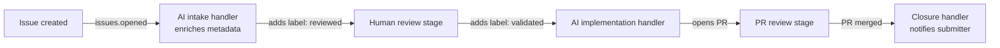

# Event-Driven Agent Routing

> Route work between AI agents and human teams by reacting to status-change events — label additions, project board transitions, PR state changes — rather than maintaining a central coordinator that owns the full workflow.

## Overview

In an orchestrator-worker pipeline, a parent agent holds the full plan and dispatches each step explicitly. Event-driven routing inverts this: each step is a stateless handler triggered by a state transition. The handler fires, does its work, and emits the next state. No agent owns the full sequence.

GitHub's accessibility feedback pipeline is a documented production deployment of this pattern: each stage in a multi-team pipeline (AI intake → human review → service team resolution) is a GitHub Actions workflow triggered by label additions and project board status changes — not by a central coordinator calling each step in turn. [Source](https://github.blog/ai-and-ml/github-copilot/continuous-ai-for-accessibility-how-github-transforms-feedback-into-inclusion/)

## How It Works

GitHub Issues and Projects already provide the state machine primitives. Labels, project field values, and PR states are all observable events that Actions can subscribe to.

**Trigger events:**

| Event | Activity types | Use for |
|-------|---------------|---------|
| `issues` | `labeled`, `unlabeled`, `opened`, `closed` | Route on label additions/removals |
| `pull_request` | `labeled`, `opened`, `review_requested`, `closed` | Route on PR state transitions |
| `projects_v2_item` | `edited` (with `changes` payload) | Route on project board status field changes |

[Source: GitHub Actions events docs](https://docs.github.com/en/actions/writing-workflows/choosing-when-your-workflow-runs/events-that-trigger-workflows#issues)

**Handler design:** Each workflow is stateless — it reads current issue/PR state, applies its logic, and writes the next state. Because state is stored in GitHub, re-running a handler is safe: re-adding a label re-fires it from a clean starting point.

**Human-agent handoffs:** Humans and agents are interchangeable at each stage. A human reviewer marks an issue as `reviewed` by applying a label; an agent responds identically. Neither side needs to know what comes next — sequencing lives in the trigger configuration.

## Diagram



Each node is a separate, stateless GitHub Actions workflow. No node knows about the others.

## Versus Orchestrator-Worker

| Dimension | Orchestrator-Worker | Event-Driven Routing |
|-----------|--------------------|--------------------|
| Coordination | Central agent holds full plan | Distributed — each handler knows only its stage |
| Human handoff | Explicit callback to orchestrator | Human applies a label; event fires next handler |
| Re-run semantics | Orchestrator must track progress | Re-add label → handler re-runs from clean state |
| Ownership boundaries | One owner (the orchestrator) | Each team owns the handlers for their stage |
| Failure mode | Orchestrator error stalls all stages | Missing handler stalls silently |

Google ADK and Anthropic's multi-agent research system use synchronous orchestrator-worker patterns. Anthropic notes that async event-driven execution would improve parallelism but "adds challenges in result coordination, state consistency, and error propagation." [Source](https://www.anthropic.com/engineering/multi-agent-research-system)

## Failure Modes

**Silent stall:** A state transition that fires no handler produces no error — the issue just stops advancing. Design for this explicitly:

- Every status must have a designated handler
- Add a fallback handler for `issues.labeled` that posts a comment when an unrecognized label is applied
- Include status timestamps so delayed advancement is detectable in reports

**Ambiguous ownership:** If two teams both have handlers for the same label, both fire. Define exclusive ownership per label/status: each status has exactly one handler.

GitHub's implementation mitigates silent stalls with automated weekly reports and manual re-run capability — any Action can be re-triggered by re-applying the label. [Source](https://github.blog/ai-and-ml/github-copilot/continuous-ai-for-accessibility-how-github-transforms-feedback-into-inclusion/)

## Example

GitHub's accessibility pipeline uses `issues: [opened, labeled]` to route between three tiers. The AI intake workflow fires on `issues.opened`, calls the GitHub Models API with prompts stored in `.github/copilot-instructions.md`, populates ~80% of metadata (severity, WCAG mapping, affected groups), then applies the next label. A separate workflow fires when a human applies `validated`, routing to the service team.

```yaml
# .github/workflows/ai-intake.yml
on:
  issues:
    types: [opened]

jobs:
  enrich:
    runs-on: ubuntu-latest
    steps:
      - name: Analyze with Copilot
        # calls GitHub Models API, applies labels based on response
```

Prompts live in `.github/copilot-instructions.md` and are modified via pull requests — no ML expertise needed to update AI behavior. [Source](https://github.blog/ai-and-ml/github-copilot/continuous-ai-for-accessibility-how-github-transforms-feedback-into-inclusion/)

## Key Takeaways

- Use event-driven routing when team ownership boundaries map cleanly to status transitions — each team owns the handlers for their stage
- Each handler must be stateless: read current state, do work, emit next state
- Silent stalls are the primary failure mode — design observability (timestamps, fallback handlers) before deploying
- Humans and agents are interchangeable handlers; the routing logic only sees the label, not who applied it
- `projects_v2_item` webhook events are in public preview — test before building production pipelines on them

## Sources

- [Continuous AI for Accessibility (GitHub Blog)](https://github.blog/ai-and-ml/github-copilot/continuous-ai-for-accessibility-how-github-transforms-feedback-into-inclusion/)
- [Events that trigger workflows (GitHub Docs)](https://docs.github.com/en/actions/writing-workflows/choosing-when-your-workflow-runs/events-that-trigger-workflows#issues)
- [projects_v2_item webhook (GitHub Docs)](https://docs.github.com/en/webhooks/webhook-events-and-payloads#projects_v2_item)
- [Multi-Agent Research System (Anthropic)](https://www.anthropic.com/engineering/multi-agent-research-system)

## Unverified Claims

- `projects_v2_item` webhook delivery via GitHub Actions (as distinct from webhook delivery to external services) is documented as public preview — behavior may differ from the stable `issues` trigger. `[unverified]`

## Related

- [Orchestrator-Worker Pattern](../multi-agent/orchestrator-worker.md)
- [Agent Composition Patterns: Chains, Fan-Out, Pipelines, Supervisors](agent-composition-patterns.md)
- [Human-in-the-Loop Placement](../workflows/human-in-the-loop.md)
- [Agent Handoff Protocols](../multi-agent/agent-handoff-protocols.md)
- [Bounded Batch Dispatch](../multi-agent/bounded-batch-dispatch.md)
- [Idempotent Agent Operations](idempotent-agent-operations.md)
