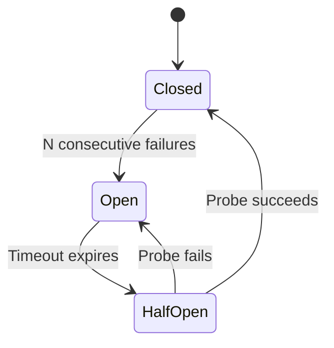

# Exception Handling and Recovery Patterns

> Agents fail. The question is whether they fail forward (recover and continue) or fail catastrophically (corrupt state, lose progress, repeat work).

## The Progressive Failure Hierarchy

Every agent failure response should follow this escalation:

**Self-correct**: the agent detects the error and retries or adjusts. Most tool errors resolve here — a failed file read triggers a path correction, a syntax error triggers a fix.

**Fallback**: the primary approach fails repeatedly, so the agent switches to an alternative strategy or model.

**Degrade gracefully**: the agent cannot complete the full task but delivers partial results rather than failing entirely.

**Escalate**: the agent surfaces the failure to a human with enough context to resolve it. Last resort, not first response.

## Git-Based Recovery

Git is the primary recovery mechanism for coding agents. Anthropic's approach for long-running agents ([multi-agent research system](https://www.anthropic.com/engineering/multi-agent-research-system)):

- **Commit frequently** with descriptive messages — each commit is a checkpoint
- **Write progress files** (e.g., `claude-progress.txt`) that survive session crashes — see [Goal Monitoring and Progress Tracking](goal-monitoring-progress-tracking.md)
- **Revert to known-good states** with `git revert` when changes go wrong

Git operations are cheap, atomic, and reversible — an agent that commits after each meaningful change can always roll back without losing everything. See [Rollback-First Design](rollback-first-design.md) for the broader design principle.

## Model-Driven Error Adaptation

Anthropic's finding from their [multi-agent research system](https://www.anthropic.com/engineering/multi-agent-research-system): telling the model a tool is failing and letting it adapt works "surprisingly well". The model reroutes to alternative tools or changes approach — without explicit fallback logic in the harness.

The simplest error handling strategy: catch the tool error, include the error message in the agent's next context, let the model decide what to do. This outperforms rigid retry logic for novel failure modes.

!!! warning "When model-driven adaptation fails"
    This approach breaks down for **silent failures** — the agent produces output without detecting the underlying error (stale data, partial writes, skipped validation). Model-driven adaptation requires the model to *know* something went wrong. Add output validation and data freshness checks for failure modes the model cannot observe directly.

## Durable Execution

For agents that must survive process crashes (not just tool errors), durable execution frameworks checkpoint state after every step:

**LangGraph** provides [three durability modes](https://docs.langchain.com/oss/python/langgraph/durable-execution):

| Mode | Behavior | Use case |
|------|----------|----------|
| `exit` | Persist only at graph exit (success, error, or interrupt) | Human-in-the-loop gates |
| `async` | Persist asynchronously while next step runs | Long-running research |
| `sync` | Persist synchronously before each step starts | Mission-critical workflows |

State is checkpointed to a configurable backend (Postgres, DynamoDB, and others). After a crash, the agent resumes from the last checkpoint rather than restarting.

**DBOS** takes a decorator-based approach: [`@DBOS.workflow` and `@DBOS.step`](https://docs.dbos.dev/typescript/reference/workflows-steps) persist execution state automatically, providing exactly-once semantics.

Both solve the same problem: an agent that ran for 30 minutes should not lose all progress to a process crash.

## Model Fallback

When a model provider fails, route to an alternative. LangChain's [`ModelFallbackMiddleware`](https://docs.langchain.com/oss/python/langchain/middleware/built-in) chains alternative models automatically (`Primary → Fallback 1 → Fallback 2`). This handles outages and rate limits, though different models may produce different results for the same prompt.

## Circuit Breakers for Tool Calls

Adapted from distributed systems: a circuit breaker tracks consecutive failures for a specific tool and temporarily disables it after a threshold.

**Closed**: tool calls proceed normally, failures are counted. **Open**: tool calls are blocked, agent uses alternatives. **Half-open**: a single probe call tests recovery.

In practice, most coding agents use a lighter-weight version: count failures, inform the model the tool is unreliable, and let model-driven adaptation handle routing. Full circuit breaker state machines are more common in multi-agent systems with shared tool infrastructure.

## The Rollback-Over-Prevention Philosophy

Let agents make recoverable mistakes rather than preventing all mistakes: sandbox execution, review gates before permanent effects, session trees for fork/explore/discard, and checkpoints at every meaningful boundary. Restrictive permissions limit capability more than they reduce risk. See [Rollback-First Design](rollback-first-design.md) for this tradeoff in detail.

## When This Backfires

The progressive failure hierarchy adds latency and complexity. These conditions favor failing fast and re-running from scratch instead:

- **Short-lived tasks with no side effects** — a task that completes in under 30 seconds and makes no external writes gains nothing from recovery logic; retry overhead exceeds the benefit.
- **Cascading failures in multi-agent systems** — when multiple agents share infrastructure (databases, queues, tool APIs), one agent's recovery attempts can amplify load on already-stressed components. Circuit breakers and backpressure must be coordinated across agents, not just per-agent.
- **Silent corruption without validation** — recovery only works when the agent can detect that something went wrong. If the task involves writing to external systems without output validation, an agent that "recovers" and continues may compound bad state. Fail fast with a human escalation is safer than progressive recovery when the integrity of intermediate state cannot be verified.

## Example

A coding agent tasked with refactoring a module hits a test failure after changing a function signature:

1. **Self-correct** — the agent reads the test error, identifies the mismatched argument, and fixes the call site. Tests pass.
2. On the next file, the same refactor produces a circular import. The agent retries twice, fails both times.
3. **Fallback** — the agent abandons the automated refactor for that file and applies a manual re-export to break the cycle.
4. A third file depends on an external service that is down. The agent cannot run integration tests.
5. **Degrade gracefully** — the agent commits the passing unit-tested changes and leaves the integration-dependent file unchanged, noting the skip in its progress log.
6. The agent encounters a permissions error trying to update a protected config file.
7. **Escalate** — the agent opens a draft PR with its completed work and flags the config change for human review, including the error message and the intended edit.

Throughout, the agent commits after each successful file change (`git commit -m "refactor: update signature in <file>"`), so any revert affects only one file.

## Related

- [Rollback-First Design](rollback-first-design.md)
- [Circuit Breakers](../observability/circuit-breakers.md)
- [Idempotent Agent Operations](idempotent-agent-operations.md)
- [Agent Harness](agent-harness.md)
- [Harness Engineering](harness-engineering.md)
- [Human-in-the-Loop Placement](../workflows/human-in-the-loop.md)
- [Loop Detection](../observability/loop-detection.md)
- [Trajectory Logging and Progress Files](../observability/trajectory-logging-progress-files.md)
- [Agent Backpressure](agent-backpressure.md)
- [Cross-Vendor Competitive Routing](cross-vendor-competitive-routing.md)
- [Agent Self-Review Loop](agent-self-review-loop.md)
