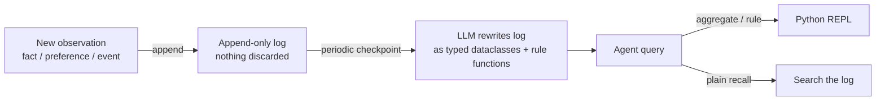

# Executable Memory: User State as Code for Personalized Agents

> Compile a user's memory log into typed code and call functions instead of retrieving passages — beats retrieval on aggregates, loses on plain recall.

Executable memory represents a personalized agent's view of the user — trips, contacts, medical visits, transactions — as typed Python objects with rule functions rather than a corpus of retrievable text, so the agent answers a query by calling a function over those objects — `sum(t.cost for t in trips if t.year == 2024)` — instead of aggregating retrieved passages. That design beats text retrieval on aggregate queries, rule enforcement, and contradiction handling, and loses to it on plain recall. Two phases keep it honest: an append-only log preserves every observation, and a periodic checkpoint compiles the log into dataclasses ([Li 2026 — arXiv:2606.16707](https://arxiv.org/abs/2606.16707)). The codebase analogue (commits, ASTs, task graphs as code) is [code-native memory substrates](code-native-memory-substrates.md); this page covers the user-state instance.

## When the pattern pays

Use executable memory only when at least one row applies:

| Workload signal | Why code beats retrieval |
|---|---|
| Aggregate queries — count, sum, group-by, top-k, time-window filter | Retrieval forces the LLM to reduce across passages; a Python function does it deterministically. UaC reports 99% accuracy across 100 aggregate cases against 43% for MemMachine and 6% for Mem0 ([Li 2026, Table 3](https://arxiv.org/abs/2606.16707)). |
| Rule enforcement — drug-allergy conflicts, dietary constraints, scheduling rules | Rules become predicates that fire at decision time, not optional context the model may ignore. |
| Contradiction-sensitive history — preferences that change, conflicting facts across sessions | The append-only log preserves every prior fact. Checkpoint generation can encode contradictions as explicit `if`/`elif` arbitration rather than leaving which version surfaces to chance. |

On the LOCOMO conversation-recall benchmark — pure "what did the user say" retrieval — text-based systems beat code-as-memory: MemMachine reaches 91.69% ([Yang et al. 2026 — arXiv:2604.04853](https://arxiv.org/abs/2604.04853)), Memobase 75.78% ([Memobase LOCOMO benchmark](https://github.com/memodb-io/memobase/blob/main/docs/experiments/locomo-benchmark/README.md)), against UaC's 78.8% ([Li 2026](https://arxiv.org/abs/2606.16707)). The pattern complements retrieval-based memory ([Agent Memory Patterns](agent-memory-patterns.md)), not replaces it.

## How the two phases work



The append-only log is the safety property. It keeps every observation verbatim. Contradictions stay visible, so the checkpoint pass has the material to encode arbitration rules rather than discarding history.

The checkpoint is the performance property. A model rewrites the log as typed Python — dataclasses for entities (`Trip`, `Contact`, `MedicalVisit`), typed lists for collections, rule functions for invariants. Once compiled, the agent invokes those objects through a Python REPL rather than reasoning over retrieved text. Ning et al. catalog this broader shift — code as an operational substrate for agent reasoning, memory, and tool use — across an established design space ([arXiv:2605.18747](https://arxiv.org/abs/2605.18747)).

## Why it works

UaC's structured retrieval matches its full-context upper bound at 100% across all record sizes ([Li 2026, Table 3](https://arxiv.org/abs/2606.16707)) — the lift is not "better retrieval." It comes from converting an aggregation that the LLM does unreliably (multi-step arithmetic across retrieved passages) into a function call the model executes reliably. The log preserves the temporal ordering aggregates need; a retrieval system that compresses the past loses it.

## When this backfires

- Recall-dominated workloads. When the agent's job is to find the relevant past message rather than compute a value across history, text retrieval beats UaC on LOCOMO (numbers above) and the code-generation cost does not earn itself back.
- Fast-evolving user state without a clear schema. When the checkpoint cadence is shorter than the median time between schema changes — early-stage product onboarding, evolving permissions models — each checkpoint over-fits the moment or rewrites the schema, breaking rule functions that downstream agent calls assume exist.
- Weak code-generation models. Checkpoint passes running on small open-weights chat models produce dataclasses with silent type errors that surface only at agent-query time. A broken checkpoint emits zero facts; a noisy embedding still returns plausibly-relevant material.
- Regulated decision support (HIPAA-covered clinical, SOC 2 / SOX financial calc, FDA Software-as-a-Medical-Device). The checkpoint is code that runs against user data. Compliance has seen retrieval indexes; it has not seen model-authored Python deciding what counts as a drug-allergy conflict. The log is auditable; the checkpoint introduces a new artifact class.
- Contradiction-heavy domains without explicit resolution rules. The paper acknowledges that checkpoints can encode conflicting rules with no automatic arbitration — execution order (first-match wins) is the default tie-break ([Li 2026](https://arxiv.org/abs/2606.16707)). The model silently picks a winner the user did not approve.
- Workloads that fit in one context window. Full Context + Python REPL matches UaC at 100% on aggregates ([Li 2026, Table 3](https://arxiv.org/abs/2606.16707)) — if history fits in context the checkpoint earns nothing.

## Example

A personal-health agent tracks medications, allergies, and recent meals. The user asks: "Is it safe to take ibuprofen with what I had for lunch?"

Retrieval memory searches for "ibuprofen", "allergy", and "lunch" passages, returns top-k snippets, and asks the model to reconcile them. Top-k may surface a six-month-old "no allergies" note alongside last week's "developed NSAID sensitivity" — the model adjudicates from text similarity scores.

Executable memory holds the user as typed objects with rule functions ([Li 2026, Listing 6](https://arxiv.org/abs/2606.16707) shows the dataclass shape):

```python
@dataclass
class Allergy:
    substance: str
    severity: str
    confirmed_date: date

@dataclass
class Meal:
    items: list[str]
    timestamp: datetime

def check_drug_interaction(drug: str, meal: Meal, user: User) -> str | None:
    matches = [a for a in user.allergies if a.substance.lower() == drug.lower()]
    if matches:
        latest = max(matches, key=lambda a: a.confirmed_date)
        return f"Allergy logged {latest.confirmed_date}: {latest.severity}"
    conflicts = [item for item in meal.items if any(a.substance.lower() in item.lower() for a in user.allergies)]
    if conflicts:
        return f"Meal items may interact: {', '.join(conflicts)}"
    return None
```

The agent calls `check_drug_interaction("ibuprofen", lunch, user)` and gets a deterministic answer that uses the most recent confirmed allergy and the actual meal contents. The append-only log still contains the earlier "no allergies" note — auditable — but the checkpoint encoded the contradiction-resolution rule as code rather than asking the model to infer it from snippets.

## Key Takeaways

- Executable memory uses an append-only log (nothing discarded) plus a periodic code checkpoint (typed dataclasses + rule functions) — the log is the safety property, the checkpoint is the performance property.
- It dominates retrieval on aggregate, rule-enforcement, and contradiction-sensitive queries (see table above).
- It loses to text retrieval on plain recall — treat the pattern as a complement to a retrieval index, not a replacement: code path for aggregates and rules, index for "what did the user say about X."
- Skip the pattern when the user history fits in one context window — Full Context + Python REPL matches UaC at 100% on aggregates with no checkpoint cost ([Li 2026, Table 3](https://arxiv.org/abs/2606.16707)).

## Related

- [Agent Memory Patterns: Learning Across Conversations](agent-memory-patterns.md) — the retrieval-based memory taxonomy this pattern complements
- [Code-Native Memory Substrates](code-native-memory-substrates.md) — the same code-as-memory idea applied to *codebase* state rather than user state
- [Memory Retrieval as a Control Decision](memory-retrieval-as-control.md) — the abstention / gating mechanism that pairs with checkpoint queries when no rule matches
- [Externalization in LLM Agents](externalization-in-llm-agents.md) — the broader externalization framework this pattern instantiates (memory as one of four cognitive externalization surfaces)
- [Skill Program Functions](skill-program-functions.md) — the action-side analogue: executable guardrails over agent state, not user state
