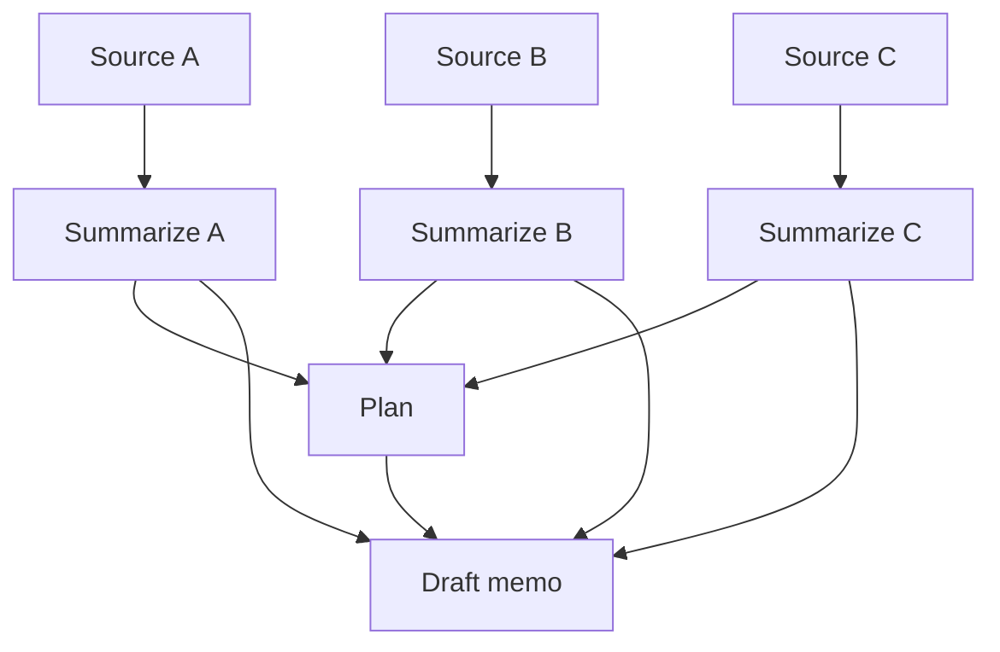

# Execution Lineage: DAG of Artifacts vs Agent Loops

> Represent revisable AI-native work as a DAG of artifact-producing computations with explicit dependencies, stable intermediate boundaries, and identity-based replay — so unrelated edits don't perturb the final output.

## The Maintained-State Quality Gap

An agent loop that interleaves reasoning, tool use, and iterative refinement can produce a polished final answer while leaving the underlying state inconsistent. Rosen and Rosen call this the gap between *final answer quality* and *maintained-state quality* — both can be measured, and they don't move together ([arXiv:2605.06365](https://arxiv.org/abs/2605.06365)).

The mechanism is implicit conversational state. When the agent revises a multi-artifact work product (a memo with sources, summaries, and conclusions; a PR with research notes, plan, and code), the loop has no structural way to say *which* artifacts must change, which must remain identical, and how a change should propagate. The model regenerates plausible outputs each pass and contamination leaks in from unrelated context.

## The Three Structural Primitives

Execution lineage replaces the loop with a directed acyclic graph of artifact-producing computations and adds three properties ([arXiv:2605.06365](https://arxiv.org/abs/2605.06365)):

1. **Explicit dependencies** — each node declares the artifacts it consumes; nothing is read implicitly from a transcript.
2. **Stable intermediate boundaries** — intermediate artifacts (summaries, plans, draft sections) are first-class outputs with stable identity, not throwaway scratch.
3. **Identity-based replay** — when an input changes, only descendants of the changed node re-run; everything else is reused by identity.

The mechanism is the same one that gives Make, Bazel, and asset-based orchestrators like [Dagster](https://dagster.io/learn/data-pipeline-orchestration-tools) reproducibility on data pipelines. The contribution of the paper is applying it to LLM-produced artifacts and measuring the gap empirically.



When Source B changes, only `Summarize B`, `Plan`, and `Draft memo` re-run; `Summarize A` and `Summarize C` are reused. When an unrelated branch is added, none of the existing nodes re-run.

## What the Experiments Showed

Rosen and Rosen ran two controlled policy-memo update tasks against loop-centric baselines ([arXiv:2605.06365](https://arxiv.org/abs/2605.06365)):

- **Unrelated-branch update** — DAG replay preserved the final memo exactly across all runs, with zero churn and zero contamination from the unrelated branch. Loop baselines regenerated the memo and frequently imported unrelated context.
- **Intermediate-artifact edit** — all systems reflected the new constraint in the final memo, but only DAG replay achieved upstream preservation, downstream propagation, unaffected-artifact preservation, and cross-artifact consistency.

The authors are explicit that loop baselines remain competitive on bounded one-shot synthesis where every source fits in context. The DAG earns its keep when work is *revised* across time.

## When Loops Beat the DAG

The pattern is conditional, not universal. A loop is the right shape when:

- The work is one-shot — produce a PR, ship it, no further revisions.
- Fan-out is genuinely dynamic — the set of downstream sub-tasks depends on runtime decisions the agent hasn't made yet. A static DAG either over-restricts the agent or needs a meta-layer that re-introduces loop state ([Static-to-Dynamic Workflow Survey](https://arxiv.org/abs/2603.22386)).
- Tools have non-idempotent side effects — `send-email`, `create-pr`, `charge-card`. DAG replay assumes a node can re-run cleanly given identical inputs; effectful nodes need an idempotency layer outside the model.
- Intermediate boundaries don't factor — when artifacts share deep mutable state, "stable boundaries" don't exist and the DAG degenerates to a single mega-node.

Classical DAG schedulers also don't handle non-deterministic LLM output, reasoning-failure-as-primary-error-mode, or non-idempotent retries without explicit additions ([Kinde, *Orchestrating Multi-Step Agents*](https://www.kinde.com/learn/ai-for-software-engineering/ai-devops/orchestrating-multi-step-agents-temporal-dagster-langgraph-patterns-for-long-running-work/)).

## Relation to Existing Patterns

The DAG-of-artifacts model composes with — and is distinct from — three adjacent patterns already documented:

- [Cognitive Reasoning vs Execution](cognitive-reasoning-execution-separation.md) splits *what to do* from *how to do it* via typed tool boundaries. Execution lineage operates one layer up: it structures the *artifacts* that flow between calls.
- [Event Sourcing for Agents](../observability/event-sourcing-for-agents.md) (ESAA) uses an append-only event log for replay-verifiable execution. The log gives *temporal* replay; execution lineage gives *dependency-scoped* replay — only descendants of changed inputs re-run.
- [Durable Interactive Artifacts](durable-interactive-artifacts.md) treats agent outputs as persistent re-openable workspace objects. Execution lineage adds the dependency edges between them.

Productized analogues are starting to ship: Cloudflare Artifacts (May 2026 beta) gives agent outputs git-like versioning with parent lineage ([InfoQ coverage](https://www.infoq.com/news/2026/05/cloudflare-artifacts-ai-agents/)); [Union.ai](https://www.union.ai/blog-post/move-fast-and-dont-break-things-introducing-artifacts-lineage-and-reactive-workflows) wires artifact lineage as the medium of exchange between workflows.

## Example

A multi-file PR being revised after review feedback is the canonical use case. The naive loop:

**Before — agent loop regenerates everything:**

```
1. Read review comment "rename `User` to `Account` in module B"
2. Re-read all files, regenerate plan, regenerate diffs
3. Module A and C touched despite no requested change
4. Test fixtures reshuffled because the model re-decided shape
```

**After — DAG replay scoped by dependency:**

```
1. Mutate input: rename in module B's spec node
2. Re-run: module-B implementation, module-B tests, integration tests
3. Untouched: module A, module C, fixtures, lockfile
4. Final PR diff is exactly the rename plus its closure
```

The loop produces a polished PR that may pass review on second look. The DAG replay produces a PR whose diff is *provably* the closure of the requested change.

## Key Takeaways

- Final-answer quality and maintained-state quality are distinct measurements; a polished output can mask state inconsistency that compounds over revisions.
- Adopt the DAG-of-artifacts model when work is revised across time and intermediate artifacts factor cleanly. Stick with a loop when the task is one-shot or fan-out is genuinely runtime-decided.
- The mechanism is dependency-explicit caching with content identity — the same primitive that makes Make and Dagster reproducible, applied to LLM-produced artifacts.
- Side-effectful nodes need an idempotency layer outside the DAG model; replay alone doesn't make `send-email` safe.

## Related

- [Cognitive Reasoning vs Execution: A Two-Layer Agent](cognitive-reasoning-execution-separation.md)
- [Event Sourcing for Agents](../observability/event-sourcing-for-agents.md)
- [Durable Interactive Artifacts](durable-interactive-artifacts.md)
- [Beads: Structured Task Graphs as External Agent Memory](beads-task-graph-agent-memory.md)
- [Simulation and Replay Testing for Agent Verification](../workflows/simulation-replay-testing.md)
