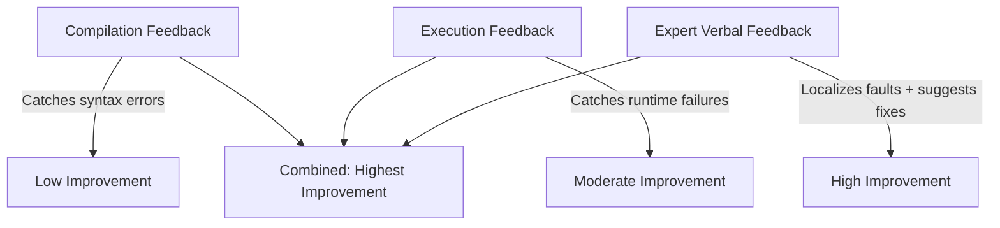

# Feedback as Capability Equalizer

> Weaker models with high-quality iterative feedback outperform stronger models operating without feedback — feedback loop investment yields higher returns than model upgrades.

## The Evidence

ConvCodeWorld, an ICLR 2025 benchmark for conversational code generation, tested 16 LLMs across 9 feedback combinations. The central finding: **DeepSeek-Coder-6.7B with expert verbal feedback achieved 82.8% Recall, exceeding GPT-4o's single-turn 50.8%** — a 6.7B parameter model outperforming a frontier model through iterative feedback alone ([Han et al., ICLR 2025](https://arxiv.org/abs/2502.19852)).

This is not an isolated result. LangChain improved Terminal Bench 2.0 scores from 52.8% to 66.5% through pure harness changes — no model change ([LangChain](https://blog.langchain.com/improving-deep-agents-with-harness-engineering/)). LLMloop's five automated feedback loops raised pass@10 from 76.2% to 90.2% ([Ravi et al., ICSME 2025](https://arxiv.org/html/2603.23613v1)).

The pattern holds across contexts: **improving the feedback loop outperforms upgrading the model**.

## Feedback Type Hierarchy

Not all feedback is equal. ConvCodeWorld categorized feedback into three types, each with quality tiers ([Han et al., ICLR 2025](https://arxiv.org/abs/2502.19852)):

| Type | Description | Impact |
|------|-------------|--------|
| **Compilation (fc)** | Syntax and type errors only; no refinement guidance | Lowest — catches surface errors but provides no direction |
| **Execution (fe/fe\*)** | Runtime errors with partial or full test coverage | Moderate to high — full coverage (fe\*) enables precise fault localization |
| **Verbal (fv/fv\*)** | Natural language feedback at novice or expert level | Highest when expert-level — detailed fault localization and refinement guidance |

The strongest combination was full test coverage + expert verbal feedback (fc, fe\*, fv\*), which pushed GPT-4 to 92.5% Recall. Compilation-only feedback produced significantly lower gains.



The practical implication: **invest in the richest feedback your harness can provide**. A type checker alone is a floor, not a ceiling. Adding test execution and structured error messages with remediation guidance unlocks substantially more model capability.

## The Generalization Trap

Models trained on specific feedback combinations fail when encountering unfamiliar feedback types. ReflectionCoder, fine-tuned on compilation + execution + novice verbal feedback, showed dramatic performance degradation when encountering expert-level verbal feedback. The base DeepSeek-Coder model outperformed its fine-tuned variant on the unfamiliar feedback type ([Han et al., ICLR 2025](https://arxiv.org/abs/2502.19852)).

Design principle: **match feedback types to what the model was trained on**. A model trained primarily with execution feedback will extract more value from test output than from verbose natural language critique. When introducing new feedback types, verify that the model can use them — do not assume generalization.

## Efficiency vs Coverage Tradeoff

Models that solve problems quickly do not solve the most problems. GPT-4o achieved the highest MRR (65.3 — fewest turns per solved problem) but GPT-4 led in Recall (92.5 — most problems solved overall) under full feedback ([Han et al., ICLR 2025](https://arxiv.org/abs/2502.19852)).

This tradeoff matters for iteration budget decisions:

- **Optimize for MRR** when token cost per problem matters and partial coverage is acceptable — use a fast model with tight feedback loops
- **Optimize for Recall** when completeness matters and you can afford more turns — use a persistent model with comprehensive feedback

Most agentic coding workflows should optimize for Recall: an agent that takes more turns but solves the problem is more valuable than one that gives up quickly.

## Models Cannot Self-Evaluate

A critical enabler: models perform "very poorly" at detecting their own correctness or safety issues. Only with explicit feedback from external tools — test runners, static analyzers, type checkers — do repair capabilities emerge ([Fakhoury et al., 2024](https://arxiv.org/abs/2412.14841)).

This confirms that [agent backpressure](agent-backpressure.md) is not optional. Self-assessment is unreliable. External feedback signals are the mechanism that unlocks iterative improvement.

## Designing for Feedback Quality

Feedback quality has two dimensions: **signal precision** (how accurately the feedback localizes the problem) and **LLM consumability** (how effectively the model can act on it).

Custom linter messages that include remediation instructions outperform raw error output because they provide actionable context at the moment of violation ([Fowler/Bockeler](https://martinfowler.com/articles/exploring-gen-ai/harness-engineering.html)):

```
# Low signal — raw error
ERROR: Service layer cannot import from UI layer.

# High signal — actionable remediation
ERROR: Service layer cannot import from UI layer.
  Move shared logic to a Provider in src/providers/,
  or restructure to keep UI-specific code in src/ui/.
  See docs/architecture/layer-rules.md for the dependency diagram.
```

The remediation message provides what the model needs: what is wrong, what to do instead, and where to find more context. This is feedback optimized for LLM consumption.

## Static Benchmarks as Cheap Proxies

ConvCodeBench, a static benchmark using pre-generated feedback logs, correlated 0.82-0.99 (Spearman's rank) with the dynamic ConvCodeWorld benchmark ([Han et al., ICLR 2025](https://arxiv.org/abs/2502.19852)). This validates using cheaper static evaluation as a proxy when measuring how models respond to feedback — you do not need to run full interactive environments to compare feedback strategies.

## Example

A team runs an agentic coding workflow with Claude Sonnet for implementation tasks. The agent produces correct code ~60% of the time on first attempt. Two improvement paths:

**Path A — Upgrade the model:** Switch to Claude Opus. Higher per-token cost, marginal improvement on straightforward tasks where Sonnet already succeeds, meaningful improvement only on complex reasoning tasks.

**Path B — Improve the feedback loop:** Add strict TypeScript types to the codebase (compilation feedback). Write targeted test cases for the areas the agent modifies (execution feedback). Configure linter rules with remediation messages explaining the correct pattern (structured verbal feedback). The agent now self-corrects through a write-check-fix loop — each error message guides the next attempt.

Path B produces higher overall success rates at lower cost. The model did not change; the feedback environment did. Path A remains appropriate for the subset of tasks that require deeper reasoning, but Path B addresses the larger volume of work where feedback quality is the binding constraint.

## Key Takeaways

- A 6.7B model with expert feedback outperforms GPT-4o without feedback — feedback loop quality is a stronger lever than model scale ([Han et al., ICLR 2025](https://arxiv.org/abs/2502.19852)).
- Feedback types form a hierarchy: compilation < execution < expert verbal. Invest in the richest feedback your harness can provide.
- Match feedback types to the model's training — do not assume generalization across unfamiliar feedback formats.
- Models cannot self-evaluate reliably. External feedback signals (tests, linters, type checkers) are not optional — they are the mechanism that enables iterative improvement.
- Optimize iteration budgets using the efficiency-coverage tradeoff: fast resolution (MRR) and broad coverage (Recall) are different goals requiring different strategies.

## Related

- [Agent Backpressure](agent-backpressure.md) — the automated feedback loops this pattern depends on
- [L1 → L2: Adding Feedback Loops](../frameworks/brownfield-to-agent-first/level-1-to-2.md) — how to implement compilation, execution, and structured verbal feedback in a brownfield repo
- [Cost-Aware Agent Design](cost-aware-agent-design.md) — routing by complexity; feedback quality changes which tier is needed
- [Harness Engineering](harness-engineering.md) — designing the environment that provides high-quality feedback
- [Evaluator-Optimizer Pattern](evaluator-optimizer.md) — the generator-evaluator loop that operationalizes iterative feedback
- [Heuristic-Based Effort Scaling](heuristic-effort-scaling.md) — allocating iteration budget proportional to task complexity
- [Temporary Compensatory Mechanisms](temporary-compensatory-mechanisms.md) — feedback loops as compensating scaffolding for model limitations
