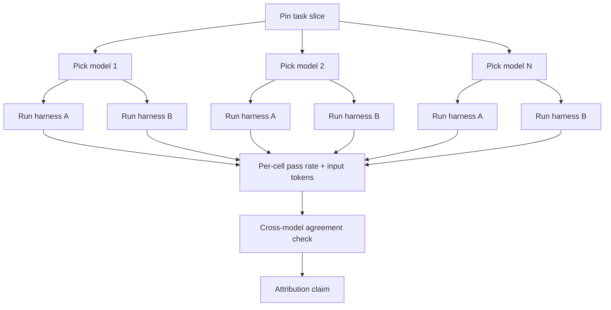
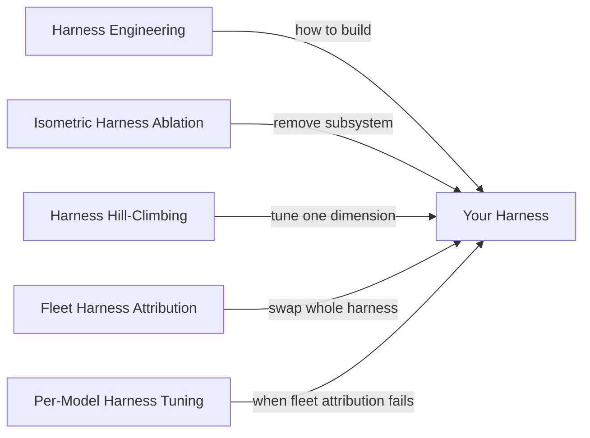

# Fleet Harness Attribution: Pinning the Model to Compare Whole Harnesses

> Pin the model and task, swap whole harnesses, then measure pass rate and tokens across a model fleet to attribute outcomes to the harness.

Apply this when (a) you run the same harness against more than one backing model, (b) you measure input-token consumption alongside task-resolution rate, and (c) you guard for per-model interaction effects. Outside those conditions the method either collapses into ordinary [isometric harness ablation](isometric-harness-ablation.md) or reports interaction terms as harness contribution.

## The methodology

Hold the model and the task fixed. Swap the harness — your own versus a vendor's native CLI, or harness-A versus harness-B. Repeat the swap on every model in the fleet. Record two outputs per cell: task-resolution rate and input tokens consumed. The cross-model agreement on pass-rate parity and token efficiency is the attribution claim.

GitHub's Copilot harness team applied this against five benchmarks — SWE-bench Verified, SWE-bench Pro, SkillsBench, TerminalBench, Win-Hill — comparing the Copilot harness with each vendor's native CLI (Claude Code, Codex CLI). They controlled for context window size, reasoning effort, and tool availability to keep the swap fair. Across 20+ models the Copilot harness reached on-par task resolution against vendor harnesses with lower token consumption across most configurations; on TerminalBench differences fell within stochastic variance ([GitHub](https://github.blog/ai-and-ml/github-copilot/evaluating-performance-and-efficiency-of-the-github-copilot-agentic-harness-across-models-and-tasks)).

## The two output metrics

Pass rate alone reduces to ordinary harness comparison and misses the cost-side win. Input-token consumption is the harness output most decoupled from model capability — it tracks context-engineering choices the harness makes (what to load, what to summarise, when to externalise), not how many tokens a model needs per reasoning step. The Agentic Harness Engineering paper attributes harness gains to tools, middleware, and long-term memory rather than the system prompt — structural levers the token-input metric exposes directly ([AHE](https://arxiv.org/abs/2604.25850)).

| Output metric | What it measures | Why both matter |
|---|---|---|
| Task-resolution rate | Did the harness get the model to the answer | Headline capability claim |
| Input-token consumption | Did the harness waste context or use it strategically | Cost claim independent of model token pricing |

A harness can win on either metric alone. The interesting result is parity on task resolution plus a token reduction — what GitHub reported across most cells. A harness that wins on tokens but loses on task resolution is buying cost with capability; one that wins on task resolution but spends more tokens is buying capability with cost. The pair tells you which trade you made.

## Why It Works

Pinning the model fixes its capability; pinning the task fixes the difficulty; the swap leaves the harness as the only varying factor. Variance in pass rate or token consumption then traces to harness orchestration — system prompt, tool set, retry logic, context management. Repeating the measurement across a model fleet does two distinct things. It averages out one model's idiosyncratic interaction with the harness, producing a fleet-mean estimate. And it exposes interaction terms — when per-model deltas disagree in sign or magnitude, the harness contribution is partly an interaction the experiment cannot decompose without a factorial design.

Harness-Bench formalises this as the attribution argument: agent capability should be reported at the model-harness configuration level rather than attributed to the base model alone — the same controlled-variable logic generalised to 106 sandboxed tasks and 5,194 trajectories ([Harness-Bench](https://arxiv.org/abs/2605.27922)).

## How to run it

1. Pin a representative task slice with deterministic grading — SWE-bench Verified, your own held-out eval, or whatever your team already grades reproducibly. Without a graded slice the method produces noise dominated by per-run variance.
2. Pick a fleet of two or more models that differ on a dimension you care about — vendors (Anthropic, OpenAI, Google), tiers (Haiku, Sonnet, Opus), or generations.
3. For each (model, harness) cell, run the slice and record both pass rate and total input tokens. Use [pass^k](../verification/pass-at-k-metrics.md) or multi-trial averaging if per-cell variance approaches your effect size.
4. Lay out the matrix. Cells where the harness ranking agrees across models support a portability claim. Cells where it disagrees flag a per-model interaction — log them as conditions, not as part of the headline result.
5. Report the result at the model-harness pair level, not at the harness level alone. A claim of the form "harness A wins" should always carry the fleet it was measured on.

## When This Backfires

- Single-model deployments. No fleet to attribute across, no portability surface to claim. [Isometric harness ablation](isometric-harness-ablation.md) — remove one subsystem at a time within the model you ship — is the right tool. The fleet machinery costs measurement budget without earning anything back.
- Strong per-model interactions. Per-model harness tuning produces 10–20 pp deltas on tau2-bench — GPT-5.3 Codex from 33% to 53%, Claude Opus 4.7 from 43% to 53% with profile-level overrides ([LangChain](https://blog.langchain.com/tuning-deep-agents-different-models)). When the deltas point different ways for different models, the same harness across the fleet attributes interaction terms to the harness layer and overstates portability. The treatment is [Per-Model Harness Tuning](per-model-harness-tuning.md), not a fleet-mean claim.
- No paired token-efficiency baseline. Reading only pass rate collapses the method into ordinary harness comparison and misses the cost-side win. The GitHub Copilot result is mostly a token-reduction result with pass-rate parity — measuring only pass rate would have shown nothing.
- Vendor-managed harness. Claude Managed Agents, Copilot consumer tiers, and most cloud APIs route to harness components you cannot vary. There is no harness to attribute. The framework applies to teams shipping their own scaffold against multiple models, not to teams consuming a managed agent.
- Stochastic noise larger than the effect. GitHub's TerminalBench differences fell within stochastic variance ([GitHub](https://github.blog/ai-and-ml/github-copilot/evaluating-performance-and-efficiency-of-the-github-copilot-agentic-harness-across-models-and-tasks)). Single-trial fleet attribution on a noisy benchmark cannot separate harness from noise. Use multi-trial averaging or accept that this slice is not informative.
- Tier-skewed fleet. Stronger model backends both score higher and exhibit lower cross-harness variance — harness investment pays back differently at different tiers ([Harness-Bench](https://arxiv.org/abs/2605.27922)). A fleet weighted toward one tier produces an attribution claim that does not generalise to the others.

## Relation to adjacent methods

- [Isometric Harness Ablation](isometric-harness-ablation.md) — removes one subsystem within a fixed harness; fleet attribution swaps whole harnesses across multiple models. The former ranks subsystem investment; the latter ranks harness choice.
- [Harness Hill-Climbing](harness-hill-climbing.md) — within-harness iterative optimisation; fleet attribution is between-harness comparison. Hill-climb after you have picked the harness; attribute to pick it.
- [Per-Model Harness Tuning](per-model-harness-tuning.md) — the failure case fleet attribution makes visible. When per-cell deltas disagree, per-model overrides are the treatment, not a generic harness.
- [Eval Strategy by Agent Generation](eval-strategy-by-agent-generation.md) — the locator that picks the eval surface from your current structure. Fleet attribution is one Gen-6 eval method, applicable when the system is a harness wrapping a model fleet.

## Key Takeaways

- Pin the model and task, swap whole harnesses, measure pass rate alongside input-token consumption across a model fleet — the matrix attributes outcomes to the harness layer.
- Token efficiency is a co-equal output metric, not a downstream cost concern; the GitHub Copilot result is mostly a token-reduction win with pass-rate parity.
- Cells where harness ranking disagrees across models flag per-model interaction — the treatment is [Per-Model Harness Tuning](per-model-harness-tuning.md), not a fleet-mean claim.
- Report results at the model-harness pair level — "harness A wins" without the fleet it was measured on is incomplete ([Harness-Bench](https://arxiv.org/abs/2605.27922)).
- Single-model teams, managed harnesses, and noise-dominated slices are out of scope; pick [isometric ablation](isometric-harness-ablation.md) or skip the method.

## Related

- [Isometric Harness Ablation](isometric-harness-ablation.md) — within-harness subsystem ranking; pair this method with fleet attribution for the inside-vs-outside view
- [Harness Hill-Climbing](harness-hill-climbing.md) — single-dimension iterative tuning that runs after you have picked the harness
- [Per-Model Harness Tuning](per-model-harness-tuning.md) — what to do when fleet attribution exposes per-model interaction
- [Eval Strategy by Agent Generation](eval-strategy-by-agent-generation.md) — locates the eval surface from current architecture; this is one Gen-6 method
- [Cost-Aware Agent Design](../token-engineering/cost-aware-agent-design.md) — token efficiency as a routing axis; complements the cost-side metric here
