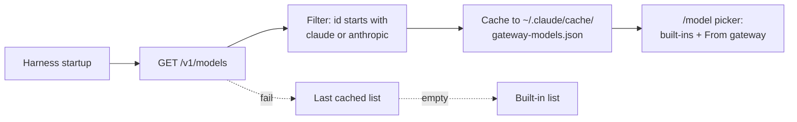

# Gateway Model Routing

> Point the harness at an Anthropic-compatible gateway and let the gateway's `/v1/models` endpoint populate the model picker — a single config knob controls both inference target and visible catalogue.

## The Pattern

A traditional harness ships with a hard-coded model list and uses a base-URL override only to redirect inference traffic. Gateway-served models then have to be added manually with custom-model env vars or settings flags. The pattern decouples model identity from the harness binary: when the inference endpoint and the catalogue come from the same gateway, model choice follows the same configuration path as model invocation.

Claude Code 2.1.126 (2026-05-01) ships this pattern as a built-in. From the [changelog](https://code.claude.com/docs/en/changelog): "The `/model` picker now lists models from your gateway's `/v1/models` endpoint when `ANTHROPIC_BASE_URL` points at an Anthropic-compatible gateway."

## The Discovery Contract

The harness queries the gateway at startup, applies a namespace filter, and renders discovered entries in `/model` alongside built-ins ([Claude Code: LLM gateway](https://code.claude.com/docs/en/llm-gateway)). Four contract points matter:



1. **Trigger** — runs only when `ANTHROPIC_BASE_URL` points at a non-Anthropic host exposing the Anthropic Messages format. It does not run for Bedrock or Vertex pass-through endpoints, nor when the variable is unset or points at `api.anthropic.com`.
2. **Auth** — the discovery request reuses inference credentials: `ANTHROPIC_AUTH_TOKEN` as bearer, or `ANTHROPIC_API_KEY` as `x-api-key`, plus headers from `ANTHROPIC_CUSTOM_HEADERS`. No second auth surface.
3. **Filter** — only IDs starting with `claude` or `anthropic` are added to the picker. Each entry is labelled "From gateway" using the response's `display_name` field.
4. **Failure mode** — on request failure or missing endpoint, the picker falls back to the previously cached list, then to the built-in list. The harness keeps working.

## Gateway Requirements

Anthropic documents a minimum API contract for any gateway in front of Claude Code: it must expose `/v1/messages` and `/v1/messages/count_tokens`, and it must forward the `anthropic-beta` and `anthropic-version` request headers. "Failure to forward headers or preserve body fields may result in reduced functionality or inability to use Claude Code features" ([Claude Code: LLM gateway](https://code.claude.com/docs/en/llm-gateway)).

Two header behaviours affect gateway operators specifically:

- `X-Claude-Code-Session-Id` is sent on every request so proxies can aggregate per-session traffic without parsing the body.
- An attribution block is prepended to the system prompt. The Anthropic API strips it before processing, so first-party prompt caching is unaffected — but a gateway running its own cache keyed on the full request body will see drift. Set `CLAUDE_CODE_ATTRIBUTION_HEADER=0` to omit it ([Claude Code: LLM gateway](https://code.claude.com/docs/en/llm-gateway)).

## Capability Declaration

Discovery puts a model in the picker; it does not tell the harness what features that model supports. Claude Code matches IDs against built-in patterns to enable effort levels, extended thinking, and adaptive reasoning. Gateway-discovered IDs that do not match leave those features off ([Claude Code: Model configuration](https://code.claude.com/docs/en/model-config)).

For pinned defaults, declare capabilities explicitly via `ANTHROPIC_DEFAULT_OPUS_MODEL_SUPPORTED_CAPABILITIES` (and the Sonnet/Haiku equivalents). Values include `effort`, `xhigh_effort`, `max_effort`, `thinking`, `adaptive_thinking`, and `interleaved_thinking`. The companion `_NAME` and `_DESCRIPTION` variables override the picker label and take effect under any custom `ANTHROPIC_BASE_URL` ([Claude Code: Model configuration](https://code.claude.com/docs/en/model-config)).

## When This Backfires

- **Single-vendor, single-team workloads.** A gateway adds an extra hop, an auth surface, and a binary in the supply chain. Without per-team budgets, multi-vendor routing, or centralised audit, the operational cost outweighs the discovery benefit.
- **Non-Anthropic IDs.** Gateways that publish OpenAI- or Gemini-style IDs through an Anthropic-compatible facade are filtered out by the namespace check. The fallback is a single manual entry via `ANTHROPIC_CUSTOM_MODEL_OPTION`, which undermines the "single source of truth" framing the pattern is sold on.
- **Header-stripping proxies.** Any gateway that drops `anthropic-beta` or `anthropic-version` silently degrades harness features. The request succeeds; the harness ships in reduced-functionality mode.
- **Third-party trust surface.** Anthropic does not endorse, maintain, or audit LiteLLM, and LiteLLM's PyPI versions 1.82.7 and 1.82.8 shipped credential-stealing malware ([Claude Code: LLM gateway](https://code.claude.com/docs/en/llm-gateway); [BerriAI/litellm#24518](https://github.com/BerriAI/litellm/issues/24518)). Standing up a gateway adds a supply-chain dependency that has to be pinned and monitored.

## Example

A team running LiteLLM as a unified gateway in front of Claude Code uses one variable to switch both inference and discovery:

```bash
export ANTHROPIC_BASE_URL=https://litellm-server:4000
export ANTHROPIC_AUTH_TOKEN=sk-litellm-static-key
```

LiteLLM's unified Anthropic-format endpoint serves `/v1/messages` for inference and `/v1/models` for discovery. On startup, Claude Code 2.1.126 queries the gateway, filters returned IDs to those beginning with `claude` or `anthropic`, and adds them to `/model` labelled "From gateway." If the gateway exposes a custom Bedrock-routed Opus deployment with an ID like `claude-opus-4-7-bedrock-prod`, it appears in the picker without rebuilding the harness.

For deployments that need effort levels enabled on the gateway-served model:

```bash
export ANTHROPIC_DEFAULT_OPUS_MODEL='claude-opus-4-7-bedrock-prod'
export ANTHROPIC_DEFAULT_OPUS_MODEL_NAME='Opus via Gateway'
export ANTHROPIC_DEFAULT_OPUS_MODEL_SUPPORTED_CAPABILITIES='effort,xhigh_effort,thinking,adaptive_thinking'
```

This is the gateway version of pinning a Bedrock ARN ([Claude Code: Model configuration](https://code.claude.com/docs/en/model-config)). The pinned ID participates in the `opus` alias, the picker shows the friendly name, and the harness enables effort and thinking for the model.

## Key Takeaways

- Gateway model routing decouples model choice from harness binary by treating an Anthropic-compatible gateway as both inference target and catalogue source.
- Discovery is opt-in by URL, namespace-filtered (`claude`/`anthropic` only), and degrades gracefully through cached and built-in fallbacks.
- The harness contract requires `/v1/messages`, `/v1/messages/count_tokens`, and forwarded `anthropic-beta`/`anthropic-version` headers — gateways that violate this silently disable features.
- Capability detection is separate from discovery: declare effort and thinking support via `_SUPPORTED_CAPABILITIES` for IDs the harness does not recognise.
- The pattern adds an auth surface and a supply-chain dependency; reserve it for workloads that already need centralised auth, budgets, or multi-vendor routing.

## Related

- [Cross-Vendor Competitive Routing](cross-vendor-competitive-routing.md) — platform-level fan-out across vendors; gateway routing is the infrastructure layer that makes single-harness multi-vendor practical.
- [Cost-Aware Agent Design](cost-aware-agent-design.md) — within-harness tier selection that runs on top of gateway-discovered models.
- [Model Deprecation Lifecycle](../workflows/model-deprecation-lifecycle.md) — operational wrapper for migrating gateway-routed model IDs.
- [Per-Model Harness Tuning](per-model-harness-tuning.md) — per-model configuration once a gateway exposes multiple options.
- [Managed vs Self-Hosted Harness](managed-vs-self-hosted-harness.md) — trade-off frame that gateways sit inside.
- [Copilot CLI BYOK Local Models](../tools/copilot/copilot-cli-byok-local-models.md) — comparable BYOK pattern in a different harness.
