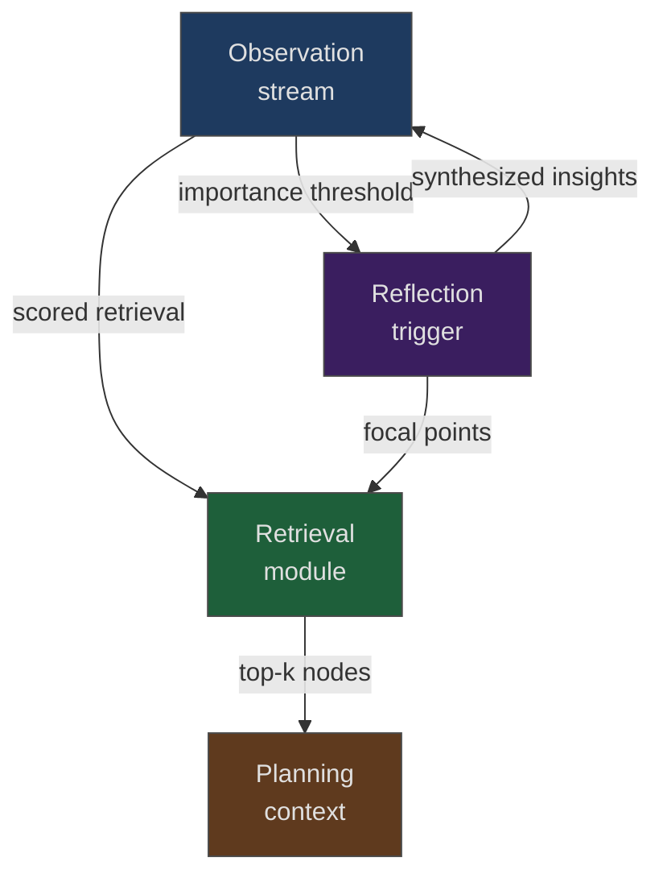

# Generative Agents Memory Stream

> Store agent observations in a retrievable stream, score retrieval candidates by recency, relevance, and importance, then periodically synthesize higher-level reflections — enabling coherent behavior across long sessions without dumping full history into context.

## The Problem

Long-running coding agents face a three-way failure mode: dumping full conversation history hits context limits; aggressive summarization loses diagnostic detail; simple recency-based context retrieves current but topically irrelevant observations. The [generative agents architecture (Park et al. 2023)](https://arxiv.org/abs/2304.03442) addresses all three simultaneously through an integrated memory stream.

## Architecture Overview

The architecture has three integrated layers that work as a unit:

## Layer 1: Observation Stream

Every event the agent perceives is stored as a `ConceptNode` with: timestamp, subject-predicate-object triple, natural-language description, embedding vector, and a **poignancy score** — an LLM-assigned importance rating for the observation ([perceive.py](https://github.com/joonspk-research/generative_agents/blob/main/reverie/backend_server/persona/cognitive_modules/perceive.py)).

Poignancy is scored per event: idle events receive 1; substantive events are scored via LLM prompt. The running sum of poignancy scores drives the reflection trigger. For coding agents, the observation unit maps directly to tool outputs: a file read, a failing test result, a linter error, a git diff, a decision to skip a file. Observations must be natural-language descriptions — raw JSON tool output provides weak embedding signal; a sentence describing what the output means retrieves better.

## Layer 2: Retrieval Scoring

When planning requires context, the agent identifies **focal points** — the current task or question — and retrieves memory nodes scored on three normalized dimensions ([retrieve.py](https://github.com/joonspk-research/generative_agents/blob/main/reverie/backend_server/persona/cognitive_modules/retrieve.py)):

| Dimension | Signal | Weight |
|-----------|--------|--------|
| Recency | Exponential decay from last access | 0.5 |
| Relevance | Cosine similarity to focal point embedding | 3.0 |
| Importance | Stored poignancy score | 2.0 |

The composite score is: `recency×0.5 + relevance×3 + importance×2` (all dimensions normalized to [0, 1]). The top 30 nodes by composite score enter the planning context.

This scoring solves the three-way failure mode directly: recency prevents stale context dominating, relevance ensures topical match, importance ensures high-signal observations outcompete noise. The weights are hand-tuned in the reference implementation — the authors note they 'should potentially be learned through RL' for production use.

## Layer 3: Reflection Synthesis

Reflection fires when the cumulative importance of recent observations crosses a threshold — not on a fixed schedule. The process ([reflect.py](https://github.com/joonspk-research/generative_agents/blob/main/reverie/backend_server/persona/cognitive_modules/reflect.py)):

1. Select 3 focal points from recent non-idle observations
2. Retrieve associated memory nodes for each focal point
3. Generate 5 higher-level insights with evidence links

Reflection outputs are stored back into the observation stream as thought nodes — they become retrievable alongside raw observations. This compresses many low-level events into fewer high-level insights, reducing future retrieval surface while preserving reasoning lineage.

For coding agents, reflection synthesis converts sequences of tool-call observations ("read file A", "read file B", "ran test — failed", "located error in module C") into higher-level insights ("the auth module has a dependency inversion problem that causes cascading test failures").

## When This Pattern Applies

This architecture pays off for **long, observation-dense, coherence-critical** sessions: multi-hour CI pipelines, multi-PR workflows where later decisions depend on earlier findings, debug sessions tracking many dead ends.

It adds overhead without benefit for bounded tasks. Poignancy scoring requires one LLM call per substantive observation — at high observation frequency this cost compounds. Cold-start applies: retrieval returns low-quality results until sufficient observations accumulate. The pattern also requires a persistent memory store across invocations — agents starting fresh each run never build the density that makes retrieval valuable.

## Relation to Existing Memory Patterns

The generative agents architecture is an integrated system, not a single technique:

- **[Episodic memory retrieval](episodic-memory-retrieval.md)** — episodic retrieval stores complete problem-solving episodes; the memory stream stores atomic observations that compose into episodes over time. The stream can serve as the storage substrate for episodic memory.
- **[Memory synthesis from execution logs](memory-synthesis-execution-logs.md)** — log synthesis extracts lessons post-session; memory stream reflection triggers automatically mid-session based on importance accumulation.
- **[Subtask-level memory](subtask-level-memory.md)** — subtask memory aligns retrieval granularity to reasoning stage; memory stream retrieval anchors to the current focal point regardless of stage.

## Key Takeaways

- Store observations as atomic natural-language descriptions with embedding vectors and importance scores — not raw tool outputs
- Score retrieval candidates on all three dimensions: recency prevents stale dominance, relevance ensures topicality, importance ensures high-signal retrieval
- Let importance accumulation trigger reflection automatically rather than scheduling it on a fixed interval
- The pattern targets long-running, high-observation-density sessions — not bounded tasks where simpler memory approaches suffice

## Related

- [Agent Memory Patterns](agent-memory-patterns.md)
- [Episodic Memory Retrieval](episodic-memory-retrieval.md)
- [Memory Synthesis from Execution Logs](memory-synthesis-execution-logs.md)
- [Subtask-Level Memory for SE Agents](subtask-level-memory.md)
- [Beads: Structured Task Graphs as External Agent Memory](beads-task-graph-agent-memory.md)
- [Memory Reinforcement Learning (MemRL)](memory-reinforcement-learning.md)
- [AST-Guided Agent Memory for Repository-Level Code Generation](ast-guided-agent-memory.md)
