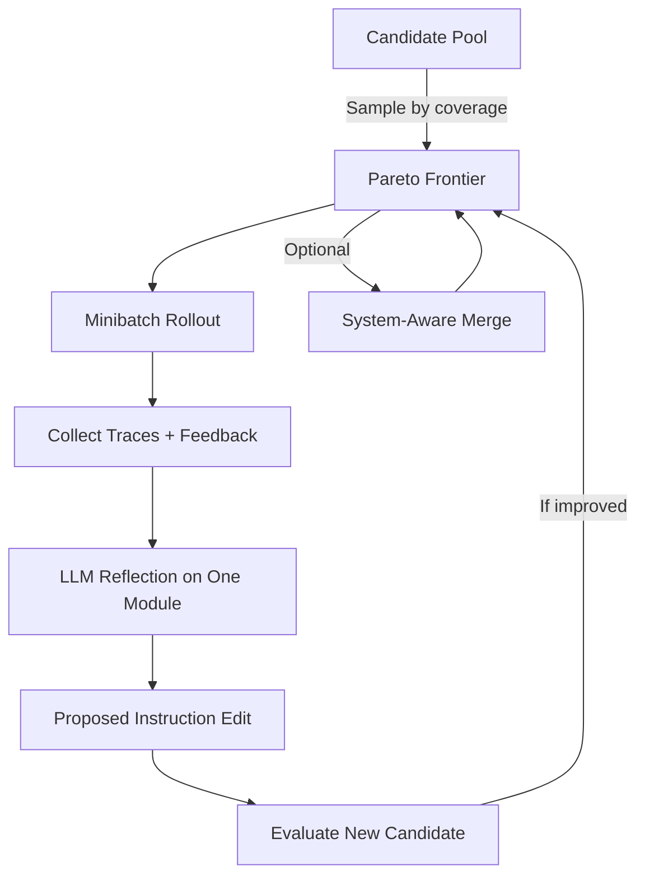

# GEPA: Reflective Prompt Evolution with Pareto Selection

> GEPA treats every execution trace as an optimization signal: an LLM reflects on failures in natural language, proposes a targeted instruction edit, and Pareto-per-instance selection keeps candidates that specialize on different failure modes — yielding large quality gains in tens-to-hundreds of rollouts instead of thousands.

## When to Apply

GEPA pays off when three preconditions hold:

1. **Rich textual feedback exists** — stage-level pass/fail, parse errors, constraint violations, unit-test output, profiler notes. The DSPy maintainers state outright that "a well-designed metric is central to GEPA's sample efficiency and learning signal richness" ([dspy.GEPA overview](https://dspy.ai/api/optimizers/GEPA/overview/)). A scalar-only correctness metric starves the reflection step.
2. **Evaluation instances are heterogeneous** — different examples expose different failure modes. Pareto selection only adds value when the best candidate on instance A is not the best on instance B. Homogeneous evals collapse Pareto selection into plain scalar-greedy and leave only bookkeeping overhead.
3. **Rollout budget is the binding constraint** — the paper reports up to **35× fewer rollouts** than GRPO, and the reference implementation cites **100–500 evaluations** vs 5,000–25,000+ for RL ([Agrawal et al., 2025](https://arxiv.org/abs/2507.19457); [gepa-ai/gepa](https://github.com/gepa-ai/gepa)).

Without all three, reach for a different optimizer: [MIPROv2](https://arxiv.org/abs/2406.11695) for joint Bayesian search on stable pipelines, [GRPO](https://arxiv.org/abs/2402.03300) when dense scalar rewards dominate.

## The Three Mechanisms

GEPA is defined by three coupled mechanisms ([dspy.GEPA overview](https://dspy.ai/api/optimizers/GEPA/overview/)):



### 1. Reflective Prompt Mutation

The optimizer captures full execution traces — inputs, outputs, errors, tool calls — and feeds them to a reflection LLM alongside the current instruction for one targeted module. The reflection LLM diagnoses failure modes and writes a new instruction. Mutations come from linguistic analysis of real failures, not random perturbation ([dspy.GEPA overview](https://dspy.ai/api/optimizers/GEPA/overview/)).

### 2. Textual Feedback as Optimization Signal

GEPA consumes any textual feedback, not just scalar rewards — eval logs, failed parses, constraint violations, error strings, sub-module-specific notes. In DSPy, the metric returns `dspy.Prediction(score=..., feedback=...)` where `feedback` is free-form text passed to the Reflector ([dspy.GEPA overview](https://dspy.ai/api/optimizers/GEPA/overview/)). The paper's framing: "the interpretable nature of language often provides a much richer learning medium for LLMs, compared to policy gradients derived from sparse, scalar rewards" ([Agrawal et al., 2025](https://arxiv.org/abs/2507.19457)).

### 3. Pareto-per-Instance Selection

Instead of keeping a single global best candidate, GEPA maintains the **Pareto frontier**: the set of candidates that score highest on at least one evaluation instance. The next candidate to mutate is sampled with probability proportional to coverage ([dspy.GEPA overview](https://dspy.ai/api/optimizers/GEPA/overview/)). This prevents the mode collapse of scalar-greedy evolution — candidates that excel on edge cases are retained even with lower aggregate scores, and system-aware merges recombine complementary strategies across lineages.

## Reported Results

Across six tasks in the paper ([Agrawal et al., 2025](https://arxiv.org/abs/2507.19457)):

- **Beats GRPO** by 6% on average, up to 20%, using up to **35× fewer rollouts**.
- **Beats MIPROv2** by over 10% on average; **+12% on AIME-2025**.
- Reported as an **inference-time search strategy** for code optimization.
- Accepted to **ICLR 2026 as an Oral** presentation.

Treat the headline gains as an upper bound under GEPA-friendly conditions (rich feedback, heterogeneous evals) — not a floor guaranteed on arbitrary workloads.

## GEPA vs MIPROv2 vs RL

| Method | Search operator | Signal | Budget | Best when |
|--------|----------------|--------|--------|-----------|
| GEPA | Reflective LLM rewrite | Natural-language feedback | 100–500 evals | Failure traces are linguistically rich; instances are heterogeneous |
| [MIPROv2](https://arxiv.org/abs/2406.11695) | Bayesian joint search over instructions + demos | Scalar metric | Hundreds–thousands of evals | Compound pipeline with stable topology and co-dependent modules |
| [GRPO](https://arxiv.org/abs/2402.03300) / RL | Policy gradient | Scalar reward | Thousands of rollouts | Dense rewards, non-linguistic tasks, token-level credit assignment matters |

All three are different algorithmic families. The DSPy API exposes a `candidate_selection_strategy='current_best'` switch on `dspy.GEPA` for teams whose evals turn out homogeneous enough that Pareto-per-instance adds no diversity ([dspy.GEPA overview](https://dspy.ai/api/optimizers/GEPA/overview/)).

## Where GEPA Underperforms

- **Uninformative feedback** — tasks where the only signal is binary correctness. Without stage-level error text, reflection becomes noisy and the rollout advantage over MIPROv2 shrinks.
- **Homogeneous evaluation sets** — when every instance ranks candidates the same way, the Pareto frontier degenerates to a single point.
- **Long-running adaptation** — GEPA rewrites whole instruction blocks each round. For continuously adapting systems, [ACE](https://arxiv.org/abs/2510.04618) reports an **82.3% reduction in adaptation latency vs. GEPA** by replacing full rewrites with structured delta entries ([Zhang et al., 2026](https://arxiv.org/abs/2510.04618)); see [Evolving Playbooks](../context-engineering/evolving-playbooks.md).
- **Small reflection-LM budget** — each round calls the Reflector. Tight per-round token budgets with cheap rollouts may favor MIPROv2 end-to-end.

## Example: GEPA-Friendly Feedback Metric

A RAG pipeline where the failure modes are "wrong retrieval" versus "correct retrieval but wrong answer synthesis." A scalar exact-match metric cannot distinguish them; GEPA starves.

**Anti-pattern** — scalar-only metric:

```python
def em_metric(gold, pred, trace=None, pred_name=None, pred_trace=None):
    return float(pred.answer == gold.answer)
```

**GEPA-friendly** — stage-decomposed with textual feedback, matching the signature documented in [dspy.GEPA overview](https://dspy.ai/api/optimizers/GEPA/overview/):

```python
def rag_metric(gold, pred, trace=None, pred_name=None, pred_trace=None):
    retrieved = set(pred.retrieved_ids)
    needed = set(gold.supporting_ids)
    recall = len(retrieved & needed) / len(needed) if needed else 1.0
    correct = float(pred.answer == gold.answer)

    missing = needed - retrieved
    feedback = []
    if missing:
        feedback.append(f"Retriever missed documents: {sorted(missing)}")
    if recall >= 0.5 and not correct:
        feedback.append(
            f"Retrieval was adequate (recall={recall:.2f}) "
            f"but answer '{pred.answer}' != '{gold.answer}'. "
            "Synthesis step is the bottleneck."
        )
    score = 0.5 * recall + 0.5 * correct
    return dspy.Prediction(score=score, feedback=" ".join(feedback))
```

The second metric attributes failures to specific stages and writes actionable text — exactly the signal the Reflector consumes. Per the DSPy docs' practical recipe: leverage existing artifacts (logs, unit tests, profilers), decompose outcomes by objective, expose trajectories with stage-level pass/fail, ground in automatic validators or LLM-as-judge ([dspy.GEPA overview](https://dspy.ai/api/optimizers/GEPA/overview/)).

## Key Takeaways

- GEPA's three mechanisms — reflective mutation, textual feedback, Pareto-per-instance selection — form a coupled system. Removing any one collapses the advantage.
- Sample-efficiency claims (35× vs RL, >10% vs MIPROv2) are real but conditional on rich textual feedback and heterogeneous evaluation instances.
- Metric design is the highest-leverage lever. A scalar-only metric makes GEPA degenerate toward blind genetic search.
- MIPROv2, GRPO, and GEPA are different algorithmic families — pick by task structure, not by headline number.
- For continuously adapting agents, structured delta curation (ACE) undercuts GEPA's full-rewrite cost; GEPA is a compile-time optimizer, not an online adaptation loop.

## Related

- [DSPy: Programmatic Prompt Optimization](dspy-programmatic-prompt-optimization.md) — MIPROv2 and COPRO baselines, the broader DSPy optimizer surface
- [Evolving Playbooks](../context-engineering/evolving-playbooks.md) — the ACE delta-entry critique of monolithic prompt evolution
- [Evaluator-Optimizer Pattern](evaluator-optimizer.md) — the local-iteration analogue when compile-time optimization is not warranted
- [Harness Hill-Climbing](harness-hill-climbing.md) — metric-driven iteration at the harness layer rather than the prompt layer
- [Self-Rewriting Meta-Prompt Loop](self-rewriting-meta-prompt-loop.md) — related reflective rewrite pattern without the Pareto selection regularizer
- [Cost-Aware Agent Design](cost-aware-agent-design.md) — choosing optimizer complexity against runtime volume
