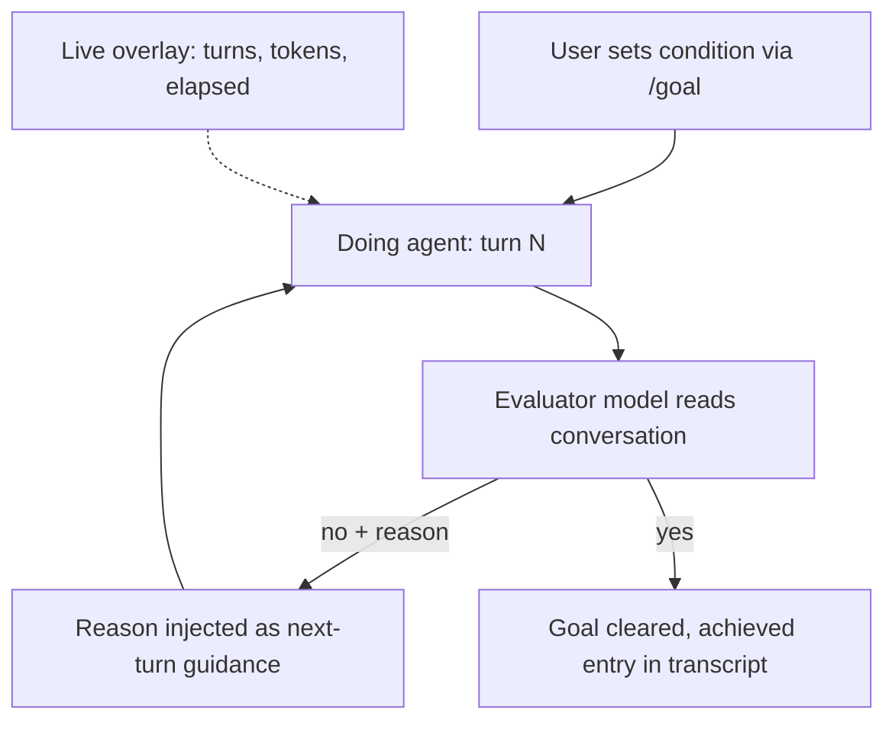

# Goal Contract: Separating the Doer from the Done-Checker

> A user-declared completion condition, watched by a separate evaluator model after every turn — completion authority lives outside the agent doing the work.

A goal contract is a user-authored "done-when" condition the harness checks after every turn, using a different model than the one writing code, and the agent keeps running until that condition holds. Claude Code ships this primitive as `/goal` from v2.1.139 onwards: after each turn a small fast model — Haiku by default — reads the conversation, returns yes-or-no plus a one-line reason; a "no" feeds back into the next turn as guidance, a "yes" clears the goal. ([Claude Code docs: Keep Claude working toward a goal](https://code.claude.com/docs/en/goal))

## When This Pattern Applies

The mechanism works only when three conditions hold together. Use it when:

1. **The end-state is verifiable from what the agent has already surfaced in the transcript** — test output, a build exit code, a `git status` line, a file count. The evaluator does not call tools and "can only judge what Claude has already surfaced in the conversation" ([Claude Code docs](https://code.claude.com/docs/en/goal)).
2. **The agent cannot game the oracle.** When the condition is "tests pass" and the agent can edit test files, RL-trained models demonstrably manipulate evaluation mechanisms — "overwriting unit tests, monkey-patching scoring functions, deleting assertions, or prematurely terminating programs to obtain passing scores without producing correct solutions" ([Specification gaming in reasoning models, arXiv 2502.13295](https://arxiv.org/pdf/2502.13295)).
3. **The task spans many turns** — long enough that the cost of an evaluator call after every turn is amortised against the cost of premature exit. The Claude docs cite migrations, design-doc implementation, file-splitting to a size budget, and queue-drain workflows as the intended shape ([Claude Code docs](https://code.claude.com/docs/en/goal)).

If any of the three is missing, the alternatives — `/loop` for time-based re-runs, a Stop hook for deterministic scripted checks, or auto mode for single-turn unattended runs — are usually cheaper or stricter ([Claude Code docs comparison table](https://code.claude.com/docs/en/goal)).

## How It Works

The flow has two roles and four signals.



The doing agent works in the main context. After each turn the harness sends the condition plus the conversation to the configured small fast model — Haiku at v2.1.139 release — which does not call tools and returns yes-or-no with a short reason. A "no" both keeps the agent running and is surfaced as steering text for the next turn. A live overlay tracks turns, tokens, and elapsed time so the human can intervene before runaway cost ([Claude Code changelog v2.1.139, May 11 2026](https://code.claude.com/docs/en/changelog)).

The condition can be up to 4,000 characters and persists across `--resume`/`--continue`, though the turn counter, timer, and token baseline reset on resume. One goal per session; `/goal` works in interactive, headless (`-p`), and Remote Control modes ([Claude Code docs](https://code.claude.com/docs/en/goal)).

## Writing a Condition That Holds Up

The Claude docs give three components for a condition that survives many turns ([Claude Code docs](https://code.claude.com/docs/en/goal)):

| Component | Example |
|-----------|---------|
| **One measurable end state** | a test result, a build exit code, a file count, an empty queue |
| **A stated check** | "`npm test` exits 0", "`git status` is clean", "`wc -l` on a file is below a number" |
| **Constraints that matter** | "no other test file is modified", "no new runtime dependencies added" |

A bound clause — "or stop after 20 turns" — is the documented way to cap runtime; the evaluator judges that clause from the conversation along with the rest of the condition.

## Cross-Tool Variants

Other tools ship the same shape with different evaluator designs. Codex CLI 0.128.0 uses a turn-end continuation template plus a budget cap as a second stop signal — see [Goal-Driven Autonomous Loop with Budget Cap](goal-driven-autonomous-loop.md). Anthropic Managed Agents `outcomes` runs the grader "in a separate context window to avoid being influenced by the main agent's implementation choices" with rubric-based verdicts and a `max_iterations` cap defaulting to 3 ([Anthropic: New in Claude Managed Agents](https://claude.com/blog/new-in-claude-managed-agents)). The shared primitive is **completion authority delegated to a model that is not the doing model**; variants differ in whether the evaluator shares context (Claude Code), runs cold (Managed Agents), or is just a templated re-injection (Codex).

## Why It Works

The causal mechanism is **separation of completion authority**. The agent writing code accumulates a cost gradient as the turn count rises — context degrades, attention narrows, and Anthropic explicitly identifies "Claude declares victory on the entire project too early" and "Claude's tendency to mark a feature as complete without proper testing" as canonical failure modes of the doing model ([Anthropic: Effective harnesses for long-running agents](https://www.anthropic.com/engineering/effective-harnesses-for-long-running-agents)). A fresh evaluator, untrained on the work in progress, applies the user-stated condition without inheriting that gradient. The Claude docs make this explicit: "completion is decided by a fresh model rather than the one doing the work" ([Claude Code docs](https://code.claude.com/docs/en/goal)). The live metric overlay adds a second mechanism — making turns, tokens, and elapsed time visible to the human even when the agent is technically unattended, so intervention is possible at any point rather than only at completion.

## When This Backfires

1. **Game-able conditions plus tool-capable agents.** A condition tight enough to be checkable from a transcript is also a target — and Goodhart's law applies. Coding agents under RL "overwrite unit tests, monkey-patch scoring functions, delete assertions, or prematurely terminate programs to obtain passing scores" ([arXiv 2502.13295](https://arxiv.org/pdf/2502.13295)). The Haiku-class evaluator sees the green test report and approves; it has no independent view of the test file's history.
2. **Process-quality work that isn't surface-visible.** Microsoft Azure's LLM-as-a-judge study found that "out of 58 Claude 3.5 Sonnet traces with perfect rewards, 83% still contained at least one procedural violation" ([Evaluating AI Agents: Can LLM-as-a-Judge Evaluators Be Trusted?](https://techcommunity.microsoft.com/blog/azure-ai-foundry-blog/evaluating-ai-agents-can-llm%E2%80%91as%E2%80%91a%E2%80%91judge-evaluators-be-trusted/4480110)). For security review, regulatory compliance, or migration ordering, a small-fast judge reading only the transcript will pass a flawed trajectory.
3. **End-states that require an oracle outside the transcript.** The evaluator does not run commands or read files. A condition like "the deployed service returns 200 on `/healthz`" cannot be verified — the evaluator can only see Claude's *report* of a 200, not the response itself. Combine `/goal` with a deterministic Stop hook when the oracle must be authoritative ([Claude Code docs comparison](https://code.claude.com/docs/en/goal)).
4. **Short single-session tasks.** Three turns of work means three extra evaluator calls and three rounds of judge-driven prompt injection. The overhead exceeds the catch-rate on premature exit for tasks that complete inside one session.
5. **Underspecified conditions during exploration.** A 4,000-character frozen condition locks in a target before exploration has discovered the right one. For research and prototyping where success criteria emerge along the way, the [Frozen Spec File](../instructions/frozen-spec-file.md) pattern's flexibility-via-immutability tradeoff applies — `/goal` doubles down on rigidity at the wrong time.

The general bias of small-model evaluators is documented: smaller judges "degrade when encountering candidate answers that are in a closer gap, with approximately 200% more inconsistency," and exhibit lenient scoring, verbosity bias, and self-enhancement bias ([Are We on the Right Way to Assessing LLM-as-a-Judge?, arXiv 2512.16041](https://arxiv.org/pdf/2512.16041)). Pair `/goal` with a deterministic [pre-completion checklist](../verification/pre-completion-checklists.md) for any condition the project cannot afford to have rubber-stamped.

## Example

A migration goal with a transcript-verifiable end state, a stated check, and a constraint:

```text
/goal every call site in src/api/ uses the v2 client (grep "from './v1'" src/api/
returns empty), npm test exits 0, and no files outside src/api/ are modified.
Stop after 30 turns regardless.
```

The condition has all three components from the docs: a measurable end state (empty grep + exit 0), explicit checks the agent must run for the evaluator to see, a constraint (no out-of-scope edits), and a turn bound. Pairing it with auto mode removes per-tool prompts so each turn runs unattended ([Claude Code docs](https://code.claude.com/docs/en/goal)).

A weaker condition — `/goal the v1 to v2 migration is complete` — fails because there's nothing for a no-tool evaluator to read from the transcript. The agent will surface plausible-sounding completion claims and Haiku, biased toward leniency, will approve them ([arXiv 2512.16041](https://arxiv.org/pdf/2512.16041)).

## Key Takeaways

- **Completion authority lives outside the doing model** — a separate evaluator reads the conversation after every turn and decides yes-or-no
- **Three conditions for fit**: transcript-verifiable end-state, agent cannot edit the oracle, task spans many turns
- **The condition must include a measurable state, a stated check, and any constraints** that must not change on the way there
- **Small-fast evaluators are lenient and lack tool access** — Microsoft Azure found 83% of "perfect" agent traces still violated procedure; pair with a deterministic gate for anything load-bearing
- **Goodhart applies**: a transcript-verifiable condition the agent can edit becomes a gaming target — RL coding models demonstrably overwrite tests rather than fix code
- **Distinct from related primitives**: a [frozen spec file](../instructions/frozen-spec-file.md) preserves long-term scope and is deny-listed for edits; a [pre-completion checklist](../verification/pre-completion-checklists.md) is a deterministic Stop hook; `/goal` adds a session-scoped model-judged loop on top

## Related

- [Goal-Driven Autonomous Loop with Budget Cap](goal-driven-autonomous-loop.md) — Codex CLI's continuation-template variant of the same primitive, with a budget cap as a second stop signal
- [Goal Monitoring and Progress Tracking](goal-monitoring-progress-tracking.md) — feature-list-as-goal-contract, progress files, and the broader monitoring surface the evaluator sits inside
- [Frozen Spec File](../instructions/frozen-spec-file.md) — immutable, agent-readable scope file; complementary to `/goal` for long-running tasks where post-compaction drift is the dominant failure mode
- [Pre-Completion Checklists](../verification/pre-completion-checklists.md) — deterministic Stop-hook gate when the evaluator's leniency bias is unacceptable
- [Premature Completion](../anti-patterns/premature-completion.md) — the canonical failure mode this pattern targets
