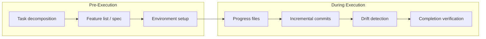
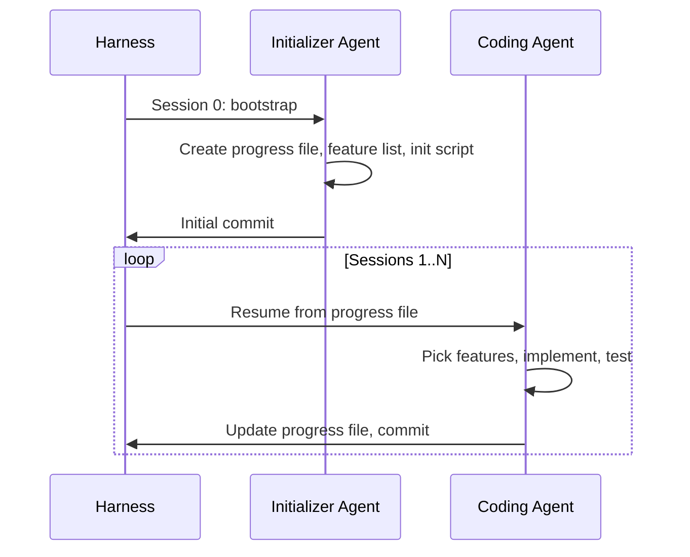

# Goal Monitoring and Progress Tracking

> Planning tells the agent what to do. Monitoring tells you whether it actually did it — and whether it wandered off.

Long-running coding agents declare tasks complete prematurely, drift from objectives after [context compression](../context-engineering/context-compression-strategies.md), and enter doom loops editing the same file repeatedly. The root cause: no durable, machine-readable record of what "done" looks like and how far the agent has gotten.

## Planning vs. Monitoring



Planning is pre-execution: decompose the problem, define success criteria, set up the environment. Monitoring is during-execution: track accomplishments, detect drift, and verify completion against the spec. Most guidance focuses on planning — monitoring is the harder problem.

## Core Artifacts

### Progress Files

A progress file (`claude-progress.txt` or equivalent) is a plain-text summary written at the end of each session: what was accomplished, what remains, any blockers. The next session reads it to resume without reconstructing state. Without it, agents misinterpret partial progress and either redo work or declare the task complete. ([Anthropic: Effective harnesses for long-running agents](https://www.anthropic.com/engineering/effective-harnesses-for-long-running-agents))

### Feature List Specs

A JSON [feature list](../instructions/feature-list-files.md) defines every granular feature as a testable unit, each initially marked `failing`. As the agent implements features, it marks them `passing`. JSON is preferred because structured formats are harder for the model to accidentally corrupt.

```json
{
  "features": [
    { "name": "user-login", "status": "passing" },
    { "name": "session-timeout", "status": "failing" },
    { "name": "password-reset", "status": "failing" }
  ]
}
```

The feature list serves as a **goal contract** — an objective measure of completeness that prevents the agent from declaring victory based on vibes. ([Anthropic: Effective harnesses for long-running agents](https://www.anthropic.com/engineering/effective-harnesses-for-long-running-agents))

### Incremental Commits

Descriptive git commits act as a secondary progress log. [unverified] Each commit records what changed and why, enabling human review and agent rollback via `git diff` or `git revert`.

## Failure Modes

### Premature Completion

Without progress files and feature lists, agents see partial progress and declare the job done. The feature list provides an objective counter: if 40 of 200 features are still `failing`, the agent cannot credibly claim completion.

### [Objective Drift](../anti-patterns/objective-drift.md)

After context summarization, an agent may lose track of the original user intent — asking for unnecessary clarification or pursuing tangential subtasks. LangChain identifies this as "the most insidious failure mode" because the agent appears functional while working on the wrong thing. ([LangChain: Context management for deep agents](https://blog.langchain.com/context-management-for-deepagents/))

Test for drift by deliberately triggering context summarization mid-task and checking whether the agent continues correctly.

### Doom Loops

An agent edits the same file repeatedly without converging. Detection: track per-file edit counts via tool call hooks. After N edits, inject context like "you have edited this file 8 times — consider a different approach." ([LangChain: Improving deep agents with harness engineering](https://blog.langchain.com/improving-deep-agents-with-harness-engineering/))

## Harness Patterns

### The Initializer Agent

A dedicated first-session agent handles environment setup: creates `init.sh`, `claude-progress.txt`, `feature_list.json`, and an initial git commit. [unverified] This separates bootstrapping from coding — the coding agent never decides what "done" looks like.



### Pre-Completion Checklist

Middleware intercepts the agent before exit and forces a verification pass against the task spec. Each requirement must be confirmed before the harness allows completion — a mechanical safeguard against premature exit. ([LangChain: Improving deep agents with harness engineering](https://blog.langchain.com/improving-deep-agents-with-harness-engineering/))

### [Loop Detection](../observability/loop-detection.md) Middleware

Tool call hooks track repetitive behavior. [unverified] The harness counts edits per file, consecutive failed tests, or repeated identical tool calls. When thresholds are exceeded, it injects corrective context or forces a strategy change.

### Environmental Feedback

Agents need continuous ground truth — test results, linter output, build status — to know whether changes actually work, not just whether they look right. ([Anthropic: Building effective agents](https://www.anthropic.com/engineering/building-effective-agents))

## Production Monitoring

For production agents, two additional patterns apply:

**[Rainbow deployments](../multi-agent/rainbow-deployments-agents.md)**: Gradually shift traffic between agent versions to update without disrupting in-progress tasks. ([Anthropic: Multi-agent research system](https://www.anthropic.com/engineering/multi-agent-research-system))

**Decision path tracing**: Monitor decision patterns and interaction structures (not content) to diagnose failures. Agent failures are non-deterministic, so full tracing is essential. ([Anthropic: Multi-agent research system](https://www.anthropic.com/engineering/multi-agent-research-system))

## Example

A harness bootstraps a multi-session coding task with monitoring artifacts, then uses them to prevent premature completion:

```bash
# Session 0: Initializer agent creates monitoring artifacts
cat > claude-progress.txt << 'EOF'
## Status: IN PROGRESS
## Completed: 0/5 features
## Current: Setting up project scaffolding
## Blockers: None
EOF

cat > feature_list.json << 'EOF'
{
  "features": [
    { "name": "auth-middleware", "status": "failing" },
    { "name": "rate-limiter", "status": "failing" },
    { "name": "health-endpoint", "status": "failing" },
    { "name": "request-logging", "status": "failing" },
    { "name": "graceful-shutdown", "status": "failing" }
  ]
}
EOF

git add claude-progress.txt feature_list.json
git commit -m "init: monitoring artifacts for API server task"
```

```bash
# Pre-completion hook — blocks exit until all features pass
FAILING=$(jq '[.features[] | select(.status == "failing")] | length' feature_list.json)
if [ "$FAILING" -gt 0 ]; then
  echo "ERROR: $FAILING features still failing. Cannot complete."
  exit 1
fi
```

## Key Takeaways

- **Progress files bridge sessions** — without them, agents misread partial state and declare premature completion
- **JSON feature lists are goal contracts** — structured, machine-readable definitions of "done" that resist model corruption
- **Drift is invisible** — test for it explicitly by triggering summarization and checking continuity
- **Separate bootstrapping from execution** — an initializer agent defines success criteria; coding agents work toward them
- **Mechanical verification beats self-assessment** — pre-completion checklists and loop detection catch failures that agents cannot self-diagnose
- **Production agents need tracing** — non-deterministic failures require observability into decision paths, not just outputs

## Unverified Claims

- Incremental commits as a secondary progress log enabling agent rollback is a logical extension of progress file patterns but not explicitly documented in the cited sources
- The initializer agent as a dedicated first-session bootstrapper is synthesized from Anthropic's harness guidance, not described as a named pattern in the source material
- Loop detection middleware counting per-file edits is inferred from LangChain's doom loop discussion; the specific implementation pattern is not prescribed

## Related

- [The Plan-First Loop](../workflows/plan-first-loop.md)
- [Harness Engineering](harness-engineering.md)
- [Agent Loop Middleware](agent-loop-middleware.md)
- [Session Initialization Ritual](session-initialization-ritual.md)
- [Convergence Detection](convergence-detection.md)
- [Steering Running Agents](steering-running-agents.md)
- [Agent Harness](agent-harness.md)
- [Loop Strategy Spectrum](loop-strategy-spectrum.md)
- [Trajectory Logging via Progress Files and Git History](../observability/trajectory-logging-progress-files.md)
