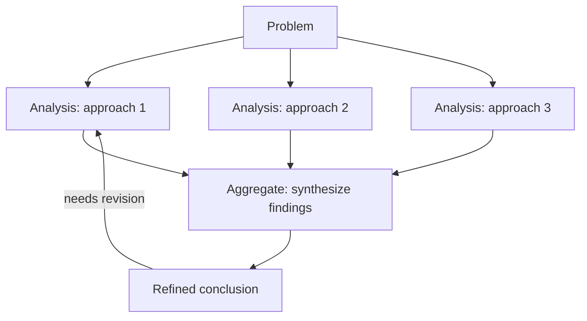

<!-- source: nibzard/awesome-agentic-patterns (Apache 2.0, https://github.com/nibzard/awesome-agentic-patterns) — retain attribution per license -->

# Graph of Thoughts: Directed Graph Reasoning for Multi-Path Problems

> Model reasoning as a directed graph to aggregate insights across independent paths — the operation that neither Chain-of-Thought nor Tree of Thoughts can express.

## The Problem with Linear and Tree Topologies

Chain-of-Thought (CoT) forces reasoning into a single linear sequence: each step depends only on the prior step. Tree of Thoughts (ToT) adds branching, letting the model explore multiple paths in parallel — but paths never reconverge. Once two branches diverge, each proceeds in isolation to its own conclusion.

Problems requiring synthesis across independent reasoning lines — multi-hop inference, strategic planning with interdependent sub-goals, reconciling multiple converging analyses — cannot be expressed in either topology.

[Besta et al. (2023)](https://arxiv.org/abs/2308.09687) introduced Graph of Thoughts (GoT) to close this gap. GoT models reasoning as a directed graph where thoughts are vertices and dependencies are edges. Any vertex can have multiple predecessors, enabling diverged paths to reconverge before a conclusion is drawn.

## Four Core Operations

GoT defines four operations on the reasoning graph:

| Operation | Description | Available in CoT? | Available in ToT? |
|-----------|-------------|:-----------------:|:-----------------:|
| **Branch** | Generate multiple thoughts from one state | No | Yes |
| **Aggregate** | Merge insights from multiple paths into one thought | No | No |
| **Refine** | Improve a thought using context from neighboring nodes | Partial | Partial |
| **Backtrack** | Revisit an earlier node using later context | No | No |

**Aggregate is the key differentiator.** It enables reasoning paths to converge:

CoT and ToT can only represent linear or tree-shaped structures — the converging edges from B, C, and D into E are not expressible in either.

## Performance and Cost

On sorting tasks, GoT showed a [62% quality improvement over ToT while reducing costs by more than 31%](https://arxiv.org/abs/2308.09687) compared to ToT. The gains come from aggregation: merging intermediate results avoids redundant exploration across independent tree searches.

GoT is **5–20x costlier than linear CoT** ([nibzard catalog](https://github.com/nibzard/awesome-agentic-patterns/blob/main/patterns/graph-of-thoughts.md)). The overhead is only justified when the problem genuinely requires path convergence.

[Besta et al. (IEEE TPAMI 2025)](https://arxiv.org/abs/2401.14295) formalized the reasoning topology taxonomy — positioning CoT, ToT, and GoT as a progression in expressiveness, with GoT as the general case of which the others are special instances.

## When GoT Is Justified

GoT adds value when the problem has **interdependent reasoning paths** — where insights from one analysis must inform another before a conclusion is sound:

- **Multi-hop reasoning**: the answer requires chaining findings across multiple independent sub-queries
- **Strategic planning**: sub-goals have mutual dependencies that require reconciling independent analyses before committing to a plan
- **Revision under new context**: an earlier reasoning step needs refinement after a later step reveals new information — Backtrack makes this explicit rather than ad-hoc
- **Solution synthesis**: the correct answer is the merge of insights from several paths, not the output of any single one

GoT is **not justified** for:

- Problems solvable by a single reasoning chain — use CoT
- Exploration tasks where paths don't need to reconverge — use ToT or [Plan Mode](../workflows/plan-mode.md)
- Resource-constrained settings — 5–20x cost premium and implementation complexity limit production use ([nibzard catalog](https://github.com/nibzard/awesome-agentic-patterns/blob/main/patterns/graph-of-thoughts.md))
- Advanced reasoning models (Claude extended thinking, o1) that internalize multi-step synthesis — external GoT scaffolding introduces additional latency without a demonstrated benefit over the model's built-in chain computation

## Implementation Considerations

Production GoT requires infrastructure that tree-based prompting does not:

- **Graph state management**: tracking which nodes are complete, pending, or ready for aggregation
- **Scoring per node**: evaluation criteria at each vertex, not just at leaves
- **Pathfinding**: a traversal strategy for deciding which aggregated nodes to expand next
- **Redundancy detection**: pruning to prevent duplicate reasoning paths accumulating

The [nibzard catalog entry](https://github.com/nibzard/awesome-agentic-patterns/blob/main/patterns/graph-of-thoughts.md) flags these as adoption barriers — GoT is more common in research settings than production agent systems.

## Key Takeaways

- GoT adds Aggregate and Backtrack — operations unavailable in CoT or ToT that enable path convergence and explicit revision
- Aggregate is the core differentiator: it merges insights from independent reasoning paths before drawing a conclusion
- GoT is 5–20x costlier than linear CoT — reserve it for problems that genuinely require multi-path synthesis
- Production use requires graph state management, per-node scoring, and redundancy detection — significant barriers to adoption
- For problems with known, fixed decision sequences, [Petri Net of Thoughts](petri-net-of-thoughts.md) provides formal structure with lower overhead

## Related

- [Petri Net of Thoughts: Formal Process Models as Prompting Scaffolds](petri-net-of-thoughts.md) — Formal graph-based reasoning with Petri net structure and state-aware prompts
- [Three Reasoning Spaces: Plan, Bead, and Code](three-reasoning-spaces.md) — Explicit phase gates that separate planning topology from execution
- [Reasoning Budget Allocation: The Reasoning Sandwich](reasoning-budget-allocation.md) — Allocate reasoning compute by phase rather than uniformly
- [Agent Composition Patterns](agent-composition-patterns.md) — Multi-agent structural patterns including chains, fan-out, pipelines, and supervisors
- [Evaluator-Optimizer Pattern](evaluator-optimizer.md) — Two-role loop where generator and evaluator iterate to a quality threshold
- [Self-Discover Reasoning: LLM-Composed Reasoning Structures](self-discover-reasoning.md) — Model selects and composes reasoning modules per task, an alternative to fixed CoT or GoT topologies
