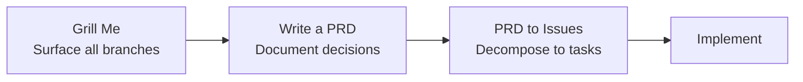

# Grill Me: Developer-Initiated Plan Interrogation

> Direct the agent to challenge your plan rather than execute it — surfacing hidden assumptions and decision gaps before implementation begins.

## The Inversion

The default agent workflow runs one way: developer specifies, agent executes. Grill Me reverses the direction for one focused session. You describe your plan; the agent interrogates it, asking probing questions until every branch of the decision tree is resolved.

The inversion is developer-initiated and exhaustive. The agent is explicitly tasked to be difficult — not to be helpful in the "implement this" sense but helpful in the "expose what I haven't thought through" sense. This runs before any code is written.

## How It Works

Matt Pocock's [grill-me skill](https://github.com/mattpocock/skills/blob/main/grill-me/SKILL.md) implements this as three directives to the agent:

1. Interview the developer relentlessly about every aspect of the plan
2. Walk every branch of the decision tree, resolving dependencies one at a time — ask one question at a time, providing a recommended answer for each
3. If a question can be answered by exploring the codebase, explore the codebase instead of asking

The one-question-at-a-time constraint matters: it prevents the session from collapsing into a questionnaire the developer answers superficially. The recommended-answer per question prevents interrogation fatigue — the agent proposes, the developer confirms or corrects, and the session stays productive.

The codebase-first heuristic eliminates noise: questions whose answers already exist in code are resolved by the agent without developer input, keeping the session focused on genuine unknowns.

## When to Trigger It

Grill Me earns its overhead when:

- The feature involves decisions that could go multiple ways and the wrong choice is expensive to reverse
- The spec exists but feels underspecified — you sense there are branches you haven't walked
- You're about to hand a plan to an agent for unattended execution and want confidence before it runs
- A design review is appropriate but no human reviewer is available

Skip it for single-step tasks, reversible experiments, and changes where the decision space is already fully constrained by external requirements.

## Distinction from Related Patterns

Three patterns involve agents and plan gaps; they differ in who triggers them and when:

| Pattern | Who triggers | When | Goal |
|---------|-------------|------|------|
| **Grill Me** | Developer | Before implementation, explicitly | Exhaust all decision branches |
| [Agent Pushback Protocol](agent-pushback-protocol.md) | Agent | During execution, when detecting a concern | Surface a specific implementation or requirements concern |
| [Interactive Clarification](interactive-clarification-underspecified-tasks.md) | Agent | When underspecification is detected | Resolve the minimal information gap needed to proceed |

Grill Me is exhaustive by design. The pushback protocol and interactive clarification are targeted — they fire on detection of a specific problem. Grill Me fires unconditionally and walks everything.

## In a Workflow Pipeline

Grill Me functions as the first gate in a pre-implementation pipeline. Pocock's five-skill library uses it as the entry point: grill-me produces shared understanding, which feeds a PRD session, which decomposes into implementation tasks ([daily-use skill library](../workflows/daily-use-skill-library.md)):



The session output — the resolved decision tree — becomes the input for a PRD or specification step, making the interrogation findings durable across the stateless boundary of a new agent session.

## When This Backfires

The technique adds cost without value in three conditions:

**Constrained problems with one valid solution.** When external requirements (API contract, regulatory rule, existing interface) fully determine the answer, interrogation produces confirmation rather than discovery.

**Fast-iteration loops on reversible work.** If the cost of a wrong assumption is one failing test rather than a shipped feature, implementation reveals gaps faster than interrogation.

**No downstream artifact.** If the session findings are not captured (PRD, spec, written plan), agent statelessness erases them. The next session starts cold. Run Grill Me only when the output feeds a durable artifact.

## Example

The complete grill-me skill from [mattpocock/skills](https://github.com/mattpocock/skills/blob/main/grill-me/SKILL.md) is a minimal instruction set — the [daily-use skill library](../workflows/daily-use-skill-library.md) characterises it as "three sentences" — that changes agent behavior at this decision point:

```
Interview me relentlessly about every aspect of this plan until we reach a
shared understanding. Walk down each branch of the design tree, resolving
dependencies between decisions one-by-one. For each question, provide your
recommended answer. Ask the questions one at a time. If a question can be
answered by exploring the codebase, explore the codebase instead.
```

Invoke it by including this text in your system prompt or as a slash command skill, then describe your plan. The agent shifts from executor to interrogator for the duration of the session.

## Key Takeaways

- Grill Me inverts the developer-instructs-AI flow: the agent challenges the plan, not executes it
- Three constraints drive the technique: one question at a time, recommended answer per question, codebase-first resolution
- Trigger it before non-trivial features where wrong assumptions are expensive; skip it for reversible single-step tasks
- The technique is exhaustive by design — it differs from pushback protocol (agent-initiated, targeted) and interactive clarification (agent-initiated, gap-specific)
- Capture session output in a durable artifact — without a PRD or written spec, agent statelessness discards the findings

## Related

- [Agent Pushback Protocol](agent-pushback-protocol.md)
- [Interactive Clarification for Underspecified Tasks](interactive-clarification-underspecified-tasks.md)
- [Critic Agent Pattern](critic-agent-plan-review.md)
- [Daily-Use Skill Library](../workflows/daily-use-skill-library.md)
- [Spec-Driven Development](../workflows/spec-driven-development.md)
- [Discrete Phase Separation](discrete-phase-separation.md)
