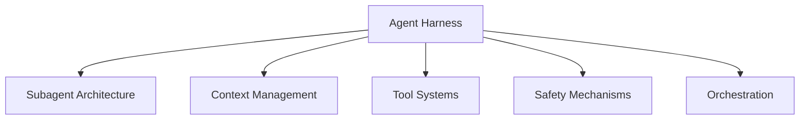

# Harness Design Dimensions and Archetypes

> A source-grounded study of 70 agent-system projects reduces harness infrastructure to five recurring design dimensions and five archetypes — a population-level lens for reading and comparing harnesses.

## Why Dimensions Beat Ad-Hoc Comparison

Harness code — the non-LLM mediator handling tools, context, delegation, safety, and orchestration — determines agent behaviour as much as the model. Independent evidence: pure harness changes took Terminal Bench 2.0 from 52.8% to 66.5% ([LangChain](https://blog.langchain.com/improving-deep-agents-with-harness-engineering/)). Projects therefore diverge sharply in how they engineer this layer.

[Hu Wei (2026) "Architectural Design Decisions in AI Agent Harnesses"](https://arxiv.org/abs/2604.18071) analyses 70 publicly available agent-system projects through source code and technical material. The output is a shared vocabulary for reading harness choices at the ecosystem level.

## Five Design Dimensions

Each dimension is a position choice, not a binary ([arXiv:2604.18071](https://arxiv.org/abs/2604.18071)):

- **Subagent architecture** — flat, hierarchical, or peer coordination between specialised agents.
- **Context management** — file-persistent, hybrid, and hierarchical strategies dominate the corpus; ephemeral in-memory is rarer in production systems.
- **Tool systems** — registry-oriented systems are dominant; [MCP](../tool-engineering/mcp-result-persistence-annotation.md)- and plugin-oriented extensions are emerging.
- **Safety mechanisms** — intermediate isolation (sandboxes, permission prompts) is common; high-assurance audit is rare.
- **Orchestration** — the control flow and scheduling layer around agent loops.

The paper complements the 12-dimension / 13-system [Scaffold Architecture Taxonomy](scaffold-architecture-taxonomy.md) ([arXiv:2604.03515](https://arxiv.org/abs/2604.03515)): finer-grained analysis of individual scaffolds, lower population coverage. Pick the five-dimension view for cross-ecosystem reading; pick the 12-dimension view when characterising a single scaffold in depth.

## Co-occurrence: Choices Cluster

Design dimensions are not independent. [arXiv:2604.18071](https://arxiv.org/abs/2604.18071) reports three recurring clusters:

| Cluster | What pairs with what |
|---------|----------------------|
| Coordination ↔ context | Deeper subagent coordination pairs with more explicit context services |
| Execution ↔ governance | Stronger execution environments correlate with more structured governance |
| Tooling ↔ ecosystem | Formalised tool-registration boundaries align with broader ecosystem ambitions |

The implication for design: a single upgrade rarely lands in isolation. Adding multi-agent coordination without corresponding [context services](../context-engineering/phase-specific-context-assembly.md) leaves agents starved of state; tightening tool boundaries without ecosystem commitments imposes cost without the reach that justifies it.

## Five Archetypes

The same paper groups the 70 projects into five recurring archetypes ([arXiv:2604.18071](https://arxiv.org/abs/2604.18071)):

| Archetype | Profile |
|-----------|---------|
| Lightweight tools | Minimal harness infrastructure; a thin loop around tool calls |
| Balanced CLI frameworks | Moderate complexity; CLI-oriented with adaptive loops and registry tools |
| Multi-agent orchestrators | Deep coordination, explicit context services, role-specialised subagents |
| Enterprise systems | Structured governance, stronger isolation, broader ecosystem scope |
| Scenario-verticalised projects | Domain-specific harnesses optimised for one class of workflow |

Archetypes are descriptive clusters, not prescriptions. A project's archetype emerges from the dimension choices that reinforce each other — which is why the co-occurrence clusters matter more than any individual dimension.

## Reading a Harness with the Framework

Apply the five dimensions in order when evaluating or designing a harness:

1. Where on the subagent spectrum — single loop, delegated roles, or peer coordination?
2. Which context strategy — file-persistent, hybrid, hierarchical, or ephemeral?
3. Which tool system — direct shell, typed registry, MCP, or plugin?
4. Which safety posture — none, intermediate isolation, or high-assurance audit?
5. Which orchestration layer — fixed pipeline, adaptive loop, or external scheduler?

Read the cluster alignments to predict where effort is missing: a project with multi-agent coordination but no file-persistent context is likely under-invested on context services; one with formal tool registration but no ecosystem scope is paying integration cost without reach.

## When the Framework Under-Delivers

- **Single-script tools** — only one or two dimensions are meaningful; the archetype collapses to "lightweight tools" without informing design.
- **Pre-production prototypes** — co-occurrence patterns assume differentiated systems; early harnesses are not yet clustered.
- **In-house vertical harnesses** — the archetype is predetermined by the domain, so the framework adds vocabulary without decision support.

## Example

Reading two public harnesses through the dimensions:

**Harness A — a terminal coding agent**: single control loop (flat subagent), accumulated in-memory context with summarisation on threshold, typed tool registry exposed as a shell-like interface, permission prompts before destructive actions, adaptive orchestration. Archetype: balanced CLI framework. Expected co-occurrence gap: limited multi-agent coordination means no need for explicit context services, which matches its [single-context strategy](loop-strategy-spectrum.md).

**Harness B — a multi-agent research system**: hierarchical subagents with [orchestrator-worker](../multi-agent/multi-agent-topology-taxonomy.md) topology, file-persistent [progress files](../observability/trajectory-logging-progress-files.md) and hybrid per-agent context, plugin-style tool registration with MCP extensions, sandbox isolation and audit logging, external scheduler driving orchestration. Archetype: multi-agent orchestrator / enterprise. Co-occurrence checks pass: deep coordination paired with explicit context services; formal tool registration paired with ecosystem scope.

The dimensions frame the differences; the archetypes name the clusters.

## Key Takeaways

- Five dimensions — subagent architecture, context management, tool systems, safety mechanisms, orchestration — cover the non-LLM choices in an agent harness.
- Dimension choices cluster: coordination with context services, execution with governance, tooling with ecosystem. Single-axis upgrades under-perform the paired investment.
- Five archetypes (lightweight, CLI, multi-agent, enterprise, verticalised) are descriptive clusters derived from the 70-project corpus, not prescribed templates.
- The framework is most useful at ecosystem level; pair it with a finer-grained taxonomy when characterising a single scaffold.
- Rare-in-corpus signals are actionable: high-assurance audit is uncommon, so any project claiming it should be verified, not assumed.

## Related

- [Scaffold Architecture Taxonomy for Coding Agents](scaffold-architecture-taxonomy.md)
- [Agent Harness: Initializer and Coding Agent](agent-harness.md)
- [Harness Engineering](harness-engineering.md)
- [Managed vs Self-Hosted Harness](managed-vs-self-hosted-harness.md)
- [Agent Composition Patterns](agent-composition-patterns.md)
- [Loop Strategy Spectrum](loop-strategy-spectrum.md)
- [Multi-Agent Topology Taxonomy](../multi-agent/multi-agent-topology-taxonomy.md)
