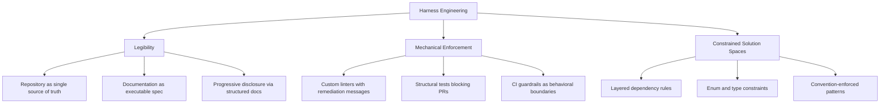
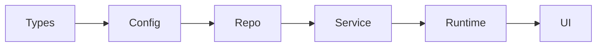
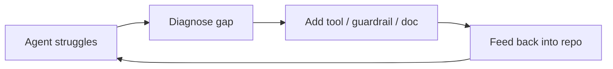

# Harness Engineering

> The discipline of designing agent environments -- layered architecture, mechanical enforcement, legibility -- so agents reliably produce correct results. Environment design matters more than prompting.

## The Discipline

Harness engineering is the practice of structuring a codebase, its tooling, and its documentation so that coding agents succeed by default. It treats the repository as the primary interface for agent work: if something is not in the repo, it does not exist for the agent.

The term emerged from convergent findings across OpenAI, Anthropic, LangChain, and Martin Fowler's team -- each independently discovering that environment quality determines agent output quality, not model capability or prompt sophistication. `[unverified]`

OpenAI shipped roughly one million lines of production code without manually written source in a five-month experiment. The enabler was environment design ([InfoQ](https://www.infoq.com/news/2026/02/openai-harness-engineering-codex/)). LangChain improved Terminal Bench 2.0 from 52.8% to 66.5% through pure harness changes -- no model change ([LangChain](https://blog.langchain.com/improving-deep-agents-with-harness-engineering/)).

## Three Pillars



### Legibility

Anything not in the repository does not exist for agents. Repository legibility -- how easily an agent can find, read, and act on project knowledge -- determines the capability ceiling. It includes:

- **Documentation structure** -- AGENTS.md as a compact index (~100 lines) pointing to deeper resources, not a monolithic knowledge dump
- **Decision visibility** -- architectural choices and rationale documented where agents encounter them (inline comments, directory-level READMEs)
- **[Progressive disclosure](progressive-disclosure-agents.md)** -- layered docs so agents load context proportional to the task

Legibility is distinct from [codebase readiness](../workflows/codebase-readiness.md), which focuses on code-level qualities (types, tests, patterns); legibility focuses on knowledge organization.

### Mechanical Enforcement

Written conventions rely on agent compliance. Mechanical enforcement makes violation impossible -- or immediately visible.

| Mechanism | What it enforces | How the agent experiences it |
|-----------|-----------------|------------------------------|
| Custom linter | Dependency layer rules, import restrictions | Error message at the exact decision point |
| Structural test | Architecture invariants (no UI imports in service layer) | Test failure with actionable fix description |
| CI gate | Build, lint, test must pass before merge | Binary pass/fail blocking the PR |
| Pre-commit hook | Format, lint on every commit | Immediate feedback before the commit lands |

**Linter error messages are just-in-time context**: the failure output enters the agent's context at the exact moment it needs to make a different decision. Write messages as actionable remediation, not violation flags ([Fowler/Bockeler](https://martinfowler.com/articles/exploring-gen-ai/harness-engineering.html)).

```
# Bad: flags the problem
ERROR: Service layer cannot import from UI layer.

# Good: provides remediation
ERROR: Service layer cannot import from UI layer.
  Move shared logic to a Provider in src/providers/,
  or restructure to keep UI-specific code in src/ui/.
  See docs/architecture/layer-rules.md for the dependency diagram.
```

OpenAI's custom linters enforcing these constraints were themselves generated by coding agents, creating a self-reinforcing loop: agents build the guardrails that constrain future agent work ([Lavaee](https://alexlavaee.me/blog/openai-agent-first-codebase-learnings/)).

### Constrained Solution Spaces

Trading "generate anything" flexibility for reliability by restricting available architectures rather than hoping the agent picks a good one.

OpenAI's Harness team enforces a strict dependency chain:



Each layer may only import from layers to its left. This is enforced by linters and structural tests that block PRs on violation -- not by documentation that asks agents to comply ([Lavaee](https://alexlavaee.me/blog/openai-agent-first-codebase-learnings/), [InfoQ](https://www.infoq.com/news/2026/02/openai-harness-engineering-codex/)).

An agent in the Service layer cannot couple to UI concerns because tooling prevents it. Fewer valid options means fewer wrong options.

## The Feedback Signal

When an agent struggles, the struggle is diagnostic. Harness engineering treats agent failure as a signal about the environment, not about the agent:



Each iteration improves the harness for all future agent sessions. This is the same [agentic flywheel](agentic-flywheel.md) applied specifically to environment design: every failure that gets addressed as a harness improvement compounds across all agents and all sessions ([Fowler/Bockeler](https://martinfowler.com/articles/exploring-gen-ai/harness-engineering.html)).

## Entropy Management

Codebases drift -- documentation goes stale, boundaries erode, conventions accumulate exceptions. Harness engineering includes active [entropy reduction](../workflows/entropy-reduction-agents.md): periodic agent scans for inconsistencies, auto-generated refactoring PRs targeting specific drift, and linters that evolve with the codebase. The harness is maintained infrastructure, not a bootstrap step ([Lavaee](https://alexlavaee.me/blog/openai-agent-first-codebase-learnings/), [Fowler/Bockeler](https://martinfowler.com/articles/exploring-gen-ai/harness-engineering.html)).

## Example

A TypeScript subscription API has three source directories: `src/types`, `src/services`, and `src/api`. An agent is asked to add a billing webhook endpoint.

**Without harness engineering**: the agent imports a database client directly into the route handler, pulls a UI formatter from a shared utility, and opens a PR. It works locally. CI fails in staging due to a circular import and a missing environment variable. A human debugs it for an hour.

**With harness engineering**:

*Legibility* — `AGENTS.md` at the repo root (≈80 lines) describes the three directories, their responsibilities, and what each layer may import. `src/api/README.md` says: "Route handlers only. Call service methods — do not import from `src/types` or database clients directly."

*Mechanical enforcement* — a custom ESLint rule blocks cross-layer imports with a remediation message at the point of violation:

```
ESLintError [api/no-direct-db-import]:
  src/api/webhook.ts:4 — api layer cannot import from src/services/db.ts.
  Call a method in src/services/ instead, or add one if it doesn't exist.
  See docs/architecture/layers.md
```

*Constrained solution spaces* — a structural test (`npm run test:arch`) enforces `types → services → api` as the only valid import direction, failing with the exact files involved on any violation.

**What the agent experiences**: it creates the webhook handler, attempts to import the database client directly, receives the ESLint error, restructures to call `src/services/billing.ts` instead, and opens a PR that passes CI on the first run without human intervention.

All three pillars contributed: legibility told the agent what to do, mechanical enforcement told it when it was wrong, and constrained solution spaces made the correct path the only available path.

## Key Takeaways

- Harness engineering is the discipline of designing environments where agents succeed by default -- it subsumes prompt engineering
- Three pillars: legibility (repo as single source of truth), mechanical enforcement (linters and CI as behavioral boundaries), constrained solution spaces (restricted architectures)
- Linter error messages are just-in-time agent context -- write them as remediation instructions, not violation flags
- Agent failure is a signal about the environment; feed fixes back into the repository
- Environment design compounds: every harness improvement benefits all future agent sessions

## Unverified Claims

- The exact term "harness engineering" as a named discipline originates from the Fowler/Bockeler article; other sources describe the same practices without using this specific term `[unverified]`
- "Legibility precedes capability" is an editorial distillation of Lavaee's findings -- the exact phrase does not appear in the source `[unverified]`
- Whether OpenAI's ~1M LOC figure includes generated tests and configuration, or only application logic, is not specified in the InfoQ source `[unverified]`

## Related

- [AGENTS.md: A README for AI Coding Agents](../standards/agents-md.md) — the project instruction file standard that provides agents project context before any task
- [Rigor Relocation](../human/rigor-relocation.md) -- the broader thesis that engineering discipline relocates from code to scaffolding
- [Agent Harness](agent-harness.md) -- the specific initializer/worker two-phase architecture
- [Agent-First Software Design](agent-first-software-design.md) -- designing systems where agents are the primary consumers
- [Codebase Readiness](../workflows/codebase-readiness.md) -- code-level qualities that make a codebase agent-friendly
- [Process Amplification](../human/process-amplification.md) -- agents amplify existing practices, good or bad
- [Convention over Configuration](../instructions/convention-over-configuration.md) -- conventions as constraint mechanisms
- [Specification as Prompt](../instructions/specification-as-prompt.md) -- formal specs as agent instructions
- [Context-Injected Error Recovery](../context-engineering/context-injected-error-recovery.md) -- error messages as agent context
- [Getting Started: Setting Up Your Instruction File](../workflows/getting-started-instruction-files.md) -- bootstrap the instruction file that feeds the harness
- [Pre-Completion Checklists](../verification/pre-completion-checklists.md) -- verification gates before task completion
- [Agent Self-Review Loop](agent-self-review-loop.md) -- agents reviewing their own output using linters and tests
- [Empowerment Over Automation](empowerment-over-automation.md) -- enforcement and linter-based constraints as agent empowerment
- [Wink: Agent Misbehavior Correction](wink-agent-misbehavior-correction.md) -- guardrail-based correction of agent behavior
- [Agent Loop Middleware](agent-loop-middleware.md) -- wrapping the agent loop to guarantee critical enforcement steps happen regardless of agent behavior
- [Agent Backpressure](agent-backpressure.md) -- linter and guardrail signals that slow agent execution when quality degrades
- [Temporary Compensatory Mechanisms](temporary-compensatory-mechanisms.md) -- short-lived linter rules and harness patches that bridge capability gaps
- [Open Agent School Pattern Mapping](open-agent-school-pattern-mapping.md) -- mapping harness and guardrail patterns across agent frameworks
