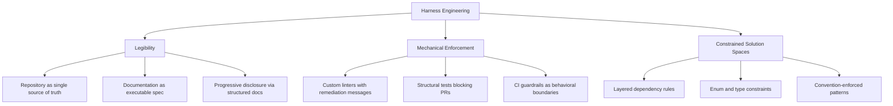
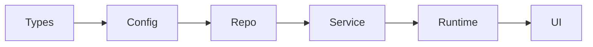
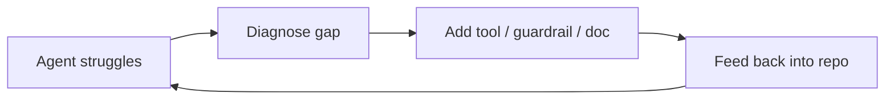
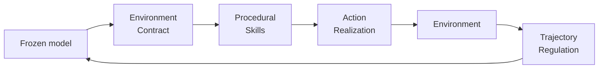
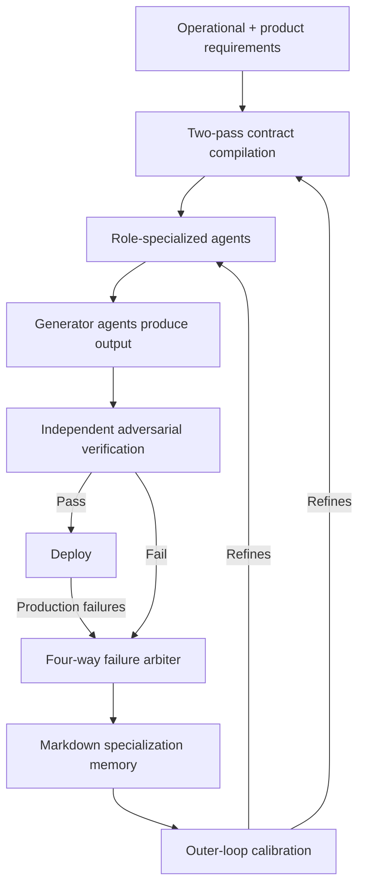

# Harness Engineering for Building Reliable AI Agents

> The discipline of designing agent environments -- layered architecture, mechanical enforcement, legibility -- so agents reliably produce correct results. Environment design matters more than prompting.

## The Discipline

Harness engineering is the practice of structuring a codebase, its tooling, and its documentation so that coding agents succeed by default. It treats the repository as the primary interface for agent work: if something is not in the repo, it does not exist for the agent.

OpenAI, Anthropic, LangChain, and Martin Fowler's team each published findings converging on the same conclusion: environment quality determines agent output quality more than model capability or prompt sophistication.

OpenAI shipped roughly one million lines of production code without manually written source in a five-month experiment. The enabler was environment design ([InfoQ](https://www.infoq.com/news/2026/02/openai-harness-engineering-codex/)). LangChain improved Terminal Bench 2.0 from 52.8% to 66.5% through pure harness changes -- no model change ([LangChain](https://blog.langchain.com/improving-deep-agents-with-harness-engineering/)).

## Three Pillars


```mermaid
flowchart TD
    HE[Harness Engineering] --> L[Legibility]
    HE --> ME[Mechanical Enforcement]
    HE --> CS[Constrained Solution Spaces]

    L --> L1[Repository as single source of truth]
    L --> L2[Documentation as executable spec]
    L --> L3[Progressive disclosure via structured docs]

    ME --> ME1[Custom linters with remediation messages]
    ME --> ME2[Structural tests blocking PRs]
    ME --> ME3[CI guardrails as behavioral boundaries]

    CS --> CS1[Layered dependency rules]
    CS --> CS2[Enum and type constraints]
    CS --> CS3[Convention-enforced patterns]
```

### Legibility

Anything not in the repository does not exist for agents. Repository legibility -- how easily an agent can find, read, and act on project knowledge -- determines the capability ceiling. It includes:

- **Documentation structure** -- [AGENTS.md as a compact index](../instructions/agents-md-as-table-of-contents.md) (~100 lines) pointing to deeper resources, not a monolithic knowledge dump
- **Decision visibility** -- architectural choices and rationale documented where agents encounter them (inline comments, directory-level READMEs)
- **[Progressive disclosure](progressive-disclosure-agents.md)** -- layered docs so agents load context proportional to the task

Legibility is distinct from [codebase readiness](codebase-readiness.md), which focuses on code-level qualities (types, tests, patterns); legibility focuses on knowledge organization.

### Mechanical Enforcement

Written conventions rely on agent compliance. Mechanical enforcement makes violation impossible -- or immediately visible.

| Mechanism | What it enforces | How the agent experiences it |
|-----------|-----------------|------------------------------|
| Custom linter | Dependency layer rules, import restrictions | Error message at the exact decision point |
| Structural test | Architecture invariants (no UI imports in service layer) | Test failure with actionable fix description |
| CI gate | Build, lint, test must pass before merge | Binary pass/fail blocking the PR |
| Pre-commit hook | Format, lint on every commit | Immediate feedback before the commit lands |

**Linter error messages are just-in-time context**: the failure output enters the agent's context at the exact moment it needs to make a different decision. Write messages as actionable remediation, not violation flags ([Fowler/Bockeler](https://martinfowler.com/articles/exploring-gen-ai/harness-engineering.html)).

```
# Bad: flags the problem
ERROR: Service layer cannot import from UI layer.

# Good: provides remediation
ERROR: Service layer cannot import from UI layer.
  Move shared logic to a Provider in src/providers/,
  or restructure to keep UI-specific code in src/ui/.
  See docs/architecture/layer-rules.md for the dependency diagram.
```

OpenAI's custom linters enforcing these constraints were themselves generated by coding agents, creating a self-reinforcing loop: agents build the guardrails that constrain future agent work ([Lavaee](https://alexlavaee.me/blog/openai-agent-first-codebase-learnings/)).

### Constrained Solution Spaces

Trading "generate anything" flexibility for reliability by restricting available architectures rather than hoping the agent picks a good one.

OpenAI's Harness team enforces a strict dependency chain:


```mermaid
flowchart LR
    T[Types] --> C[Config]
    C --> R[Repo]
    R --> S[Service]
    S --> RT[Runtime]
    RT --> UI[UI]
```

Each layer may only import from layers to its left. This is enforced by linters and structural tests that block PRs on violation -- not by documentation that asks agents to comply ([Lavaee](https://alexlavaee.me/blog/openai-agent-first-codebase-learnings/), [InfoQ](https://www.infoq.com/news/2026/02/openai-harness-engineering-codex/)).

An agent in the Service layer cannot couple to UI concerns because tooling prevents it. Fewer valid options means fewer wrong options.

## The Feedback Signal

When an agent struggles, the struggle is diagnostic. Harness engineering treats agent failure as a signal about the environment, not about the agent:


```mermaid
flowchart LR
    F[Agent struggles] --> D[Diagnose gap]
    D --> Fix[Add tool / guardrail / doc]
    Fix --> R[Feed back into repo]
    R --> F
```

Each iteration improves the harness for all future agent sessions. This is the same [agentic flywheel](agentic-flywheel.md) applied specifically to environment design: every failure that gets addressed as a harness improvement compounds across all agents and all sessions ([Fowler/Bockeler](https://martinfowler.com/articles/exploring-gen-ai/harness-engineering.html)).

Mid-run, the same diagnostic stance drives runtime recovery — see [Exception Handling and Recovery Patterns](exception-handling-recovery-patterns.md) and [Rollback-First Design](rollback-first-design.md) for the recovery counterparts to this evolutionary loop.

## Operational Concerns

Beyond the three design pillars, production harnesses own four runtime concerns that compound across sessions — each with canonical coverage elsewhere:

- **Permission boundaries** — runtime gates that enforce what CI cannot reach: [Permission Framework Over Model Trust](../security/permission-framework-over-model.md), [Permission-Gated Custom Commands](../security/permission-gated-commands.md).
- **Sandboxing** — runtime-layer isolation paired with CI-layer enforcement: [Sandbox Runtime Comparison](../security/sandbox-runtime-comparison.md), [Sandbox Rules at the Harness/Tools Boundary](../security/sandbox-rules-harness-tools.md).
- **Cost controls** — the harness owns token and tool-call budgets, not just correctness: [Cost-Aware Agent Design](cost-aware-agent-design.md), [Dual-Budget Control](dual-budget-control-search-agents.md).
- **Failure recovery** — distinct from the harness-evolution loop above: [Exception Handling and Recovery Patterns](exception-handling-recovery-patterns.md), [Rollback-First Design](rollback-first-design.md).

## Entropy Management

Codebases drift -- documentation goes stale, boundaries erode, conventions accumulate exceptions. Harness engineering includes active [entropy reduction](../workflows/entropy-reduction-agents.md): periodic agent scans for inconsistencies, auto-generated refactoring PRs targeting specific drift, and linters that evolve with the codebase. The harness is maintained infrastructure, not a bootstrap step ([Lavaee](https://alexlavaee.me/blog/openai-agent-first-codebase-learnings/), [Fowler/Bockeler](https://martinfowler.com/articles/exploring-gen-ai/harness-engineering.html)).

## Example

A TypeScript subscription API has three source directories: `src/types`, `src/services`, and `src/api`. An agent is asked to add a billing webhook endpoint.

**Without harness engineering**: the agent imports a database client directly into the route handler (`src/api`), pulls a UI formatter from a shared utility, and opens a PR. It works locally. CI fails in staging due to a circular import and a missing environment variable. A human debugs it for an hour.

**With harness engineering**:

*Legibility* — `AGENTS.md` at the repo root (≈80 lines) describes the three directories, their responsibilities, and what each layer may import. `src/api/README.md` says: "Route handlers only. Call service methods — do not import from `src/types` or database clients directly."

*Mechanical enforcement* — a custom ESLint rule blocks cross-layer imports with a remediation message at the point of violation:

```
ESLintError [api/no-direct-db-import]:
  src/api/webhook.ts:4 — api layer cannot import from src/services/db.ts.
  Call a method in src/services/ instead, or add one if it doesn't exist.
  See docs/architecture/layers.md
```

*Constrained solution spaces* — a structural test (`npm run test:arch`) enforces `types → services → api` as the only valid import direction, failing with the exact files involved on any violation.

**What the agent experiences**: it attempts the direct database import, receives the ESLint error, restructures to call `src/services/billing.ts`, and opens a PR that passes CI on the first run. Legibility told it what to do, mechanical enforcement told it when it was wrong, and constrained solution spaces left the correct path as the only one available.

## When This Backfires

Harness engineering addresses structural failure modes reliably -- import violations, architecture boundary crossings, format errors. It does not reliably catch higher-impact problems: misdiagnosis of issues, overengineering, unnecessary features, and misunderstood instructions still surface because linters and CI gates operate at the syntax and architecture layer, not the intent layer ([Fowler](https://martinfowler.com/articles/harness-engineering.html)).

Three specific conditions where the investment pays off less:

- **Over-constraint limits problem-solving** -- excessively narrow linter rules block valid solutions and force agents to contort implementations to satisfy constraints rather than solve the actual problem. Comprehensive tool libraries with every capability gave worse results than stripped-down essentials in Vercel's experience; fewer choices made agents faster and more reliable ([NxCode](https://www.nxcode.io/resources/news/harness-engineering-complete-guide-ai-agent-codex-2026)).
- **Documentation maintenance overhead** -- monolithic instruction files rot quickly; stale rules become noise that degrades agent decision quality (the failure mode [AGENTS.md as a compact index](../instructions/agents-md-as-table-of-contents.md) is designed to avoid). The harness requires active maintenance proportional to codebase change rate, or it becomes a liability.
- **Short-lived codebases** -- building custom linters, structural tests, and layered docs pays off across many agent sessions. For prototypes or throwaway code, the investment cost exceeds the reliability benefit.

## Runtime Harness Adaptation: Fixing the Interface, Not the Model

A specialised application of the feedback signal above fixes recurring LLM-agent failures by editing the model-environment interface, not the model. Each recurring failure in a training trajectory becomes a rule, skill, validator, or monitor at one of four layers; the harness is held fixed at evaluation. [Xu et al. (2026)](https://arxiv.org/abs/2605.22166) report 116 of 126 model-environment settings improved across 18 backbones — average +88.5% relative — with harnesses evolved from a single 4B model transferring to 17 others.

The technique only generalises in **deterministic, rule-governed environments** with stable tool interfaces and stable success criteria; the authors flag fully open-ended tasks as outside scope ([Xu et al., 2026](https://arxiv.org/html/2605.22166v1)). Coding-agent work sits *between*: refactoring a typed codebase with linters and tests is rule-governed; building a novel feature from a vague prompt is not. Use the four-layer surface for the rule-governed slices.


```mermaid
graph LR
    M[Frozen model] --> EC[Environment<br/>Contract]
    EC --> PS[Procedural<br/>Skills]
    PS --> AR[Action<br/>Realization]
    AR --> E[Environment]
    E --> TR[Trajectory<br/>Regulation]
    TR --> M
```

| Layer | What it does | Failure mode it catches |
|-------|--------------|-------------------------|
| **Environment contract** | Makes stable constraints, policy clauses, tool-use rules, and known pitfalls explicit before the first turn | Valid syntax, wrong tool usage — model never saw the rule |
| **Procedural skill** | Skill library distilled from training trajectories; retrieves task-relevant skills as non-parametric guidance | Reasoning gaps the model could fill if shown the right procedure once |
| **Action realization** | Gate between model output and environment; verifies executability, canonicalises interface errors, blocks deterministically failing actions | Action intent unclear in executable form, repeated bad-argument calls |
| **Trajectory regulation** | Post-execution monitor for repetition, stagnation, budget exhaustion; triggers recovery | Degenerate loops, premature termination, runaway budgets |

Each layer is sourced from observed trajectory failures, not from a priori design. Encoding the interface once and gating execution against it converts per-call inference into retrieval and gating, which LLMs perform more consistently than reconstruction from weights ([Zhou et al., 2026 — externalization survey](https://arxiv.org/pdf/2604.08224); [Xu et al., 2026](https://arxiv.org/abs/2605.22166)). Cross-backbone transfer holds only to the extent that what is encoded is environment-side, not model-side. When the next model handles an action natively — structured output, native tool-call repair, internal stopping — action-realization and trajectory-regulation layers become depreciating capital: Cursor measured a 30% drop on GPT-5-Codex when reasoning traces were dropped between tool calls, forcing the model to re-infer its prior thought process ([Cursor](https://cursor.com/blog/codex-model-harness)). Place each fix at the matching layer (policy violation → environment contract; reasoning skip → procedural skill; bad argument → action realization; loop or stall → trajectory regulation), hold the harness fixed at evaluation, and re-ablate on every model swap to drop rules whose lift evaporates ([per-model harness tuning](per-model-harness-tuning.md), [isometric harness ablation](isometric-harness-ablation.md)).

## Meta-Engineering Harness: The Production-Scale Composite

Scaled across many features and months, harness engineering becomes a *composite* architecture that integrates contract compilation, role-specialized agents, adversarial verification, and outer-loop calibration into one feedback loop. This is a `emerging` production-scale pattern: it pays back only when four conditions hold simultaneously, per the deployment report in [Sengupta et al., May 2026](https://arxiv.org/abs/2605.25665):

- **Continuous production, not project work** — the same system delivers many features over months or years.
- **Feature throughput amortises the outer loop** — below roughly ten features per quarter, the failure-classification pipeline costs more than it saves.
- **Token-cost overhead is acceptable** — single agents use about 4x more tokens than chat, multi-agent systems about 15x ([Anthropic Engineering](https://www.anthropic.com/engineering/multi-agent-research-system)).
- **Requirements settle before generation** — the two-pass compiler needs contracts stable enough to compile against.

Below this threshold, simpler architectures — single-agent harnesses, [sprint contracts](sprint-contracts.md) per task, [research-plan-implement](../workflows/research-plan-implement.md) loops — deliver better cost-per-feature.


```mermaid
graph TD
    REQ[Operational + product requirements] --> C[Two-pass contract compilation]
    C --> R[Role-specialized agents]
    R --> G[Generator agents produce output]
    G --> V[Independent adversarial verification]
    V -->|Pass| D[Deploy]
    V -->|Fail| F[Four-way failure arbiter]
    D -->|Production failures| F
    F --> M[Markdown specialization memory]
    M --> O[Outer-loop calibration]
    O -->|Refines| C
    O -->|Refines| R
```

The four mechanisms:

1. **Two-pass contract compilation.** Requirements compile into explicit, machine-readable contracts *before* any agent generates code. Two passes exist because operational requirements (latency, error budgets, observability) and product requirements (user-visible behaviour) carry different trade-off boundaries — one pass cannot reconcile both without losing structure ([Sengupta et al., 2026](https://arxiv.org/abs/2605.25665)). This is broader than per-task [sprint contracts](sprint-contracts.md): the harness compiles the entire feature surface.
2. **Role-specialized agents.** Work routes through agents with exclusive scopes — see [specialized agent roles](specialized-agent-roles.md) — extended with explicit handoff schemas addressing accountability and context-fragmentation problems ([traceability research](https://arxiv.org/abs/2510.07614)).
3. **Independent and adversarial verification.** Verification runs as a separate role with no access to the generator's reasoning, plus a "four-way failure arbiter" for the canonical disagreement outcomes ([Sengupta et al., 2026](https://arxiv.org/abs/2605.25665)). Critic-builder separation favours false positives over false negatives ([Adversarial Code Review pattern](https://asdlc.io/patterns/adversarial-code-review/)) — but role separation alone is not sufficient: framing a change as bug-free reduces LLM vulnerability detection by 16–93% ([arxiv 2603.18740](https://arxiv.org/abs/2603.18740)). The contract is load-bearing — it gives the verifier an independent target no upstream framing can defeat.
4. **Outer-loop calibration via failure classification.** Production failures feed back into structural improvements to contracts and verification boundaries, not per-feature patches — the [incident-to-eval synthesis](../verification/incident-to-eval-synthesis.md) discipline at architecture level. The substrate is persistent markdown memory with "specialization records," structurally the same as [persona-as-code](persona-as-code.md) and [agent memory patterns](agent-memory-patterns.md). The payments case study — 17 features over several weeks — surfaced contract incompleteness and verification-boundary gaps that the calibration loop turned into targeted architectural improvements rather than 17 one-off patches.

The calibration loop is the part that earns the "meta" prefix; without it, the architecture is just a multi-agent pipeline. It backfires below the throughput threshold, on heavy feature interdependencies where role-separation coordination overhead exceeds parallelism benefit (coding tasks "have fewer parallelizable opportunities than research" — [Anthropic Engineering](https://www.anthropic.com/engineering/multi-agent-research-system)), under frequent requirement churn that staleness contracts faster than calibration refines them, and in cost-constrained deployments. The originating 17-feature deployment includes no single-agent A/B baseline — treat the architecture as a structurally-grounded candidate, not an empirically-proven default.

## Key Takeaways

- Harness engineering is the discipline of designing environments where agents succeed by default -- it subsumes prompt engineering
- Three pillars: legibility (repo as single source of truth), mechanical enforcement (linters and CI as behavioral boundaries), constrained solution spaces (restricted architectures)
- Linter error messages are just-in-time agent context -- write them as remediation instructions, not violation flags
- Agent failure is a signal about the environment; feed fixes back into the repository
- Environment design compounds: every harness improvement benefits all future agent sessions

## Related

- [Agent Harness](agent-harness.md) -- the specific initializer/worker two-phase architecture
- [Harness Hill-Climbing](harness-hill-climbing.md) -- eval-driven iterative improvement of the agent harness using benchmark scores as the optimization signal
- [Per-Model Harness Tuning](per-model-harness-tuning.md) -- when runtime-adaptation transfer breaks, declare model-keyed overrides
- [Sprint Contracts](sprint-contracts.md) -- per-task evaluator agreements; the constituent mechanism the meta-engineering composite scales up
- [Specialized Agent Roles](specialized-agent-roles.md) -- the role-specialization mechanism the meta-engineering composite extends with handoff schemas
- [Incident-to-Eval Synthesis](../verification/incident-to-eval-synthesis.md) -- the calibration discipline that converts production failures into structural improvements
- [Codebase Readiness](codebase-readiness.md) -- code-level qualities that make a codebase agent-friendly
- [Rigor Relocation](../human/rigor-relocation.md) -- the broader thesis that engineering discipline relocates from code to scaffolding
