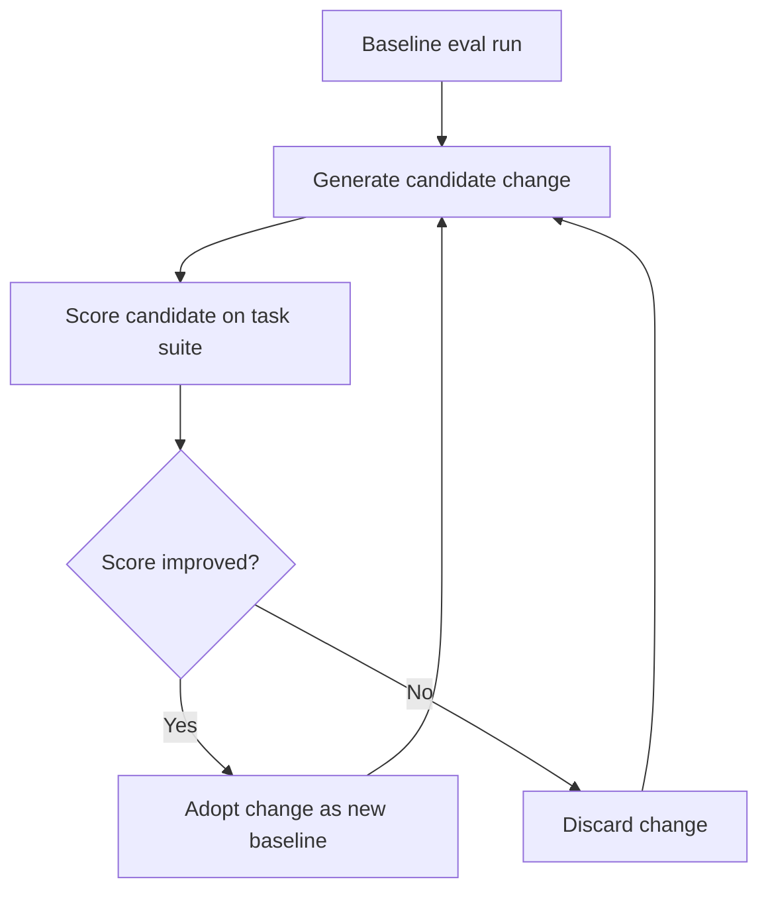

# Harness Hill-Climbing

> Use eval scores as the optimization signal to systematically improve agent harness configuration, replacing ad-hoc prompt tweaking with a structured feedback loop.

## The Loop

Harness hill-climbing applies local search to agent configuration: run a benchmark suite, make one targeted change, re-score, keep the change if the score improves. Repeat. No model changes. No retraining. The eval score is the gradient signal.

LangChain applied this on Terminal Bench 2.0 and moved from 52.8% to 66.5% through harness-only changes — no model swap ([LangChain: Improving Deep Agents with Harness Engineering](https://blog.langchain.com/improving-deep-agents-with-harness-engineering/)). Each iteration targeted one variable at a time.

## What to Tune

Not all harness components are equally amenable to eval-driven iteration. Tunable variables with measurable impact:

| Component | What changes | Signal |
|---|---|---|
| System prompt wording | Phrasing of constraints, persona, output format | Task pass rate |
| Tool descriptions | What each tool claims to do; inclusion/exclusion of examples | Tool call accuracy |
| Reasoning budget | Token allocation for planning vs. implementation phases | Score vs. cost |
| Pre-completion checklist | Verification steps agent runs before declaring done | Premature-exit rate |
| Loop-detection thresholds | Edit counts or retry limits before intervention | Loop frequency |
| Context injection timing | When reference docs or prior state load into context | Task coherence |

The [reasoning sandwich pattern](reasoning-budget-allocation.md) is a concrete example: allocating maximum reasoning compute for planning and verification phases with moderate compute for implementation scored 63.6% vs. 53.9% for uniform maximum — a measurable delta from a single configuration change ([LangChain](https://blog.langchain.com/improving-deep-agents-with-harness-engineering/)).

## Eval Design for Tuning

The task suite you tune against must satisfy two requirements: it must be representative, and it must be held out from production use so you don't accidentally measure your eval fixture rather than real capability.

**Isolation**: Use a separate task set for tuning and a second held-out set for final validation. Never tune against the validation set. This mirrors train/validation/test splits in model training — the discipline is identical.

**Breadth**: Include tasks where the target behavior *should* trigger and tasks where it *shouldn't*. A harness optimized only against positive cases will over-trigger. Anthropic's eval guidance specifies testing both directions explicitly ([Demystifying Evals for AI Agents](https://www.anthropic.com/engineering/demystifying-evals-for-ai-agents)).

**Grading**: Prefer deterministic outcome graders (test suite pass/fail, schema checks) over LLM-as-judge for the tuning loop. Deterministic graders are cheaper to run repeatedly and eliminate evaluator variance from the signal. Use [pass^k](../verification/pass-at-k-metrics.md) rather than single-trial pass rate when consistency matters — a harness that scores 90% on one run but 60% on another hasn't actually improved.

## Overfitting Risk

A harness tuned to a specific eval suite can score high on that suite while degrading on real workloads. This happens when the harness over-indexes on surface patterns in the eval tasks rather than the underlying capability.

Signs of eval overfitting:

- Score on the tuning suite keeps rising while production error rates stay flat or increase
- The harness changes that "work" are narrow prompt additions that match specific eval phrasing
- Held-out validation score doesn't track the tuning score

Mitigations:

- **Rotate eval tasks**: periodically replace tuning tasks with fresh ones drawn from production traces; see [Incident-to-Eval Synthesis](../verification/incident-to-eval-synthesis.md)
- **Held-out validation**: run a final check on a task set that never touched the tuning loop before promoting a harness change
- **Monitor production**: treat eval score as a leading indicator, not a final signal; production outcomes are the ground truth

The [agentic flywheel](agentic-flywheel.md) page notes this directly: "Harness optimizes for a specific eval suite, not general capability. Rotate eval tasks and include unseen scenarios."

## One Change at a Time

The hill-climbing loop depends on isolating variables. Changing system prompt wording and tool descriptions in the same iteration conflates two signals — you cannot attribute a score change to either change specifically.

Single-variable changes also make rollback trivial: if a change degrades the score, reverting is unambiguous. Multi-variable changes require untangling which component caused the regression.

This is the same principle as [incremental verification](../verification/incremental-verification.md): commit to small, checkpointed steps so each step is independently reversible and attributable.

## Relationship to Continuous Improvement

Hill-climbing is a structured, eval-mediated version of the [continuous agent improvement](../workflows/continuous-agent-improvement.md) loop. That loop relies on human observation to identify failure patterns; hill-climbing replaces observation with eval measurement. Use continuous improvement to identify *which component* to target, then use hill-climbing to find the best configuration for it.

The [agentic flywheel](agentic-flywheel.md) extends this: agents propose candidate changes automatically, and the eval loop validates them — removing the human from change generation while preserving approval gates.

## Key Takeaways

- Run a baseline eval suite, change one harness variable, re-score, keep or discard; repeat
- LangChain moved Terminal Bench 2.0 from 52.8% to 66.5% through harness-only changes using this loop
- Tune on one task set; validate on a separate held-out set; monitor production outcomes as ground truth
- Prefer deterministic outcome graders (test suites) over LLM-as-judge for tight iteration cycles
- Changing one variable per iteration makes score changes attributable and rollback unambiguous
- Eval overfitting is real: rotate tasks and include out-of-distribution scenarios to catch it

## Related

- [Harness Engineering](harness-engineering.md) — designing reliable agent environments
- [Agentic Flywheel](agentic-flywheel.md) — automated harness self-improvement using the same eval signal
- [Continuous Agent Improvement](../workflows/continuous-agent-improvement.md) — human-driven observation-to-update loop
- [Evaluator-Optimizer Pattern](evaluator-optimizer.md) — two-role LLM loop for iterative output refinement
- [pass@k and pass^k Metrics](../verification/pass-at-k-metrics.md) — capability vs. consistency metrics for eval measurement
- [Incident-to-Eval Synthesis](../verification/incident-to-eval-synthesis.md) — sourcing eval tasks from production failures
- [Reasoning Budget Allocation](reasoning-budget-allocation.md) — reasoning sandwich as a concrete tunable component
- [Incremental Verification](../verification/incremental-verification.md) — the same one-step-at-a-time principle applied to implementation
