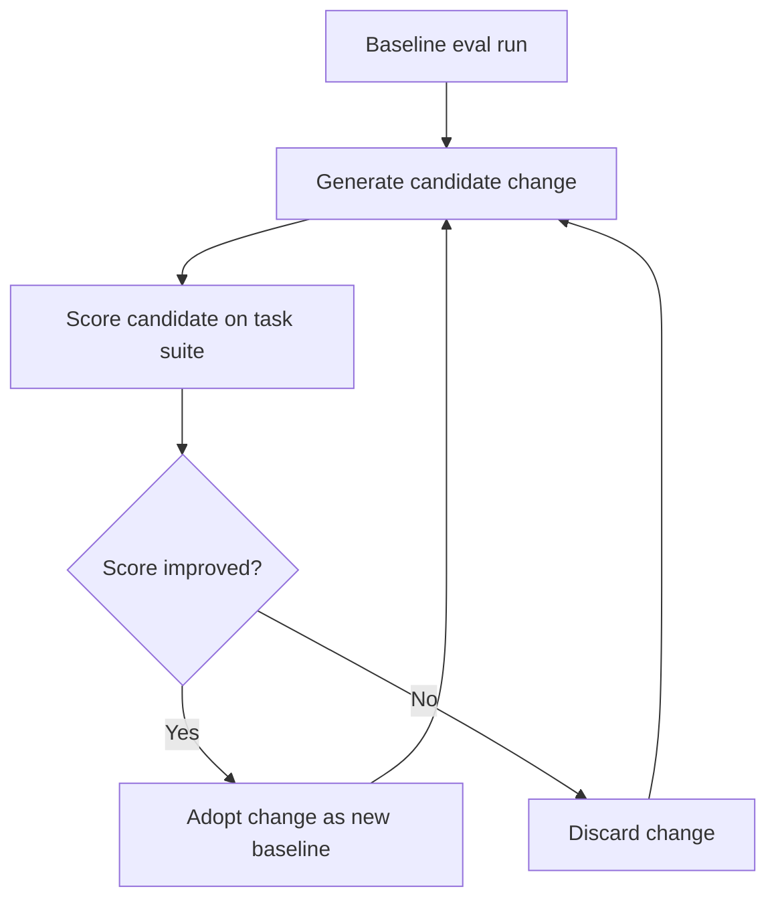

# Harness Hill-Climbing

> Use eval scores as the optimization signal to systematically improve agent harness configuration, replacing ad-hoc prompt tweaking with a structured feedback loop.

## The Loop

Harness hill-climbing applies local search to agent configuration: run a benchmark suite, make one targeted change, re-score, keep the change if the score improves. Repeat. No model changes. No retraining. The eval score is the gradient signal.

LangChain applied this on Terminal Bench 2.0 and moved from 52.8% to 66.5% through harness-only changes — no model swap ([LangChain: Improving Deep Agents with Harness Engineering](https://blog.langchain.com/improving-deep-agents-with-harness-engineering/)). Each iteration targeted one variable at a time.

## What to Tune

Tunable variables with measurable impact:

| Component | What changes | Signal |
|---|---|---|
| System prompt wording | Phrasing of constraints, persona, output format | Task pass rate |
| Tool descriptions | What each tool claims to do; inclusion/exclusion of examples | Tool call accuracy |
| Reasoning budget | Token allocation for planning vs. implementation phases | Score vs. cost |
| Pre-completion checklist | Verification steps agent runs before declaring done | Premature-exit rate |
| Loop-detection thresholds | Edit counts or retry limits before intervention | Loop frequency |
| Context injection timing | When reference docs or prior state load into context | Task coherence |

The [reasoning sandwich pattern](reasoning-budget-allocation.md) is a concrete example: allocating maximum reasoning compute for planning and verification phases with moderate compute for implementation scored 63.6% vs. 53.9% for uniform maximum — a measurable delta from a single configuration change ([LangChain](https://blog.langchain.com/improving-deep-agents-with-harness-engineering/)).

## Eval Design for Tuning

The task suite must be representative and held out from production use — otherwise you measure your eval fixture, not real capability.

**Isolation**: Use a separate set for tuning and a second held-out set for final validation. Never tune against the validation set. Same discipline as train/validation/test splits in model training.

**Breadth**: Include tasks where the target behavior *should* trigger and tasks where it *shouldn't*. A harness optimized only on positive cases will over-trigger. Anthropic's eval guidance specifies testing both directions explicitly ([Demystifying Evals for AI Agents](https://www.anthropic.com/engineering/demystifying-evals-for-ai-agents)).

**Grading**: Prefer deterministic outcome graders (pass/fail, schema checks) over LLM-as-judge for the tuning loop — cheaper to run repeatedly, eliminates evaluator variance from the signal. Use [pass^k](../verification/pass-at-k-metrics.md) rather than single-trial pass rate when consistency matters.

## Overfitting Risk

A harness tuned to a specific eval suite can score high on that suite while degrading on real workloads — the harness over-indexes on surface patterns in eval tasks rather than the underlying capability.

Signs: tuning-suite score keeps rising while production error rates stay flat or increase; harness changes that "work" are narrow prompt additions that match eval phrasing; held-out validation score doesn't track the tuning score.

Mitigations:

- **Rotate eval tasks**: periodically replace tuning tasks with fresh ones drawn from production traces; see [Incident-to-Eval Synthesis](../verification/incident-to-eval-synthesis.md)
- **Held-out validation**: run a final check on a task set that never touched the tuning loop before promoting a harness change
- **Monitor production**: treat eval score as a leading indicator; production outcomes are ground truth

## When This Backfires

Hill-climbing finds a local optimum, not a global one — if the baseline sits in a poor region of configuration space, iteration converges to the nearest local peak. Three further conditions degrade the loop:

- **Benchmark cost exceeds benefit**: Building a graded task suite takes significant effort. For narrow-scope agents, ad-hoc prompt editing reaches good-enough performance faster.
- **Component interdependencies**: Single-variable iteration assumes harness components are approximately orthogonal. When prompt phrasing, tool descriptions, and reasoning budget interact, changing one variable masks or amplifies effects of another.
- **Benchmark-to-production drift**: The eval suite is a snapshot. If production workload shifts after tuning, the optimized configuration may degrade on new task types — see [Incident-to-Eval Synthesis](../verification/incident-to-eval-synthesis.md).

## One Change at a Time

The hill-climbing loop depends on isolating variables. Changing system prompt wording and tool descriptions in the same iteration conflates two signals — you cannot attribute a score delta to either change specifically.

Single-variable changes make rollback unambiguous; multi-variable changes require untangling which component caused the regression. Same principle as [incremental verification](../verification/incremental-verification.md): small, checkpointed steps, each independently reversible.

## Relationship to Continuous Improvement

Hill-climbing is an eval-mediated version of the [continuous agent improvement](../workflows/continuous-agent-improvement.md) loop — that loop uses human observation; hill-climbing substitutes measurement. Use continuous improvement to identify *which component* to target, then hill-climbing to find the best configuration.

The [agentic flywheel](agentic-flywheel.md) extends this: agents propose candidate changes automatically, with the eval loop as the validation gate.

## Key Takeaways

- Run a baseline eval suite, change one harness variable, re-score, keep or discard; repeat
- LangChain moved Terminal Bench 2.0 from 52.8% to 66.5% through harness-only changes using this loop
- Tune on one task set; validate on a separate held-out set; monitor production outcomes as ground truth
- Prefer deterministic outcome graders (test suites) over LLM-as-judge for tight iteration cycles
- Changing one variable per iteration makes score changes attributable and rollback unambiguous
- Eval overfitting is real: rotate tasks and include out-of-distribution scenarios to catch it

## Related

- [Agent Harness](agent-harness.md) — the initializer + coding agent structure that harness hill-climbing optimizes
- [Harness Engineering](harness-engineering.md) — designing reliable agent environments
- [Agentic Flywheel](agentic-flywheel.md) — automated harness self-improvement using the same eval signal
- [Continuous Agent Improvement](../workflows/continuous-agent-improvement.md) — human-driven observation-to-update loop
- [Evaluator-Optimizer Pattern](evaluator-optimizer.md) — two-role LLM loop for iterative output refinement
- [pass@k and pass^k Metrics](../verification/pass-at-k-metrics.md) — capability vs. consistency metrics for eval measurement
- [Incident-to-Eval Synthesis](../verification/incident-to-eval-synthesis.md) — sourcing eval tasks from production failures
- [Reasoning Budget Allocation](reasoning-budget-allocation.md) — reasoning sandwich as a concrete tunable component
- [Incremental Verification](../verification/incremental-verification.md) — the same one-step-at-a-time principle applied to implementation
- [Rollback-First Design](rollback-first-design.md) — applying reversibility as a design constraint so each harness change can be undone with one step
- [LLM-as-Judge Evaluation](../workflows/llm-as-judge-evaluation.md) — when to use LLM-as-judge vs. deterministic graders, and how to calibrate both
