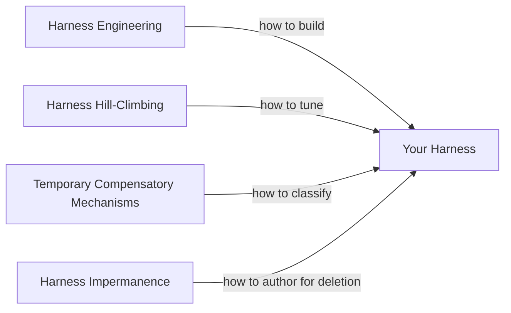

# Harness Impermanence: Build Scaffolding To Be Deleted

> Treat agent harness scaffolding as code with a finite shelf life. Design for low cost of removal, not elegance preservation, so native model capability can replace it cleanly.

Harness impermanence is the discipline of authoring agent scaffolding — multi-step orchestration, tool wrappers, parsing and validation layers, retry middleware — assuming a future model release will subsume the capability. The design constraint is not "is this elegant?" but "when the next model does this natively, how hard is it to delete?" ([Google](https://developers.googleblog.com/en/build-better-ai-agents-5-developer-tips-from-the-agent-bake-off/), [philschmid.de](https://www.philschmid.de/agent-harness-2026)).

## Why the Shelf Life is Short

Google's Agent Bake-Off documented teams who built multi-step virtual try-on pipelines in a three-hour sprint on Gemini 2.0; "the first version of Nano Banana was just weeks away ... that same complex virtual try-on experience can be achieved in a single prompt" ([Google](https://developers.googleblog.com/en/build-better-ai-agents-5-developer-tips-from-the-agent-bake-off/)). The driver is the [Bitter Lesson](http://www.incompleteideas.net/IncIdeas/BitterLesson.html) — general compute-based methods outpace hand-coded human knowledge — applied to agent infrastructure: scaffolding that wraps a current-generation limitation is hand-coded knowledge with an expiration date.

Evidence across teams:

- Manus refactored their harness five times in six months to remove rigid assumptions ([philschmid.de](https://www.philschmid.de/agent-harness-2026)).
- LangChain re-architected their Open Deep Research agent three times in a single year ([philschmid.de](https://www.philschmid.de/agent-harness-2026)).
- Vercel removed 80% of their agent's tools, producing fewer steps, fewer tokens, and faster responses ([Vercel](https://vercel.com/blog/we-removed-80-percent-of-our-agents-tools)).

## The Smell

Scaffolding most likely to be obsoleted wraps a single model call with machinery the next-generation model handles natively:

- Multi-step pipelines around a capability the next-gen model does in one prompt (the Bake-Off try-on case).
- Custom parsers extracting structured fields when the API already supports structured output.
- Retry loops compensating for instruction drift that a longer-durable model no longer exhibits.
- Validation layers re-checking format constraints the model now satisfies reliably.

Phil Schmid's test: "Build harnesses that allow [you] to rip out the 'smart' logic [you] wrote yesterday. If you over-engineer the control flow, the next model update will break your system" ([philschmid.de](https://www.philschmid.de/agent-harness-2026)).

## Relationship to Adjacent Patterns



- [Harness Engineering](harness-engineering.md) — the discipline of building the harness.
- [Harness Hill-Climbing](harness-hill-climbing.md) — the eval-driven loop for tuning it.
- [Temporary Compensatory Mechanisms](temporary-compensatory-mechanisms.md) — classifying each mechanism as compensatory, structural, or mixed. Impermanence is the authoring discipline downstream of that classification: once you know a mechanism is compensatory, write it so removal is a deletion, not a rewrite.

## Design Moves

Four moves keep the cost of removal low:

- **Place the seam at the capability boundary.** Wrap a compensatory mechanism as middleware around a single model call, not as a multi-file pipeline threaded through the agent loop. The model call is where native capability will arrive.
- **Feature-flag each compensatory mechanism.** A config flag or middleware registration is the removal interface — removing the mechanism is flipping a flag and deleting one module ([Temporary Compensatory Mechanisms](temporary-compensatory-mechanisms.md)).
- **Annotate the obsolescence condition.** For every compensatory mechanism, record what limitation it compensates for and what capability would obsolete it. Without this, future engineers cannot tell which scaffolding is still needed.
- **Prefer atomic tools to hand-coded control flow.** "Do not build massive control flows. Provide robust atomic tools. Let the model make the plan" ([philschmid.de](https://www.philschmid.de/agent-harness-2026)). Atomic tools survive model generations; bespoke pipelines do not.

## Example

A team builds an agent that extracts contract terms. With Gemini 2.0 the output is inconsistent JSON, so they add:

1. A three-step sub-pipeline: draft extraction → validation LLM call → correction pass.
2. A custom parser that repairs unclosed braces and missing commas.
3. A regex fallback when parsing still fails.

Nano Banana ships with reliable structured output ([Google](https://developers.googleblog.com/en/build-better-ai-agents-5-developer-tips-from-the-agent-bake-off/)).

**Impermanence-aware version** — the same scaffolding is written as middleware around one model call:

```yaml
extraction:
  model_call: contract_extract
  middleware:
    - name: multi_step_extraction
      type: compensatory
      compensates_for: "Inconsistent structured output on Gemini 2.0"
      obsoleted_by: "Native reliable JSON schema output"
      enabled: true
    - name: json_repair
      type: compensatory
      compensates_for: "Occasional malformed JSON in completions"
      obsoleted_by: "Schema-constrained decoding"
      enabled: true
```

Deleting the scaffolding is flipping two flags and removing two modules. The model call, the atomic tool, and the downstream consumers do not change.

The badly-authored version threads validation logic through the agent loop, couples the repair parser to the orchestration state, and embeds regex fallbacks in consumer code. "Delete the scaffolding" is now a cross-file refactor that risks regressing the callers that depended on side effects.

## When This Backfires

Impermanence is a frontier-team discipline and costs more than it pays back under specific conditions:

- **Pinned-model deployments.** Regulated systems stay on a specific model version. Removability machinery is pure overhead when the mechanism never becomes obsolete within the project's lifetime ([Temporary Compensatory Mechanisms](temporary-compensatory-mechanisms.md)).
- **Short-lived tooling.** Internal tools with a sub-six-month horizon rarely live to see a model generation; the configuration surface costs more than the eventual deletion would.
- **Structural scaffolding misclassified as compensatory.** Sandboxing, permission gates, feedback loops, and observability hooks remain valuable regardless of model capability — more capability is a *stronger* argument for sandboxing. Designing structural mechanisms for cheap removal is wasted work.
- **Over-anticipation.** Predicting which capability the next model will subsume is error-prone. Remove scaffolding on observed capability, not on rumor.
- **Capabilities that improve slowly.** Self-verification, long-horizon instruction adherence, and loop avoidance have improved incrementally for years but remain unreliable; many "temporary" compensations outlive the projects that built them.

The discipline converts to "tag compensatory mechanisms and keep the removal seam shallow" — not "route every line behind its own feature flag."

## Key Takeaways

- Harness scaffolding is depreciating capital — its value falls as model capability rises. Architect for low cost of removal, not elegance preservation ([Google](https://developers.googleblog.com/en/build-better-ai-agents-5-developer-tips-from-the-agent-bake-off/)).
- The smell: scaffolding wrapping a single model call with retries, parsing, or validation the next-gen model handles natively.
- Four moves: place the seam at the capability boundary; feature-flag compensatory mechanisms; annotate the obsolescence condition; prefer atomic tools to hand-coded control flow ([philschmid.de](https://www.philschmid.de/agent-harness-2026)).
- The thesis is qualified — pinned-model deployments, short-lived tooling, and structural mechanisms do not benefit from removability machinery.
- Distinct from the adjacent patterns: [harness engineering](harness-engineering.md) builds it, [harness hill-climbing](harness-hill-climbing.md) tunes it, [temporary compensatory mechanisms](temporary-compensatory-mechanisms.md) classifies each mechanism; this page is how to *author* compensatory mechanisms so deletion stays cheap.

## Related

- [Harness Engineering](harness-engineering.md) — the discipline of designing agent environments that produce reliable output
- [Harness Hill-Climbing](harness-hill-climbing.md) — eval-driven iterative improvement of the harness configuration
- [Temporary Compensatory Mechanisms](temporary-compensatory-mechanisms.md) — classifying mechanisms as compensatory, structural, or mixed before building them
- [Agent Harness: Initializer and Coding Agent](agent-harness.md) — the two-phase architecture the impermanence discipline applies to
- [Agent Loop Middleware](agent-loop-middleware.md) — wrapping the agent loop from the outside so mechanisms remain removable
- [Runtime Scaffold Evolution](runtime-scaffold-evolution.md) — agents that synthesize and deprecate their own scaffolding at runtime
- [Rollback-First Design](rollback-first-design.md) — the same reversibility discipline applied to agent actions
- [Agentic Flywheel](agentic-flywheel.md) — agents proposing harness changes based on their own trajectory data
