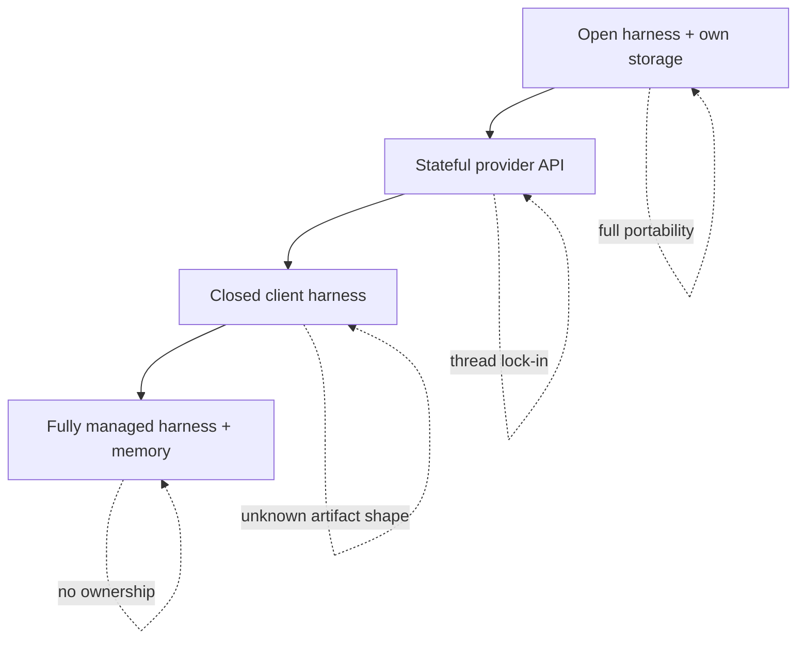

# Harness-Memory Coupling as a Design Axis

> Treat memory as a property of the harness, not a pluggable module. The load-bearing seams between them — write timing, compaction format, instruction loading, filesystem exposure — are the axis on which to compare or build agent systems.

## Memory Is Not a Plugin

Agent memory is often discussed as a separate service bolted onto a harness. Harrison Chase (LangChain, April 2026) argues the opposite: "Managing context, and therefore memory, is a core capability and responsibility of the agent harness" ([LangChain](https://blog.langchain.com/your-harness-your-memory/)). Short-term memory (messages, tool results) is what the harness manipulates every turn. Long-term memory (cross-session summaries, preferences, corrections) is written and read by the same loop. Both share one context window and one token budget. A memory system outside the harness re-implements turn-aware decisions the harness is already making.

Sarah Wooders (Letta): "Asking to plug memory into an agent harness is like asking to plug driving into a car" ([LangChain](https://blog.langchain.com/your-harness-your-memory/)).

## The Load-Bearing Seams

Every harness answers a fixed set of questions where memory meets execution. Changing harnesses means changing the answers — which is why memory written under one is rarely portable to another ([LangChain](https://blog.langchain.com/your-harness-your-memory/)):

| Seam | What the harness decides |
|------|--------------------------|
| Instruction loading | When `AGENTS.md` / `CLAUDE.md` is injected (system prompt, first user turn, lazy) |
| Skill metadata | Whether skill descriptions sit in the system prompt, system messages, or on-demand retrieval |
| Self-modification | Whether the agent can mutate its own system instructions mid-session |
| Compaction survival | Which fields survive compaction and in what format |
| Interaction storage | Whether turns are persisted, queryable, and re-injectable |
| Memory metadata | How stored memories are surfaced (tool results, system notes, priming) |
| Filesystem view | Which working directory and files are visible at each turn |

None are memory-library decisions. They are harness decisions. A memory module that tries to own them reimplements scheduler and compaction logic in a second place.

## Three Tiers of Coupling Risk

Chase describes an escalating ladder of ownership loss when memory entangles with a provider-controlled harness ([LangChain](https://blog.langchain.com/your-harness-your-memory/)):

**Stateful provider APIs** (OpenAI Responses API, Anthropic server-side compaction) hold conversation state on the provider. Resuming a thread against a different model is blocked — memory is keyed to the provider's server.

**Closed client harnesses** (Chase's example: Claude Agent SDK over closed-source Claude Code) write client-side memory artifacts in an unknown shape. The files are on your disk but another harness cannot read them.

**Fully managed harnesses with memory behind the API** are the highest-lock-in tier. [Anthropic's Claude Managed Agents](https://platform.claude.com/docs/en/managed-agents/overview) is Chase's example — harness, session log, and long-term memory all behind one API, with no user-side inspection or migration path.

Individual coupling points also leak lock-in. OpenAI's Codex is open source yet produces an encrypted compaction summary undecodable outside OpenAI ([LangChain](https://blog.langchain.com/your-harness-your-memory/)).

## Why Coupling Matters Even When You Pick a Vendor

Stateless model APIs are nearly interchangeable: prompts differ, protocols are similar, migration is tractable. State changes that calculus. Memory accumulates a proprietary dataset of interactions and preferences that makes the agent progressively more useful per user — and more expensive to replace ([LangChain](https://blog.langchain.com/your-harness-your-memory/)). The harness decides what enters that dataset and in what form. Owning the harness is how you own the memory.

Industry architectures corroborate the coupling. Anthropic's Managed Agents and LangChain's Deep Agents Deploy both document the Session — the event log that is memory — as authoritative state owned and replayed by the harness loop ([Anthropic](https://www.anthropic.com/engineering/managed-agents)). See [Session Harness Sandbox Separation](session-harness-sandbox-separation.md) for the three-primitive architecture.

## When the Coupling Framing Does Not Apply

The axis is useful when portability, continuity, or data ownership matter. Conditions that reduce its payoff:

- **Factual memory with no session continuity** — a stateless lookup assistant pulling preferences from a database each turn does not need harness-owned memory.
- **Throwaway prototypes** — investing in an open harness before the memory shape is known is premature.
- **Governed enterprise deployments where single-vendor is a feature** — if compliance requires one boundary around the whole agent, the managed-agents tier is the correct trade.
- **Short-lived memory** — in-session working memory discarded between runs carries no long-term lock-in risk.

## Using the Axis

For a new system, name each seam and decide who owns it before picking a harness. For an existing system, inventory the seams the current harness controls and ask which would have to be reimplemented to migrate. That list is the switching cost.

## Example

Two options for an internal research assistant:

**Option A — managed-agents tier.** The provider handles harness, session storage, and long-term memory behind one API. Setup is one week. Memory operations — compaction, retrieval, AGENTS.md loading, skill placement — are opaque. A year in, the team wants a different model with better retrieval; the stored memory (months of user-specific corrections) has no documented export format. Migration requires rebuilding memory from scratch.

**Option B — open harness with owned storage.** The team runs an open-source harness (e.g. Deep Agents) with memory in their own Postgres. Setup is three weeks. Explicit decisions: AGENTS.md loaded at session start, skill metadata in system messages, compaction summary stored as plain JSON, interaction log queryable by user id. A year in, swapping the model only requires re-pointing the harness — memory is untouched.

The difference is not that Option A has bad memory. Every seam in Option A was decided by the provider and is not retrievable. In Option B the seams are the team's choices and the memory rides along when the rest of the stack changes.

## Key Takeaways

- Memory is a harness property, not a pluggable module — the harness already owns the context decisions memory depends on
- Seven load-bearing seams (instruction loading, skill metadata, self-modification, compaction survival, interaction storage, memory metadata, filesystem view) are where the coupling manifests
- Lock-in escalates in three tiers: stateful provider APIs, closed client harnesses, fully managed harness+memory — each tier gives up more ownership
- Stateless models are interchangeable; stateful memory is not — the switching cost lives in the harness-memory interface
- The axis collapses when portability, continuity, or data ownership do not matter — name those conditions explicitly before dismissing it

## Related

- [Agent Harness: Initializer and Coding Agent Pattern](agent-harness.md)
- [Agent Memory Patterns](agent-memory-patterns.md)
- [Session Harness Sandbox Separation](session-harness-sandbox-separation.md)
- [Harness Engineering](harness-engineering.md)
- [Harness Design Dimensions and Archetypes](harness-design-dimensions.md)
- [Managed vs Self-Hosted Harness](managed-vs-self-hosted-harness.md)
- [Memory Synthesis from Execution Logs](memory-synthesis-execution-logs.md)
- [Agent Turn Model](agent-turn-model.md)
