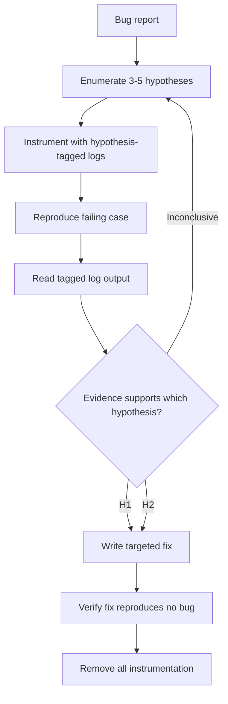

# Hypothesis-Driven Debugging: Instrument Before You Patch

> Force the agent to differentiate symptom from cause before writing a patch: enumerate competing hypotheses, instrument the failing code with hypothesis-tagged logs, converge on the root cause from runtime evidence, then remove the instrumentation.

## The Loop

Three steps, in order, with no shortcuts:

1. **Enumerate hypotheses** — generate 3–5 competing explanations for the bug, including ones a developer would not consider first.
2. **Instrument to discriminate** — insert log statements whose output will confirm or eliminate each hypothesis. Tag each line with the hypothesis it tests.
3. **Reproduce, converge, clean up** — run the failing case, read the tagged output, identify the hypothesis the evidence supports, write a targeted fix, and remove the instrumentation.

Cursor ships this as a first-class `/debug` mode in its CLI (2026-04-14): "Cursor generates hypotheses, adds log statements, and uses runtime information to pinpoint the issue before making a targeted fix." [Source: [CLI Debug Mode and /btw Support — Cursor Changelog](https://cursor.com/changelog/04-14-26)] The formal docs describe a five-phase workflow — exploration, instrumentation, reproduction, analysis, resolution/cleanup — and recommend the mode for bugs you can reproduce but cannot figure out, race conditions and timing issues, performance problems and memory leaks, and regressions. [Source: [Debug Mode — Cursor Docs](https://cursor.com/docs/agent/debug-mode)]



## Why It Beats Fix-and-Retry

A one-shot agent that proposes a patch from a stack trace alone is ranking fixes by model prior. A hypothesis-then-instrument loop ranks them by falsifiable evidence collected from the running program. Cursor reports Debug Mode typically produces "a precise two or three line modification" instead of "hundreds of lines of speculative code," and notes that "human-in-the-loop verification is critical" because the agent must confirm the bug is actually gone, not just that the code compiles. [Source: [Introducing Debug Mode — Cursor Blog](https://cursor.com/blog/debug-mode)]

The pattern is tool-portable. An open-source Claude Code skill, `claude-code-debug-mode`, implements the same loop for Claude Code, Codex, and Gemini CLI — generating 3–5 hypotheses, tagging log lines with hypothesis identifiers (`[DEBUG H1]`, `[DEBUG H2]`), writing them to `.claude/debug.log` rather than stdout to avoid context-window overflow, and stripping instrumentation on cleanup. [Source: [claude-code-debug-mode — GitHub](https://github.com/doraemonkeys/claude-code-debug-mode)] The hypothesis tag is load-bearing: unlabelled logs force the agent to re-interpret evidence on the second pass; tagged logs map output directly to the hypotheses being tested.

## When to Enter the Mode

Enter it when:

- The bug reproduces but the mechanism is unclear
- The stack trace ends in library code and the real cause is upstream state
- Prior agent attempts have produced speculative patches that did not fix the issue
- The bug is intermittent in a way that suggests timing, concurrency, or caching

Skip it when:

- The stack trace pins the defect to a single line and the repair is a one-token edit
- The bug is a straightforward type error or null dereference the model can fix from source alone
- The codepath cannot be safely instrumented (see trade-offs below)

## Trade-offs

- **Log pollution.** Even with hypothesis tags, heavy instrumentation inside a hot loop or widely-called helper can flood the log with noise that masks the discriminating line. Keep hypotheses narrow enough that each tag appears in tens of lines, not thousands.
- **Sensitive-data exposure.** Instrumenting an auth, PII, or payment handler writes variable state to the log file; if cleanup misses an intermediate branch the instrumentation becomes a data-leak vector. Mask secrets at the log call site, not after the fact.
- **Observer effect.** Log statements change timing. Inserted inside a race or latency-sensitive section, they can mask or shift the bug — the agent then converges on evidence from instrumented code, not the code that actually failed.
- **Reproduction dependency.** The loop requires that you can run the failing case with instrumentation in place. Production-only failures, load-triggered races, and unreliable tests break the reproduction step, and the agent converges on hypotheses from incomplete evidence.
- **Overhead on obvious fixes.** For bugs the model can resolve from source alone, entering the loop costs one or more agent turns on instrumentation and reproduction that were unnecessary.

## Tool-Specific Notes

- **Cursor CLI.** `/debug` is the entry point. Cleanup is automatic after the fix is verified. [Source: [Debug Mode — Cursor Docs](https://cursor.com/docs/agent/debug-mode)]
- **Claude Code / Codex / Gemini CLI.** Install a skill or prompt structure that enforces the hypothesis-tag convention. The `claude-code-debug-mode` skill writes to `.claude/debug.log` and wraps instrumentation in `#region DEBUG` blocks for automated removal across JavaScript, Python, Java, C#, Go, Rust, and HTML. [Source: [claude-code-debug-mode — GitHub](https://github.com/doraemonkeys/claude-code-debug-mode)]
- **Tool-agnostic restatement.** Any agent that can edit code and run it can execute the loop under prompt structure alone: the mechanism is scientific method applied to patch generation, not a model capability gain.

## Example

A Node.js service intermittently returns `undefined` from a cache lookup under concurrent load. The stack trace ends in user code, no error is thrown. A one-shot fix would guess at race conditions and add locks.

**Hypothesis enumeration:**

- `H1` — cache entry is evicted between `get()` and the next read (TTL race)
- `H2` — cache key is computed from an object whose serialisation is non-deterministic under concurrency
- `H3` — a concurrent `delete()` on a sibling key takes a shared lock that invalidates the read
- `H4` — the cache client pools connections and occasionally returns a stale read from a replica lagging the primary

**Instrumentation (hypothesis-tagged):**

```javascript
// #region DEBUG
console.log(`[DEBUG H1] key=${key} ttl_remaining=${entry?.ttl} now=${Date.now()}`);
console.log(`[DEBUG H2] key=${key} serialised=${JSON.stringify(keySource)}`);
console.log(`[DEBUG H3] active_ops=${client.inflightOps.size} lock_holder=${client.lockHolder}`);
console.log(`[DEBUG H4] read_from=${client.lastReadReplica} primary_lag_ms=${client.primaryLagMs}`);
// #endregion
```

**Reproduce + read logs:** under concurrent load, `[DEBUG H4]` lines show `read_from=replica-2 primary_lag_ms=340` on every failing call; the other tags show steady-state values. Evidence discriminates: H4 is the cause, H1–H3 are falsified.

**Targeted fix:** force `readConsistency: 'primary'` for this lookup — two lines. Remove instrumentation. Ship.

Without the hypothesis-and-tag structure, the agent would likely have patched H1 (add a lock) first, shipped a correct-looking fix that did not resolve the issue, and repeated.

## Key Takeaways

- The three steps are non-negotiable: enumerate hypotheses, instrument with tagged logs, converge from evidence. Skipping hypothesis enumeration is what produces speculative patches.
- Hypothesis tags (`[DEBUG H1]`, `[DEBUG H2]`) are load-bearing — they map runtime output back to the theories under test so the agent reads discriminating evidence on the second pass.
- The loop works because it ranks fixes by falsifiable evidence, not by model prior.
- Enter for bugs where mechanism is unclear; skip for one-token-obvious fixes and for codepaths you cannot safely instrument.
- Known failure modes: log pollution, sensitive-data exposure, observer effect on races, dependence on reliable reproduction.
- Cleanup is part of the loop, not an afterthought — the instrumentation must come out before the fix ships.

## Related

- [Self-Discover Reasoning: LLM-Composed Reasoning Structures](self-discover-reasoning.md) — Compose a task-specific reasoning plan before execution; same structured-reasoning philosophy applied to problem solving rather than debugging.
- [The Think Tool](think-tool.md) — Mid-stream reasoning checkpoint between tool calls; lighter-weight scaffold when the task does not require instrumentation.
- [Reasoning Budget Allocation: The Reasoning Sandwich](reasoning-budget-allocation.md) — Allocate extra compute to planning and verification phases; the hypothesis step is a verification primitive.
- [Agent Debugging: Diagnosing Bad Agent Output](../observability/agent-debugging.md) — Debugging the agent itself when its output is wrong; complementary to debugging the program under its control.
- [Incident Log Investigation Skill](../workflows/incident-log-investigation-skill.md) — Parallel-query investigation for production incidents; uses correlation across systems where hypothesis-driven debugging uses correlation across log tags.
