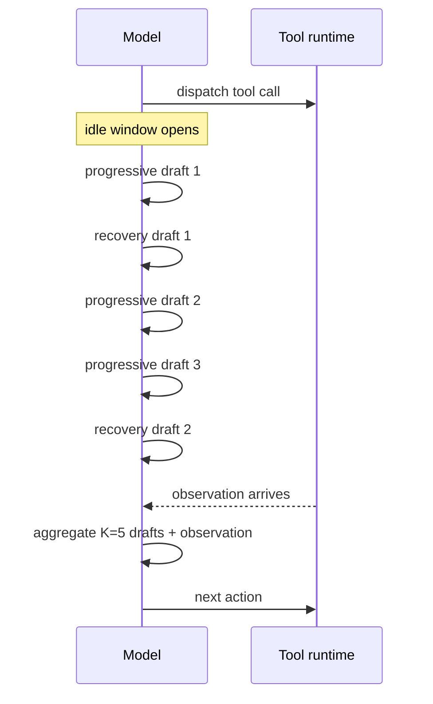

# Idle-Time Speculative Planning for ReAct Agents

> Convert tool-wait slack into best-of-K planning by drafting progressive and recovery plan candidates during idle windows, then aggregating against the real observation once it lands — applies only when idle windows exceed one reasoning step and wall-clock latency dominates dollar cost.

Idle-time speculative planning is a ReAct-loop inference technique that fills the wall-clock between tool dispatch and observation with K candidate next-steps drafted in parallel; candidates are sampled from a posterior-updated mixture of two strategies and aggregated against the real observation when it arrives, lifting accuracy without lengthening the critical path ([Choi et al., arXiv:2605.22154](https://arxiv.org/abs/2605.22154)).

## When This Applies

Three conditions must hold together before the technique pays back the speculative token spend. If any one fails, run a vanilla ReAct loop and put the saved tokens into trajectory reduction or [agentic plan caching](https://arxiv.org/pdf/2506.14852).

- **Idle window exceeds one reasoning step.** When tool calls return faster than the model can finish a single chain-of-thought, there is no slack to fill. The technique degenerates to the vanilla baseline; 25–27% of GAIA tool calls already sit in this "ultra-short" regime ([arXiv:2605.22154 §6](https://arxiv.org/html/2605.22154)).
- **Wall-clock latency dominates dollar cost.** End-to-end latency stays flat, but per-task token spend rises by the size of the discarded draft branches — IdleSpec adds 5,284 idle-window tokens per task on GAIA. The paper acknowledges this "translates into higher per-task compute and monetary cost when running on metered APIs" ([arXiv:2605.22154 §6](https://arxiv.org/html/2605.22154)).
- **ReAct-style loop, not async/parallel.** The technique is built and evaluated against synchronous ReAct frameworks. Multi-agent and async/parallel tool-calling extension is explicit future work ([arXiv:2605.22154 §8](https://arxiv.org/html/2605.22154)) — for those topologies see [Asynchronous Agent I/O and Speculative Tool Calling](asynchronous-agent-io-and-speculative-tools.md).

## How It Works

Two draft strategies cover the bimodal shape of how observations land:

- **Progressive drafts** extend the agent's modal prediction of what the tool will return.
- **Recovery drafts** plan around an unexpected or contradicting observation.

Each idle window samples a mix from a learned distribution updated by posterior feedback. The system caps retained candidates at K=5 per window to prevent context overflow and bound aggregation cost ([arXiv:2605.22154](https://arxiv.org/html/2605.22154)). When the real observation arrives, aggregation selects or merges among the K drafts plus the observation. Decode-time tokens drop from 7,126 (vanilla) to 5,966 because the model selects among pre-drafted candidates rather than reasoning from scratch ([arXiv:2605.22154](https://arxiv.org/html/2605.22154)).

## Reported Gains

On Gemini-2.5-Flash, at equal end-to-end latency to the vanilla ReAct baseline ([arXiv:2605.22154 §5](https://arxiv.org/abs/2605.22154)):

| Benchmark | Vanilla | IdleSpec | Delta |
|-----------|---------|----------|-------|
| GAIA + FRAMES (avg) | 50.5% | 55.6% | +5.1% |
| MLE-Bench (Any Medal) | — | — | +9.1% |

The MLE-Bench gain is the largest because code-execution tool calls produce long idle windows — the technique scales with the size of the slack it has to fill.

## Why It Works

Idle time on an agent's critical path is a structurally underutilised compute slot — the API or GPU budget is paid whether tokens are generated or not. Speculative planning converts that slack into test-time ensembling: when the real observation lands, the decision prompt already includes K=5 explored continuations and the aggregator selects rather than reasons from scratch. The accuracy lift is causal — more candidate trajectories at the decision point → better marginal selection — and latency parity comes from running drafts inside wall-clock the agent was paying for anyway ([arXiv:2605.22154](https://arxiv.org/abs/2605.22154)). The progressive/recovery split exists because plan deviation is bimodal — a single drafting strategy mismatches half the cases.

## When This Backfires

- **Ultra-short tool calls.** Sub-reasoning-step tool latency leaves no window to fill — the technique falls back to vanilla while still paying scheduler overhead. 25–27% of GAIA tool calls hit this regime ([arXiv:2605.22154](https://arxiv.org/html/2605.22154)).
- **Metered, cost-bound workloads.** Latency parity is real, but discarded draft branches are pure token spend. The "no latency overhead" headline does not extend to dollar cost — speculative drafting "consumes additional LLM tokens during the idle window" ([arXiv:2605.22154](https://arxiv.org/html/2605.22154)).
- **Trajectory bloat is the real bottleneck.** Predict-verify "preserves the full original computation while adding speculative work on top" ([SPAgent, arXiv:2511.20048](https://arxiv.org/abs/2511.20048)); extra turns and longer sequences can offset per-step speedup ([Sherlock, arXiv:2511.00330](https://arxiv.org/pdf/2511.00330)). If input-token accumulation already dominates spend ([Trajectory Reduction, arXiv:2509.23586](https://arxiv.org/pdf/2509.23586)), reduce the trajectory before adding speculative branches on top.
- **Non-ReAct topologies.** Async/parallel tool calling and multi-agent paradigms are out of scope for the published evaluation; use [Asynchronous Agent I/O and Speculative Tool Calling](asynchronous-agent-io-and-speculative-tools.md) or [Future-Based Async Function Calling](../tool-engineering/future-based-async-function-calling.md) instead.
- **Smaller aggregator models degrade on K candidates.** Aggregation requires reasoning over K=5 retained candidates plus the observation in one prompt; smaller models can lose accuracy on the larger reasoning input.

## Key Takeaways

- Idle-time speculative planning is a Qualified technique: lifts accuracy by 5–9% at equal end-to-end latency on ReAct agents with idle windows longer than one reasoning step.
- The latency-parity claim does not extend to dollar cost — discarded draft branches add ~5K tokens per task; the technique trades dollars for wall-clock, not for nothing.
- Two draft strategies (progressive, recovery) sampled from a posterior-updated mixture, capped at K=5 candidates per window, then aggregated when the real observation arrives.
- Skip when tool calls are ultra-short, when the workload is cost-bound rather than latency-bound, or when the agent topology is async/parallel or multi-agent.

## Related

- [Asynchronous Agent I/O and Speculative Tool Calling](asynchronous-agent-io-and-speculative-tools.md) — speculates *tool calls* rather than *plans*, for real-time and voice agents
- [Future-Based Asynchronous Function Calling](../tool-engineering/future-based-async-function-calling.md) — pipelines decode with tool execution at the function-call boundary
- [Reasoning Budget Allocation: The Reasoning Sandwich](reasoning-budget-allocation.md) — allocates compute across phases; idle-time speculation allocates compute across wall-clock slack
- [Adaptive Generate-Rank-Verify](adaptive-generate-rank-verify.md) — sister inference-time search policy where the cost asymmetry is verifier-heavy rather than idle-heavy
- [Background Todo Agent](background-todo-agent.md) — another pattern that offloads bookkeeping compute off the frontier model's critical path
