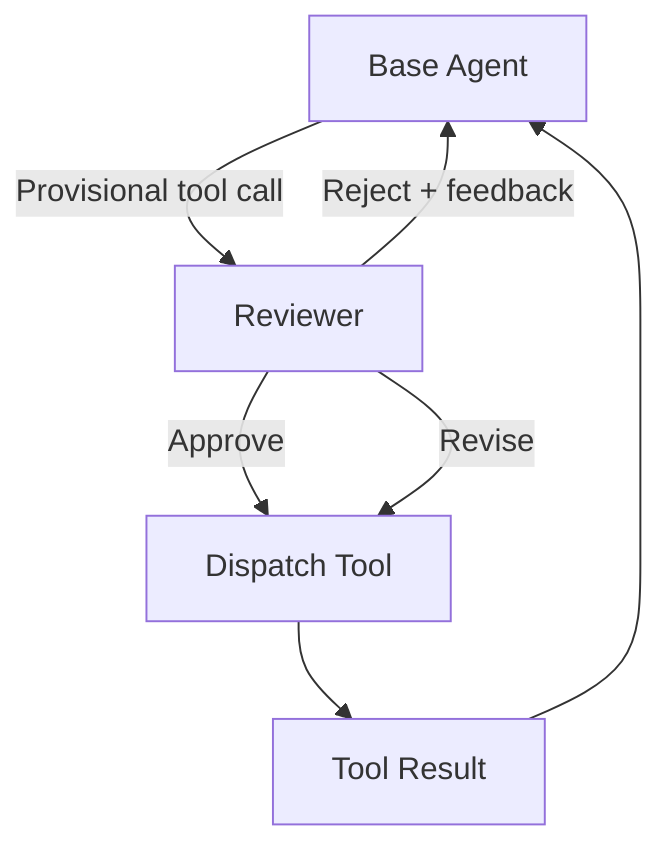

# Inference-Time Tool-Call Reviewer

> A reviewer agent inspects each provisional tool call before dispatch, gated by Helpfulness-Harmfulness metrics that quantify when feedback adds net value.

## Where the Review Happens

Existing review stations sit elsewhere in the loop. The [critic agent](critic-agent-plan-review.md) reviews the *plan*; [evaluator-optimizer](evaluator-optimizer.md) reviews *output* in a refinement loop; [trajectory-aware audit](../verification/trajectory-opaque-evaluation-gap.md) reviews the *transcript* post-hoc.

The inference-time tool-call reviewer occupies a different slot: between the base agent's decision to call a tool and the harness dispatching it. Each provisional call is intercepted, sent to a separate reviewer, and approved, rejected, or revised before it executes ([Ta et al., 2026](https://arxiv.org/abs/2604.27233)).



The contract is per-call. The reviewer sees the proposed tool, parameters, and surrounding context, then returns a verdict before any side effect occurs.

## Helpfulness vs Harmfulness

A reviewer that catches errors but also overrides correct calls is not free. [Ta et al. (2026)](https://arxiv.org/abs/2604.27233) introduce two metrics:

| Metric | Definition |
|--------|------------|
| **Helpfulness** | Percentage of base-agent errors that reviewer feedback corrects |
| **Harmfulness** | Percentage of correct base-agent responses that reviewer feedback degrades |

The benefit-to-risk ratio (helpfulness:harmfulness) tells you whether a reviewer is net positive on a given task distribution. The paper reports **3:1 for o3-mini vs 2.1:1 for GPT-4o** — the reasoning-tier model caught more errors and introduced fewer false rejections.

The framing matters: the [self-critique paradox](https://snorkel.ai/blog/the-self-critique-paradox-why-ai-verification-fails-where-its-needed-most/) shows that on tasks where the base agent is near-ceiling, adding a critic dropped accuracy from ~98% to ~57% — the reviewer hallucinates flaws to justify its existence. Without measuring harmfulness, a reviewer can degrade the system while looking productive.

## What the Evidence Shows

[Ta et al. (2026)](https://arxiv.org/abs/2604.27233) evaluate the pattern on two tool-calling benchmarks:

- **[BFCL](https://arxiv.org/abs/2604.27233)** (single-turn): +5.5% on irrelevance detection — the reviewer is most useful for catching tool calls that should not have fired at all.
- **[τ2-Bench](https://arxiv.org/abs/2406.12045)** (multi-turn stateful): +7.1% — the reviewer's value grows with turn count and state complexity.

Two findings constrain deployment:

1. **Reviewer model choice dominates.** Swapping GPT-4o for o3-mini changed the benefit-to-risk ratio from 2.1:1 to 3:1 without touching the base agent ([Ta et al., 2026](https://arxiv.org/abs/2604.27233)). A reviewer sharing the base agent's training distribution inherits its blind spots — [blind-spot research](https://arxiv.org/abs/2507.02778) measured a 64.5% rate when models reviewed their own outputs.
2. **Prompt optimisation compounds.** Applying [GEPA](gepa-reflective-prompt-evolution.md) to the reviewer prompt added **+1.5–2.8%** on top of the model swap ([Ta et al., 2026](https://arxiv.org/abs/2604.27233)). The reviewer is tunable independently of the base agent.

## When to Apply

The pattern earns its place when:

- **Tool calls have asymmetric blast radius** — destructive writes, external API calls, and stateful mutations expensive to roll back.
- **The base agent has a documented tool-call failure mode** — irrelevance, parameter drift, or scope violations that show up empirically.
- **A reasoning-tier or different-vendor reviewer is available** — same-base-model reviewers fail the blind-spot test.
- **You can measure helpfulness and harmfulness** on a held-out trajectory set — without the metric, the reviewer is unfalsifiable.

## When It Backfires

Synchronous per-call review is not the right surface for every workflow:

- **High base-agent accuracy.** Near-ceiling tasks invert the trade-off — the [self-critique paradox](https://snorkel.ai/blog/the-self-critique-paradox-why-ai-verification-fails-where-its-needed-most/) makes the reviewer a regression source.
- **Read-only or sandboxed calls.** Allowlists and [blast-radius containment](../security/blast-radius-containment.md) absorb routine prompts more cheaply. Reserve the reviewer for the residual surface allowlists cannot encode.
- **Latency-sensitive interactive flows.** Doubling round-trips per tool call breaks sub-second UI loops.
- **Same-model reviewer.** Reviewing with the base model and a different prompt inherits its blind spots; harmfulness inflates.

## Reviewer Slot vs Other Stations

| Station | Reviews | Cost shape | Right for |
|---------|---------|------------|-----------|
| [Critic agent](critic-agent-plan-review.md) | The plan | One review per task | Multi-step plans with compounding errors |
| **Inference-time tool-call reviewer** | Each provisional call | One review per tool call | Per-call risk and irrelevance detection |
| [Evaluator-optimizer](evaluator-optimizer.md) | Output, in a loop | N rounds × 2 models | Iterative refinement against explicit criteria |
| [Trajectory-opaque audit](../verification/trajectory-opaque-evaluation-gap.md) | Full transcript | Post-hoc, batched | Safety and compliance after the fact |

These compose — a critic at plan time and a reviewer at call time inspect different error surfaces. They do not replace each other.

## Example

A coding agent receives: "Drop the `users_legacy` table from staging."

**Without the reviewer**, the agent emits `db.execute(sql="DROP TABLE users_legacy")` against the production cluster — the connection string in context still points at production from an earlier read.

**With an inference-time reviewer**, the harness intercepts the call. The reviewer sees the SQL, the active connection string, and the task, and returns:

```json
{
  "verdict": "reject",
  "reason": "DROP TABLE issued against production connection while task targets staging",
  "suggestion": "switch connection to staging before re-issuing"
}
```

The base agent switches the connection and re-emits the call; the reviewer approves. The destructive operation never reaches production.

The same reviewer wired into a read-heavy lookup workflow would inflate harmfulness — every benign `SELECT` pays the review cost, and stylistic overrides degrade correct calls. The metric tells the two cases apart.

## Key Takeaways

- The inference-time tool-call reviewer fires per provisional tool call, between decision and dispatch — distinct from plan critique, output evaluation, and post-hoc audit.
- Helpfulness-Harmfulness metrics are the design contract: a reviewer is only worth running when its benefit-to-risk ratio is measurably above 1:1 on the target task distribution.
- Reviewer model choice dominates the ratio — reasoning-tier or different-vendor models avoid base-agent blind spots; same-model reviewers inherit them ([Ta et al., 2026](https://arxiv.org/abs/2604.27233)).
- Prompt optimisation on the reviewer is independent of the base agent; tuning the reviewer with [GEPA](gepa-reflective-prompt-evolution.md) compounds with model choice.
- Reserve the reviewer for tool calls allowlists and sandboxes cannot absorb — high-base-accuracy tasks and read-only calls invert the cost-benefit.

## Related

- [Critic Agent Pattern](critic-agent-plan-review.md)
- [Evaluator-Optimizer Pattern](evaluator-optimizer.md)
- [Trajectory-Opaque Evaluation Gap](../verification/trajectory-opaque-evaluation-gap.md)
- [Tool Confirmation Carousel](tool-confirmation-carousel.md)
- [GEPA: Reflective Prompt Evolution](gepa-reflective-prompt-evolution.md)
- [Cross-Vendor Competitive Routing](cross-vendor-competitive-routing.md)
- [Rollback-First Design](rollback-first-design.md)
- [Agent Self-Review Loop](agent-self-review-loop.md)
