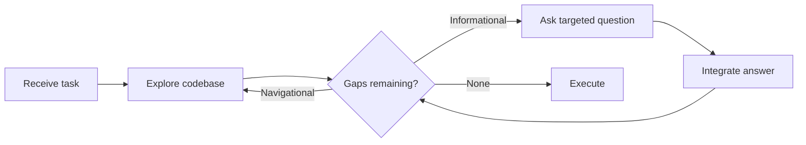

# Interactive Clarification for Underspecified Tasks

> Agents that explore the codebase first and ask targeted questions recover up to 74% of the performance lost to underspecified inputs — but only if they can detect that information is missing in the first place.

## The Problem: Agents Assume Instead of Asking

When given incomplete instructions, agents rarely ask for clarification. They fill gaps with assumptions and proceed, producing output that looks correct but solves the wrong problem. This is [assumption propagation](../anti-patterns/assumption-propagation.md) — and research shows it is the default behavior across models.

The Ambig-SWE benchmark tested this systematically by creating underspecified variants of real GitHub issues and measuring whether agents could (a) detect the missing information, (b) ask useful questions, and (c) use the answers to improve their output. The results: interactivity improved resolution rates by up to 74% on underspecified tasks, but models consistently struggled to detect underspecification without explicit prompting ([Vijayvargiya et al., ICLR 2026](https://arxiv.org/abs/2502.13069)).

## Two Types of Missing Information

Not all gaps are equal. The research identified two categories that require different clarification strategies:

| Type | What's Missing | Example |
|------|---------------|---------|
| **Informational** | Expected behavior, error nature, acceptance criteria | "Fix the auth bug" — which auth bug? What should correct behavior look like? |
| **Navigational** | File locations, module boundaries, where to make changes | "Update the config" — which config file, in which service? |

Navigational gaps are less frequently asked about but can be resolved through codebase exploration. Informational gaps require the user — no amount of code reading reveals what the expected behavior should be.

## Exploration-First, Questions Second

The most effective strategy is not to ask more questions — it is to ask fewer, better ones.

Claude Sonnet 4 asked 50% fewer questions than Qwen 3 Coder but achieved comparable information extraction. The difference: Sonnet explored the codebase first, resolving navigational ambiguity independently, then asked only about informational gaps that required human knowledge ([Vijayvargiya et al., ICLR 2026](https://arxiv.org/abs/2502.13069)).

The anti-pattern is asking questions the agent could answer itself by reading the code. Users lose trust when asked "which file should I modify?" for a change where grep would find the answer. Reserve questions for information only the user holds: expected behavior, business rules, design intent.

## Designing for Detection

The hardest part is detection — recognizing that a task is underspecified before committing to an approach. Models default to assuming completeness. Three instruction-level interventions help:

**Explicit detection prompt**: Add to system instructions: "Before implementing, identify any ambiguous or missing requirements. List what you know, what you're assuming, and what you need confirmed." This simple framing improved detection accuracy significantly in benchmark evaluation ([Vijayvargiya et al., ICLR 2026](https://arxiv.org/abs/2502.13069)).

**Assumption surfacing**: Require the agent to state assumptions explicitly before proceeding: "I'm assuming the error should return a 404 rather than a 500. Proceeding on that basis — correct me if wrong." This is a lighter-weight alternative to blocking on a question.

**Plan-phase review**: The [plan-first loop](../workflows/plan-first-loop.md) naturally surfaces underspecification — reviewing a plan reveals gaps that reviewing code would miss.

## When to Block vs. When to Surface

Not every gap warrants a blocking question. The decision depends on the cost of being wrong:

| Reversibility | Action |
|--------------|--------|
| **Easily reversible** (formatting, variable naming) | State the assumption, proceed |
| **Costly to reverse** (API contract, data migration) | Ask before proceeding |
| **Irreversible** (destructive operations, published interfaces) | Block until confirmed |

This maps directly to the [agent pushback protocol](agent-pushback-protocol.md) — the difference is that pushback gates on request quality while clarification gates on information completeness.

## Performance Reality

The 74% improvement figure is the peak result for a single model (Claude Sonnet 3.5) on synthetic underspecification. Key caveats from the research:

- Stronger models showed **diminishing relative gains** from interaction — Claude Sonnet 4 recovered 61% vs. Sonnet 3.5's 80% of the gap, suggesting the bottleneck shifts from extracting information to integrating it [unverified: whether this pattern holds outside the benchmark]
- Some models (Qwen 3 Coder) showed "complete non-responsiveness to interaction prompts" — following rigid protocols regardless of user input ([Vijayvargiya et al., ICLR 2026](https://arxiv.org/abs/2502.13069))
- High information extraction does not guarantee task success — asking the right questions matters less than integrating the answers correctly

## Key Takeaways

- Agents default to assuming rather than asking — explicit instruction to detect underspecification is required
- Explore the codebase first to resolve navigational gaps; ask only about informational gaps that require human knowledge
- Fewer, targeted questions outperform many broad questions — quality of integration matters more than quantity of extraction
- Match clarification strategy to reversibility: surface assumptions for low-cost decisions, block for high-cost ones
- The bottleneck for stronger models shifts from information extraction to information integration

## Unverified Claims

- Whether the exploration-first advantage holds when codebases are very large or entirely unfamiliar to the agent
- Whether the diminishing-returns pattern for stronger models persists outside the Ambig-SWE benchmark
- Practical applicability of benchmark results to real-world (non-synthetic) underspecification scenarios

## Related

- [Assumption Propagation](../anti-patterns/assumption-propagation.md) — the failure mode when agents do not ask
- [Agent Pushback Protocol](agent-pushback-protocol.md) — structured agent-initiated clarification on request quality
- [Plan-First Loop](../workflows/plan-first-loop.md) — plan review as a lightweight underspecification check
- [Spec-Driven Development](../workflows/spec-driven-development.md) — upstream approach to eliminating ambiguity before agent execution
- [TDD for Agent Development](../verification/tdd-agent-development.md) — tests as unambiguous executable specification
