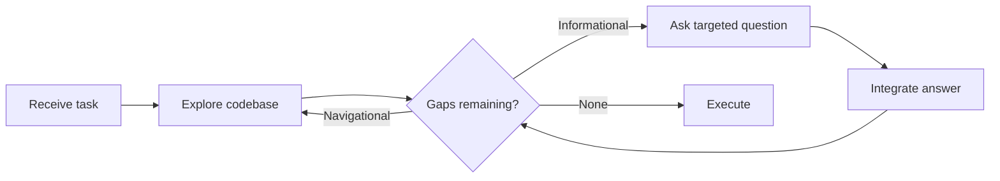

# Interactive Clarification for Underspecified Tasks

> Agents that explore the codebase first and ask targeted questions recover up to 74% of the performance lost to underspecified inputs — but only if they can detect that information is missing in the first place.

## The Problem: Agents Assume Instead of Asking

When given incomplete instructions, agents fill gaps with assumptions and produce output that looks correct but solves the wrong problem. This is [assumption propagation](../anti-patterns/assumption-propagation.md) — the default behavior across models.

The Ambig-SWE benchmark tested this by creating underspecified variants of real GitHub issues. Interactivity improved resolution rates by up to 74% on underspecified tasks, but models consistently struggled to detect underspecification without explicit prompting ([Vijayvargiya et al., ICLR 2026](https://arxiv.org/abs/2502.13069)).

## Two Types of Missing Information

The research identified two categories requiring different strategies:

| Type | What's Missing | Example |
|------|---------------|---------|
| **Informational** | Expected behavior, error nature, acceptance criteria | "Fix the auth bug" — which bug? What should correct behavior look like? |
| **Navigational** | File locations, module boundaries, where to change | "Update the config" — which config file, in which service? |

Navigational gaps resolve through codebase exploration. Informational gaps require the user — no amount of code reading reveals expected behavior.

## Exploration-First, Questions Second

The effective strategy is not more questions — it is fewer, better ones.

Claude Sonnet 4 asked 50% fewer questions than Qwen 3 Coder but achieved comparable extraction. Sonnet explored the codebase first, resolving navigational ambiguity independently, then asked only about informational gaps requiring human knowledge ([Vijayvargiya et al., ICLR 2026](https://arxiv.org/abs/2502.13069)).

The anti-pattern is asking questions the agent could answer by reading code. Reserve questions for information only the user holds: expected behavior, business rules, design intent.

## Designing for Detection

Detecting underspecification before committing to an approach is the hardest part. Three interventions help:

**Explicit detection prompt**: Add to system instructions: "Before implementing, identify ambiguous or missing requirements. List what you know, what you're assuming, and what you need confirmed." This improved detection accuracy in benchmark evaluation ([Vijayvargiya et al., ICLR 2026](https://arxiv.org/abs/2502.13069)).

**Assumption surfacing**: Require the agent to state assumptions before proceeding: "I'm assuming the error should return a 404 rather than a 500. Correct me if wrong."

**Plan-phase review**: The [plan-first loop](../workflows/plan-first-loop.md) surfaces underspecification — reviewing a plan reveals gaps that reviewing code would miss.

## When to Block vs. When to Surface

Not every gap warrants a blocking question. Decide based on cost of being wrong:

| Reversibility | Action |
|--------------|--------|
| **Easily reversible** (formatting, variable naming) | State the assumption, proceed |
| **Costly to reverse** (API contract, data migration) | Ask before proceeding |
| **Irreversible** (destructive operations, published interfaces) | Block until confirmed |

This maps to the [agent pushback protocol](agent-pushback-protocol.md) — pushback gates on request quality, clarification gates on information completeness. When [steering a running agent](steering-running-agents.md) mid-task with underspecified follow-ups, the same heuristic applies.

## Performance Reality

The 74% improvement is the peak result (Claude Sonnet 3.5, synthetic underspecification). Caveats:

- Stronger models show **compounding gains** — Sonnet 4 recovered 89% of fully-specified performance vs. Sonnet 3.5's 80%, suggesting capability shifts the bottleneck from detection to integration ([Vijayvargiya et al., ICLR 2026](https://arxiv.org/abs/2502.13069))
- Some models showed "complete non-responsiveness to interaction prompts" — following rigid protocols regardless of input ([Vijayvargiya et al., ICLR 2026](https://arxiv.org/abs/2502.13069))
- High extraction does not guarantee success — integrating answers matters more than asking the right questions

## Example

A user submits: "Fix the authentication bug in the API." The agent applies exploration-first clarification:

1. **Explore**: Searches for auth-related files, recent error logs, and failing tests. Finds `auth/token_validator.py` has a recent regression where expired tokens bypass validation.
2. **Resolve navigational gap**: Identifies the relevant file and test without asking the user.
3. **Detect informational gap**: The fix could either reject expired tokens with a 401 or silently refresh them. This is a business rule the code does not reveal.
4. **Ask one targeted question**: "The token validator currently accepts expired tokens. Should expired tokens return a 401 requiring re-login, or should the API attempt a silent refresh?"
5. **Integrate and execute**: User confirms 401 behavior. Agent implements the fix with a test covering the expired-token path.

The agent resolved the navigational ambiguity (which file, which bug) independently and asked only the informational question that required human judgment.

## Key Takeaways

- Agents default to assuming — explicit instruction to detect underspecification is required
- Explore first to resolve navigational gaps; ask only about informational gaps requiring human knowledge
- Fewer, targeted questions outperform broad ones — integration quality matters more than extraction quantity
- Match strategy to reversibility: surface assumptions for low-cost decisions, block for high-cost ones
- Stronger models gain more from interactivity — the bottleneck shifts from detection to integration as capability scales

## Related

- [Assumption Propagation](../anti-patterns/assumption-propagation.md) — the failure mode when agents do not ask
- [Agent Pushback Protocol](agent-pushback-protocol.md) — structured agent-initiated clarification on request quality
- [Plan-First Loop](../workflows/plan-first-loop.md) — plan review as a lightweight underspecification check
- [Steering Running Agents](steering-running-agents.md) — mid-run redirection where underspecified follow-ups require the same clarification heuristics
- [Spec-Driven Development](../workflows/spec-driven-development.md) — upstream approach to eliminating ambiguity before agent execution
- [TDD for Agent Development](../verification/tdd-agent-development.md) — tests as unambiguous executable specification
- [Issue Requirements Preprocessing](issue-requirements-preprocessing.md) — automated clarification of issue text before execution begins
