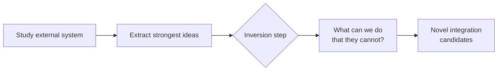

# Inversion Analysis: Surface Capabilities Competitors Cannot Replicate

> Standard competitive analysis imports what works elsewhere. Inversion asks what your architecture enables that others cannot replicate — producing novel integrations rather than feature parity.

## The Standard Analysis Trap

The default question when studying an external system — "what does X do well that we should adopt?" — produces convergence: everyone copies the same surface patterns.

Inversion breaks this. After extracting the strongest ideas, ask:

> "What can we do with our unique primitives that the external system simply could not do?"

The answer identifies capability gaps that competitors' architectures structurally preclude.

## The Three-Step Method

Step 3 in a major-feature workflow from the [Agentic Flywheel](agentic-flywheel.md):

| Step | Question | Output |
|------|----------|--------|
| **1. Study** | What does this system do well? | List of architectural strengths |
| **2. Extract** | Which ideas are worth carrying forward? | Filtered pattern list |
| **3. Invert** | What do our primitives enable that theirs foreclose? | Novel capability candidates |

Without Step 3, the output is imitation. With it, the output is differentiation.

## What Makes a Primitive Unique

A primitive qualifies as unique when it enables or precludes a class of patterns:

| Primitive | Pattern it enables | What it precludes for others |
|-----------|-------------------|------------------------------|
| Parallel context windows (multi-agent) | Independent subagent execution without [context pollution](../anti-patterns/session-partitioning.md) | Single-agent architectures must serialize or share context |
| JSONL bead storage + advisory locks | Durable, resumable task graphs | In-memory context cannot survive process restart or be locked |
| [Dynamic Tool Discovery](../anti-patterns/dynamic-tool-fetching-cache-break.md) | 85% token reduction via on-demand schema loading [unverified] | Static tool registration bloats context at session start |
| SequentialAgent / ParallelAgent primitives (ADK) | Constrained orchestration patterns per agent type | Generic agents lack enforced composition boundaries |

## Worked Example: NATS vs. Agent Flywheel Primitives

Inversion against NATS (Go pub/sub):

**Study NATS strengths**: high-throughput message routing, durable subscriptions, subject-based filtering.

**Extract ideas**: durable message queues, subject routing for task dispatch, at-least-once delivery.

**Invert**: NATS routes messages between processes but has no task graph with execution state, resumable context, or advisory locking. The Flywheel's JSONL bead model + graph routing + advisory locks enables:

- Tasks that resume mid-execution after failure
- Lock-free parallelism across steps with explicit dependency edges
- Context snapshots at each bead for downstream retrieval

NATS cannot replicate this — its message model has no execution state or bead-level resumability. The result is structurally distinct.

## Applying Inversion to Agent Architecture

Apply during:

- **[Research-plan-implement](../workflows/research-plan-implement.md) phase** — run inversion against the reference system before committing to a design
- **Architectural planning** — invert against the paths not taken when choosing between primitives
- **Competitive design reviews** — invert before matching a competitor feature to verify it is the right goal

Example questions:

- "Sub-agents with independent context windows — what workflows does this enable that single-agent architectures cannot support without serializing context?"
- "A bead store that survives process restart — what recovery patterns does this enable that in-memory context cannot?"
- "On-demand schema loading — what does this enable that a static 200-tool context cannot?"

## Constraint: Real Differentiation Required

Inversion produces value proportional to primitive uniqueness. It works best when your system has a non-standard primitive and the reference system would require restructuring to replicate it. Teams on commodity LLM wrappers find few genuine inversions — shared primitives leave nothing structurally precluded.

## Unverified Claims

- The 85% token reduction figure for Dynamic Tool Discovery is from the Anthropic Advanced Tool Use post; not independently reproducible
- "Graph routing" attributed to Agent Flywheel refers to an internal implementation ("Asupersync") without independent documentation

## Related

- [Agentic Flywheel](agentic-flywheel.md)
- [Plan-First Loop](../workflows/plan-first-loop.md)
- [Beads, Task Graphs, and Agent Memory](beads-task-graph-agent-memory.md)
- [Delegation Decision](delegation-decision.md)
- [Cost-Aware Agent Design](cost-aware-agent-design.md)
- [Classical SE Patterns and Agent Analogues](classical-se-patterns-agent-analogues.md)
- [Open Agent School Pattern Mapping](open-agent-school-pattern-mapping.md)
- [Cross-Vendor Competitive Routing](cross-vendor-competitive-routing.md)
- [Convergence Detection](convergence-detection.md)
- [Advanced Tool Use: Scaling Agent Tool Libraries](../tool-engineering/advanced-tool-use.md) — the Anthropic post source for the 85% token reduction figure via Dynamic Tool Discovery
- [Parallel Agent Sessions](../workflows/parallel-agent-sessions.md)
