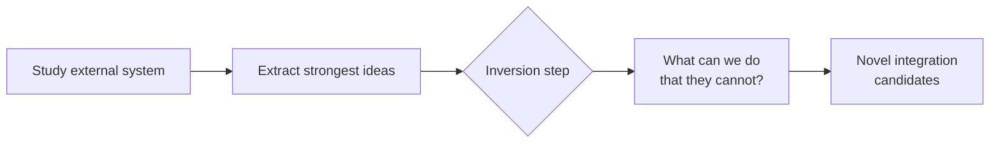

# Inversion Analysis: Surface Capabilities Competitors Cannot Replicate

> Standard competitive analysis imports what works elsewhere. Inversion asks what your architecture enables that others cannot replicate — producing novel integrations rather than feature parity.

## The Standard Analysis Trap

The default question when studying an external system — "what does X do well that we should adopt?" — produces convergence: everyone copies the same surface patterns.

Inversion breaks this. After extracting the strongest ideas, ask:

> "What can we do with our unique primitives that the external system simply could not do?"

The answer identifies capability gaps that competitors' architectures structurally preclude — the Jacobi/Munger inversion mental model ("many hard problems are best solved only when they are addressed backwards", [Farnam Street](https://fs.blog/inversion/)) applied to architectural differentiation.

## The Three-Step Method

Step 3 in a major-feature workflow from the [Agentic Flywheel](agentic-flywheel.md):

| Step | Question | Output |
|------|----------|--------|
| **1. Study** | What does this system do well? | List of architectural strengths |
| **2. Extract** | Which ideas are worth carrying forward? | Filtered pattern list |
| **3. Invert** | What do our primitives enable that theirs foreclose? | Novel capability candidates |

Without Step 3, the output is imitation; with it, differentiation.

## What Makes a Primitive Unique

A primitive qualifies as unique when it enables or precludes a class of patterns:

| Primitive | Pattern it enables | What it precludes for others |
|-----------|-------------------|------------------------------|
| Parallel context windows (multi-agent) | Independent subagent execution without [context pollution](../anti-patterns/session-partitioning.md) | Single-agent architectures must serialize or share context |
| JSONL bead storage + advisory locks | Durable, resumable task graphs | In-memory context cannot survive process restart or be locked |
| [Dynamic Tool Discovery](../anti-patterns/dynamic-tool-fetching-cache-break.md) | 85% token reduction via on-demand schema loading ([Anthropic, 2025](https://www.anthropic.com/engineering/advanced-tool-use)) | Static tool registration bloats context at session start |
| SequentialAgent / ParallelAgent primitives (ADK) | Constrained orchestration patterns per agent type | Generic agents lack enforced composition boundaries |

## Worked Example: NATS vs. Agent Flywheel Primitives

Inversion against NATS (Go pub/sub):

**Study**: high-throughput message routing, durable subscriptions, subject-based filtering.

**Extract**: durable message queues, subject routing for task dispatch, at-least-once delivery.

**Invert**: NATS routes messages but has no task graph with execution state, resumable context, or advisory locking. The Flywheel's JSONL bead model + graph routing + advisory locks enables:

- Tasks that resume mid-execution after failure
- Lock-free parallelism across steps with explicit dependency edges
- Context snapshots at each bead for downstream retrieval

NATS cannot replicate this without rebuilding around an execution-state model.

## Applying Inversion to Agent Architecture

Apply during:

- **[Research-plan-implement](../workflows/research-plan-implement.md)** — invert against the reference system before committing to a design
- **Architectural planning** — invert against the paths not taken when choosing between primitives
- **Competitive design reviews** — invert before matching a competitor feature to verify it is the right goal

Example questions:

- "Sub-agents with independent context windows — what workflows does this enable that single-agent architectures cannot support without serializing context?"
- "A bead store that survives process restart — what recovery patterns does this enable that in-memory context cannot?"
- "On-demand schema loading — what does this enable that a static 200-tool context cannot?"

## Why It Works

Inversion works because architectural constraints are asymmetric: what a system *cannot* do is determined by its foundational model, not its feature set. A competitor can copy a UI, a pricing tier, or a workflow — but replicating a structural primitive (a bead store, an advisory lock model, parallel context windows) requires rebuilding core infrastructure. The inversion question forces analysis at the layer where structural constraints live, bypassing the surface-level feature comparison that standard competitive analysis produces.

## When This Backfires

Inversion produces poor results when applied to weak structural differences:

- **Shared primitives**: Teams on commodity LLM wrappers share nearly all primitives with competitors. Inversions exist in name only — the same architecture is replicable overnight.
- **Novelty bias**: Enthusiastic inversion can justify maintaining unusual primitives *because* they are unique, even when a standard approach would serve better. Structural preclusivity does not imply value.
- **Reference system mismatch**: Inverting against a system in a different domain (e.g., a batch pipeline versus a real-time agent) yields false differentiation — the competitor never intended to support those patterns, not that they *cannot*.
- **Premature commitment**: Running inversion before adequate study of the external system produces shallow outputs. Step 1 (Study) must be thorough or Step 3 (Invert) generates noise.

## Key Takeaways

- Standard competitive analysis converges on imitation; inversion asks what your primitives enable that others structurally cannot replicate.
- Inversion is Step 3 of a study → extract → invert sequence; without it, the output is feature parity rather than differentiation.
- A primitive is worth inverting against only when it enables or precludes a class of patterns — shared, commodity primitives produce false differentiation.
- The mechanism is asymmetry: surface features can be copied overnight, but structural primitives require rebuilding core infrastructure.
- Inversion backfires when applied to weak structural differences, when novelty bias justifies unusual primitives for their own sake, or when Step 1 (Study) is shallow.

## Related

- [Agentic Flywheel](agentic-flywheel.md)
- [Cross-Vendor Competitive Routing](cross-vendor-competitive-routing.md)
- [Convergence Detection](convergence-detection.md)
- [Classical SE Patterns and Agent Analogues](classical-se-patterns-agent-analogues.md)
- [Open Agent School Pattern Mapping](open-agent-school-pattern-mapping.md)
- [Beads, Task Graphs, and Agent Memory](beads-task-graph-agent-memory.md)
- [Advanced Tool Use: Scaling Agent Tool Libraries](../tool-engineering/advanced-tool-use.md)
- [Plan-First Loop](../workflows/plan-first-loop.md)
