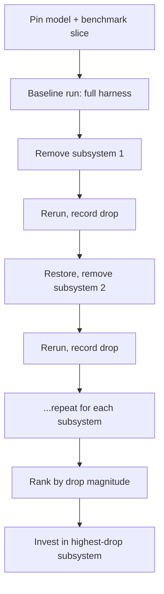

# Isometric Harness Ablation

> Pin the model, remove one harness subsystem at a time, rerun the benchmark, record the score drop. The resulting per-subsystem table tells you which subsystem to invest in next and which is scaffolding ripe for retirement.

## The Methodology

[Harness engineering](harness-engineering.md) treats the agent environment as the dominant lever on output quality. Isometric ablation quantifies *which part* of that environment is doing the work. The walkinglabs harness engineering course names the technique "isometric model control": keep the model fixed, remove subsystems one at a time, measure which removal causes the biggest performance drop ([walkinglabs](https://github.com/walkinglabs/learn-harness-engineering/blob/main/docs/en/lectures/lecture-02-what-a-harness-actually-is/index.md)).

The five subsystems to ablate, following the kitchen analogy from the same source ([walkinglabs](https://github.com/walkinglabs/learn-harness-engineering/blob/main/docs/en/lectures/lecture-02-what-a-harness-actually-is/index.md)):

| Subsystem | Concrete artifact | What removing it tests |
|---|---|---|
| Instructions | `AGENTS.md` / `CLAUDE.md` | How much of the result depended on project context |
| Tools | Shell, file edit, test runner access | How much of the result depended on action affordances |
| Environment | Lockfiles, runtime versions, services | How much of the result depended on reproducible runtime |
| State | `PROGRESS.md`, commits, session memory | How much of the result depended on cross-turn continuity |
| Feedback | Verification commands, lint, test signals | How much of the result depended on closed-loop correction |

## The Output Table

Each ablation run produces one row. The table is the deliverable.

| Removed subsystem | Baseline score | Ablated score | Drop |
|---|---|---|---|
| (none — baseline) | 80% | — | — |
| Instructions | 80% | 35% | 45 pp |
| Tools | 80% | 0% | 80 pp |
| Environment | 80% | 60% | 20 pp |
| State | 80% | 75% | 5 pp |
| Feedback | 80% | 50% | 30 pp |

The drops rank the subsystems. The operational rule: invest in upgrading the highest-drop subsystem first. Subsystems with drops near zero are simplification candidates — they consume maintenance budget without earning their place ([walkinglabs](https://github.com/walkinglabs/learn-harness-engineering/blob/main/docs/en/lectures/lecture-02-what-a-harness-actually-is/index.md)).

## Why the Same-Model Constraint Matters

The "isometric" qualifier is load-bearing. Changing model and harness together confounds the score delta — you cannot attribute it to either lever. Pinning the model converts the agent into a function of environment alone, so the delta measures environmental marginal product. This is the standard ablation argument applied to non-model components ([arxiv 2604.25850: Agentic Harness Engineering](https://arxiv.org/abs/2604.25850)).

Anthropic's 2D retro game maker comparison shows the scale: same prompt, same model class, two harnesses. A solo agent produced a non-functional prototype in 20 minutes for $9; a Planner + Generator + Evaluator harness produced a working application in 6 hours for $200. After upgrading to Opus 4.6, Anthropic removed the sprint construct while keeping planner and evaluator — one row in an isometric ablation table ([Anthropic: Harness design for long-running application development](https://www.anthropic.com/engineering/harness-design-long-running-apps)).

## Pairing With Hill-Climbing and Impermanence

The methodology slots between two adjacent practices:

- [Harness hill-climbing](harness-hill-climbing.md) optimizes a *single dimension* — one change per iteration, accept if the score improves. The climb assumes you have already picked the right dimension. Isometric ablation tells you which dimension. The ablation table maps the terrain; the climber traverses it.
- [Harness impermanence](harness-impermanence.md) flags scaffolding for deletion when native model capability subsumes it. Subsystems with near-zero ablation drop are the leading indicator: if removing the subsystem barely changes the score, the model is already doing the work the scaffold was added to provide. Add them to the simplification log.

The full cycle: ablate to rank, hill-climb the top-ranked subsystem, re-ablate to confirm the rank changed, retire low-drop subsystems.

## When This Backfires

Three failure conditions matter:

- **No graded benchmark slice exists.** The methodology needs a representative, deterministic eval set. Without one, "remove instructions, rerun" produces noisy drops dominated by per-run variance. The same precondition gates [harness hill-climbing](harness-hill-climbing.md) and any [eval-driven improvement loop](../verification/grade-agent-outcomes.md).
- **Components interact non-additively.** When feedback and state co-depend — state captures eval output that feedback consumes — removing one alone undercounts its contribution. The Agentic Harness Engineering paper found "harness components interact non-additively, so stacking effective edits caps the aggregate gain" ([arxiv 2604.25850](https://arxiv.org/abs/2604.25850)). Single-component ablation ranks; it does not quantify in isolation.
- **High per-run variance swamps small drops.** On a mature harness where remaining subsystem drops are small, single-trial ablation cannot separate signal from noise. Use [pass^k](../verification/pass-at-k-metrics.md) or multi-trial averaging before trusting drops below your noise floor.

A near-zero drop is also not evidence of a useless subsystem on its own. Other subsystems can compensate when one is removed, masking its true contribution — the compensatory-masquerade caution from neural-network ablation studies. Treat drops as a ranking signal, not a precise measurement.

## Example

A team using GPT-4o on a TypeScript + React frontend codebase (~20,000 LOC) ran the methodology by *adding* subsystems instead of removing them, fixed-model throughout ([walkinglabs](https://github.com/walkinglabs/learn-harness-engineering/blob/main/docs/en/lectures/lecture-02-what-a-harness-actually-is/index.md)):

| Stage | Subsystems present | Success rate |
|---|---|---|
| 1 — empty kitchen | README only | 20% |
| 2 — add instructions | `AGENTS.md` with stack, conventions | 60% |
| 3 — add feedback | Verification commands listed | 80% |
| 4 — add state | `PROGRESS.md` between sessions | 80–100% |

Reading the same data as an ablation table: removing instructions costs 40 pp, removing feedback costs 20 pp, removing state costs at most 20 pp. Instructions is the load-bearing subsystem on this project — invest there first. State is the smallest contributor; if maintenance becomes costly, it is the candidate to drop.

The order-of-addition is a real artifact: a different order would yield different per-stage deltas. The ranking is more stable than the exact magnitudes.

## Key Takeaways

- Pin the model, remove one of {instructions, tools, environment, state, feedback}, rerun the benchmark, record the drop — the resulting table ranks investment priorities
- The same-model constraint converts the score into a measurement of environmental marginal product; changing both model and harness conflates two signals
- Subsystems with near-zero drop are simplification candidates — pair with [harness impermanence](harness-impermanence.md) to retire them cleanly
- The methodology requires a graded benchmark slice; without one, drops are noise rather than signal
- Single-component ablation ranks subsystems but does not quantify them precisely — components interact non-additively
- Anthropic's same-prompt, same-model retro-game-maker comparison (solo agent vs. Planner+Generator+Evaluator harness) is a worked instance of the methodology at scale

## Related

- [Harness Engineering](harness-engineering.md) — the discipline this methodology measures
- [Harness Hill-Climbing](harness-hill-climbing.md) — single-dimension optimization that depends on the ablation table to pick its dimension
- [Harness Impermanence](harness-impermanence.md) — what to do with subsystems that show near-zero drop
- [Harness Design Dimensions and Archetypes](harness-design-dimensions.md) — population-level lens on harness choices that complements the per-project ablation
- [Agent Harness](agent-harness.md) — the initializer-plus-worker architecture whose subsystems are the ablation targets
- [pass@k and pass^k Metrics](../verification/pass-at-k-metrics.md) — multi-trial scoring needed when per-run variance is high
- [Incident-to-Eval Synthesis](../verification/incident-to-eval-synthesis.md) — sourcing the graded benchmark slice the methodology requires
- [Grade Agent Outcomes](../verification/grade-agent-outcomes.md) — deterministic outcome grading that keeps ablation drops interpretable
