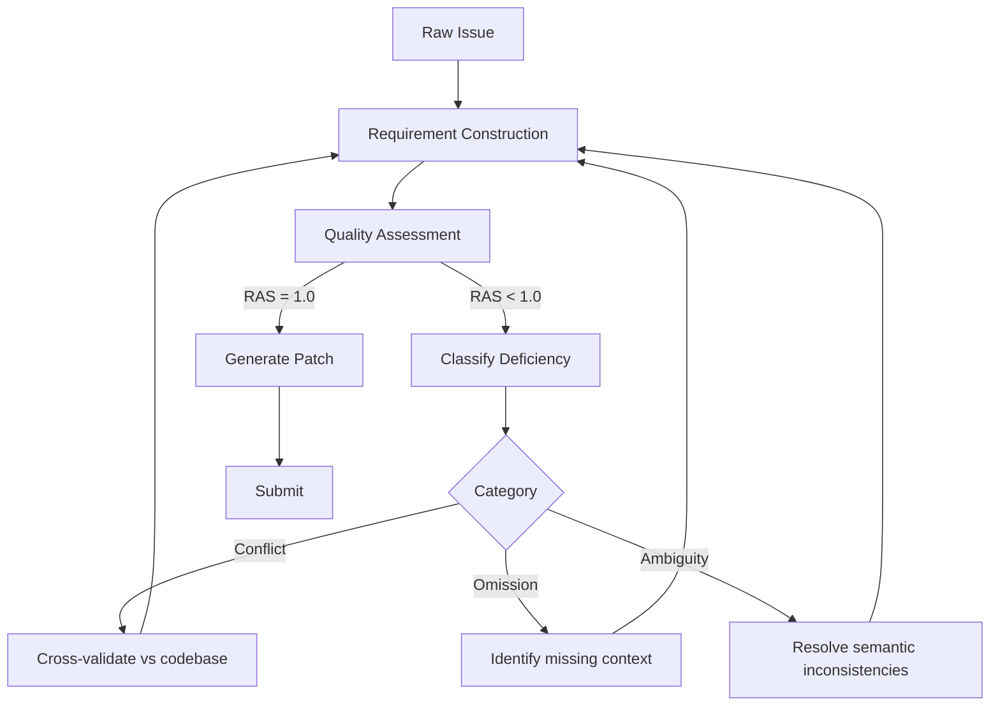

# Issue Requirements Preprocessing

> Raw issue descriptions are a lossy input format. Transforming them into structured requirements before code generation improves patch resolution rates significantly — issue quality is a variable to optimize, not a fixed constraint.

## The Problem: Agents Take Issues at Face Value

Most coding agents treat the issue description as the task specification and immediately proceed to codebase exploration and patch generation — the REAgent paper characterizes this as the default baseline behavior across the five agent systems it benchmarks against ([Kuang et al., 2026](https://arxiv.org/abs/2604.06861)). This fails because real issues routinely contain:

- **Omissions** — missing reproduction steps, expected behavior, or environment details
- **Ambiguities** — descriptions with multiple valid interpretations that lead to different patches
- **Conflicts** — requirements that contradict each other or diverge from the actual codebase state

The REAgent study ([Kuang et al., 2026](https://arxiv.org/abs/2604.06861)) tested this hypothesis at scale: across SWE-Lite, SWE-Verified, and SWE-Pro benchmarks ([Jimenez et al., 2024](https://arxiv.org/abs/2310.06770)) using two LLMs, preprocessing issue descriptions into structured requirements improved average resolution rates by 17.40% compared to five baselines that used raw issue text as input.

## The Preprocessing Approach

Rather than acting on raw issue text, REAgent introduces a requirement construction phase before patch generation begins. The agent explores the codebase and synthesizes findings into a structured format covering nine attribute categories:

| Attribute | What It Captures |
|-----------|-----------------|
| Background | Affected modules, main functionality |
| Problem Overview | Core description, impacted areas |
| Steps to Reproduce | Preconditions, key conditions, commands |
| Actual Behavior | What currently happens |
| Expected Behavior | What should happen instead |
| Environment | Dependencies, versions |
| Root Cause Analysis | Likely source of the fault |
| Solution | Modification locations, change scope |
| Additional Notes | Edge cases, related issues |

This transforms a paragraph of user-written text into a structured specification the agent can reason about precisely.

## Quality Classification and Refinement Loop

After constructing requirements, a separate assessment phase classifies any deficiencies into three categories:

**Conflict** — requirements contradict the issue description or codebase state.  
**Omission** — requirements underspecify intended behavior or constraints.  
**Ambiguity** — vague descriptions that generate multiple valid interpretations.

The Requirement Assessment Score (RAS = tests passed / total tests) drives iteration. A high-temperature sampling strategy generates ten test scripts per issue. If RAS < 1.0, the classified deficiency triggers a targeted refinement strategy and the requirements are regenerated. Non-improving feedback is recorded as a counterexample so the agent avoids repeating the same refinement in the next iteration. After at most four iterations, the highest-RAS requirement set is selected.

## What the Ablation Study Shows

Four ablation variants isolate which components matter most ([Kuang et al., 2026](https://arxiv.org/abs/2604.06861)):

| Removed Component | Avg Resolved Rate Drop | Avg Applied Rate Drop |
|-------------------|----------------------|-----------------------|
| Structured attributes (use unstructured generation) | 3.33% | 6.17% |
| Requirement analysis (use test-based feedback only) | 2.33% | 3.33% |
| Codebase retrieval (use BM25 only) | 9.50% | — |
| Requirement assessment (use LLM-as-judge) | **7.67%** | **24.67%** |

Replacing the test-based requirement assessment with LLM-as-judge scoring caused the largest drop — particularly in the applied rate (syntactically correct patches). Using generated tests as indirect quality signals, despite their imperfect correctness (23%–46%), proved significantly more reliable than model-based scoring.

## Practical Implications

**For teams writing issues**: The structured attribute list is a concrete checklist. Issues that specify reproduction steps, environment, expected vs. actual behavior, and root cause give agents the same advantage REAgent constructs automatically.

**For teams building agent pipelines**: A preprocessing agent before the coding agent — exploring the codebase and filling in the attribute schema — adds one model call but recovers a meaningful share of failed patches. The benchmark cost was $1.47 per resolved issue with DeepSeek-V3.2.

**Test generation as requirement validation**: Imperfect tests (23%–46% correctness) are still useful quality signals. Pass rate as a proxy for requirement quality is more reliable than asking a model to evaluate requirements directly.

## Example

A developer files: "The user profile page crashes when the avatar is missing."

**Without preprocessing**, the agent searches for avatar-related code, finds a null reference, and patches it. The fix passes manual inspection but misses edge cases because the expected behavior was never specified.

**With preprocessing**, the requirement construction agent explores the profile and avatar modules along with related test files. It synthesizes:

- **Steps to Reproduce**: Load profile where `user.avatar_url` is `null` or empty string
- **Expected Behavior**: Show placeholder image, no exception
- **Actual Behavior**: `AttributeError` on string formatting with `None`
- **Solution Location**: Profile renderer, guard clause before string interpolation

The coding agent receives a specification, not a report. The resulting patch handles both `null` and empty string, adds a regression test, and resolves the issue on the first attempt.

## When This Backfires

Preprocessing adds latency and an extra model call per issue. The cost-benefit calculation inverts in several conditions:

- **Well-specified issues**: When the issue already contains reproduction steps, environment details, and expected behavior, the preprocessing phase adds overhead without improving the input quality the coding agent receives.
- **Simple single-file fixes**: Typo corrections, obvious off-by-one errors, and single-symbol renames don't benefit from a nine-attribute requirement schema — the overhead exceeds the gain.
- **Low test-generation fidelity**: The RAS signal degrades when the codebase has sparse test infrastructure or when the issue domain produces tests with low correctness rates. At the low end of the 23–46% correctness range observed in the REAgent study, the RAS score may mislead the refinement loop, causing it to converge on worse requirements than the original.
- **Non-Python / non-SWE-bench codebases**: The 17.40% improvement is measured on SWE-bench Python repositories. Generalization to other languages and issue structures remains unstudied; the structured schema may require adaptation for codebases with different conventions.

## Key Takeaways

- Issue descriptions routinely omit or ambiguate information that agents need — preprocessing is not redundant
- A 17.40% average improvement in resolved issues is achievable by structuring requirements before patch generation ([Kuang et al., 2026](https://arxiv.org/abs/2604.06861))
- Test-based quality signals (even imperfect ones) outperform model-based requirement scoring
- The structured attribute schema (background, reproduction steps, expected/actual behavior, solution location) serves as a practical issue-writing checklist for developers
- Iterative requirement refinement with counterexample tracking avoids repeating failed refinement strategies

## Related

- [Interactive Clarification for Underspecified Tasks](interactive-clarification-underspecified-tasks.md) — complementary: covers agents asking clarifying questions; this covers automated preprocessing before execution begins
- [Evaluator-Optimizer Pattern](evaluator-optimizer.md) — iterative refinement loop for outputs; requirement preprocessing applies the same feedback loop to inputs
- [Spec-Driven Development](../workflows/spec-driven-development.md) — upstream approach to eliminating ambiguity at the project level; requirement preprocessing applies the same discipline at the per-issue level
- [Agent Pushback Protocol](agent-pushback-protocol.md) — agents surface concerns about request quality before proceeding; preprocessing internalizes this step automatically
- [Subtask-Level Memory for Software Engineering Agents](subtask-level-memory.md) — structured task decomposition that complements requirement preprocessing for multi-step issues
