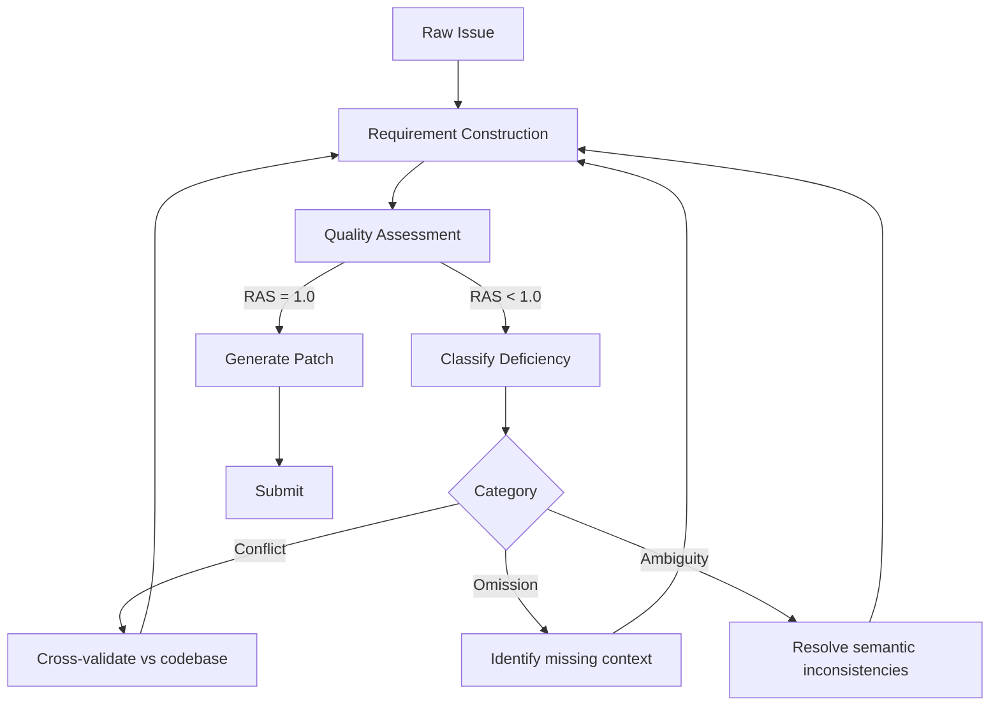

# Issue Requirements Preprocessing

> Transforming raw issue descriptions into structured requirements before code generation improves patch resolution rates — issue quality is a variable to optimize, not a constraint.

## The problem: agents take issues at face value

Most coding agents treat the issue description as the task specification. They go straight to codebase exploration and patch generation. The REAgent paper describes this as default behavior across the five agent systems it benchmarks ([Kuang et al., 2026](https://arxiv.org/abs/2604.06861)). Real issues routinely contain:

- Omissions — missing reproduction steps, expected behavior, or environment details
- Ambiguities — descriptions with multiple valid interpretations that lead to different patches
- Conflicts — requirements that contradict each other or the actual codebase state

Across SWE-Lite, SWE-Verified, and SWE-Pro benchmarks ([Jimenez et al., 2024](https://arxiv.org/abs/2310.06770)) using two LLMs, REAgent's preprocessing improved average resolution rates by 17.40% over five baselines using raw issue text.

## The preprocessing approach

REAgent inserts a requirement construction phase before patch generation. The agent explores the codebase and synthesizes findings into nine attribute categories:

| Attribute | What it captures |
|-----------|-----------------|
| Background | Affected modules, main functionality |
| Problem Overview | Core description, impacted areas |
| Steps to Reproduce | Preconditions, key conditions, commands |
| Actual Behavior | What currently happens |
| Expected Behavior | What should happen instead |
| Environment | Dependencies, versions |
| Root Cause Analysis | Likely source of the fault |
| Solution | Modification locations, change scope |
| Additional Notes | Edge cases, related issues |

This converts user-written prose into a structured specification the agent can reason about precisely ([Kuang et al., 2026](https://arxiv.org/abs/2604.06861)).

## Quality classification and refinement loop

A separate assessment phase classifies deficiencies into three categories:

```mermaid
graph TD
    A[Raw Issue] --> B[Requirement Construction]
    B --> C[Quality Assessment]
    C -->|RAS = 1.0| D[Generate Patch]
    C -->|RAS < 1.0| E[Classify Deficiency]
    E --> F{Category}
    F -->|Conflict| G[Cross-validate vs codebase]
    F -->|Omission| H[Identify missing context]
    F -->|Ambiguity| I[Resolve semantic inconsistencies]
    G & H & I --> B
    D --> J[Submit]
```

Conflict — requirements contradict the issue description or codebase state.  
Omission — requirements underspecify intended behavior or constraints.  
Ambiguity — vague descriptions that generate multiple valid interpretations.

The Requirement Assessment Score (RAS = tests passed / total tests) controls each iteration, the same [evaluator-optimizer](evaluator-optimizer.md) loop applied to inputs rather than outputs. High-temperature sampling generates ten test scripts per issue. If RAS < 1.0, the classified deficiency triggers a targeted refinement and the requirements regenerate. The agent logs non-improving feedback as a counterexample, so it avoids repeating failed refinements. After at most four iterations, REAgent selects the highest-RAS set.

## What the ablation study shows

Four ablation variants isolate which components matter most ([Kuang et al., 2026](https://arxiv.org/abs/2604.06861)):

| Removed component | Avg resolved rate drop | Avg applied rate drop |
|-------------------|----------------------|-----------------------|
| Structured attributes (use unstructured generation) | 3.33% | 6.17% |
| Requirement analysis (use test-based feedback only) | 2.33% | 3.33% |
| Codebase retrieval (use BM25 only) | 9.50% | — |
| Requirement assessment (use LLM-as-judge) | 7.67% | 24.67% |

Replacing test-based assessment with LLM-as-judge caused the largest drop, particularly in applied rate (syntactically correct patches). Generated tests, despite imperfect correctness (23%–46%), outperformed model-based scoring as quality signals.

## Practical implications

For teams writing issues: the attribute list is a concrete checklist — the per-issue counterpart to [spec-driven development](../workflows/spec-driven-development.md). Issues that specify reproduction steps, environment, expected versus actual behavior, and root cause give agents the same advantage REAgent constructs automatically.

For teams building agent pipelines: a preprocessing agent before the coding agent adds one model call but recovers a meaningful share of failed patches. The benchmark cost was $1.47 per resolved issue with DeepSeek-V3.2.

Test generation also works as validation. Imperfect tests (23%–46% correctness) still beat asking a model to evaluate requirements directly — pass rate is a more reliable quality proxy.

## Example

A developer files: "The user profile page crashes when the avatar is missing."

Without preprocessing, the agent searches for avatar-related code, finds a null reference, and patches it. The fix passes manual inspection but misses edge cases, because no one specified the expected behavior.

With preprocessing, the requirement construction agent explores the profile and avatar modules along with related test files. It synthesizes:

- Steps to reproduce: load profile where `user.avatar_url` is `null` or empty string
- Expected behavior: show placeholder image, no exception
- Actual behavior: `AttributeError` on string formatting with `None`
- Solution location: profile renderer, guard clause before string interpolation

The coding agent receives a specification, not a report. The resulting patch handles both `null` and empty string, adds a regression test, and resolves the issue on the first attempt.

## When this backfires

Preprocessing adds latency and an extra model call. The cost-benefit inverts in several conditions:

- Well-specified issues: if the issue already contains reproduction steps, environment, and expected behavior, preprocessing adds overhead without improving input quality.
- Simple single-file fixes: typo corrections, off-by-one errors, and single-symbol renames do not benefit from a nine-attribute schema.
- Low test-generation fidelity: at the low end of the 23–46% correctness range, RAS may mislead the refinement loop into worse requirements than the original.
- Non-Python or non-SWE-bench codebases: the 17.40% improvement is measured on SWE-bench Python repositories. Generalization to other languages and issue structures remains unstudied.

## Key Takeaways

- Issue descriptions routinely omit or ambiguate information that agents need — preprocessing is not redundant
- A 17.40% average improvement in resolved issues is achievable by structuring requirements before patch generation ([Kuang et al., 2026](https://arxiv.org/abs/2604.06861))
- Test-based quality signals (even imperfect ones) outperform model-based requirement scoring
- The structured attribute schema (background, reproduction steps, expected/actual behavior, solution location) serves as a practical issue-writing checklist for developers
- Iterative requirement refinement with counterexample tracking avoids repeating failed refinement strategies

## Related

- [Interactive Clarification for Underspecified Tasks](interactive-clarification-underspecified-tasks.md) — complementary: covers agents asking clarifying questions; this covers automated preprocessing before execution begins
- [Evaluator-Optimizer Pattern](evaluator-optimizer.md) — iterative refinement loop for outputs; requirement preprocessing applies the same feedback loop to inputs
- [Spec-Driven Development](../workflows/spec-driven-development.md) — upstream approach to eliminating ambiguity at the project level; requirement preprocessing applies the same discipline at the per-issue level
- [Agent Pushback Protocol](agent-pushback-protocol.md) — agents surface concerns about request quality before proceeding; preprocessing internalizes this step automatically
- [Subtask-Level Memory for Software Engineering Agents](subtask-level-memory.md) — structured task decomposition that complements requirement preprocessing for multi-step issues
