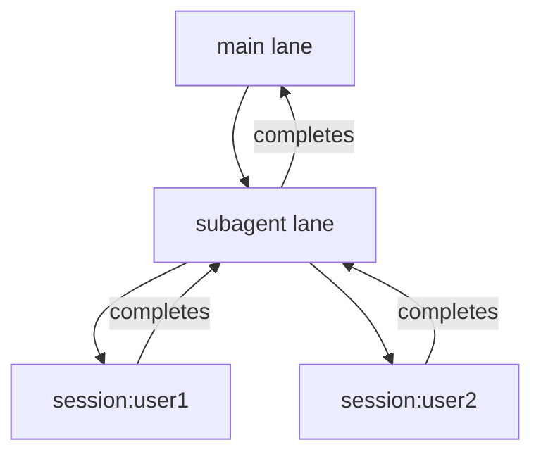

<!-- source: nibzard/awesome-agentic-patterns (Apache 2.0, https://github.com/nibzard/awesome-agentic-patterns) — retain attribution per license -->
---
title: "Lane-Based Execution Queueing"
description: "Isolate concurrent agent tasks into named queues with per-lane concurrency limits to prevent output interleaving, race conditions, and deadlocks."
tags:
  - agent-design
  - tool-agnostic
aliases:
  - execution lane isolation
  - named queue concurrency
  - per-lane concurrency limits
---

# Lane-Based Execution Queueing

> Organize agent task execution into named, isolated queues — each draining independently with configurable concurrency — to eliminate the three core hazards of concurrent agent systems.

## The Problem

Concurrent agent systems face three failure modes that a single shared queue cannot prevent:

- **Interleaving** — simultaneous stdout/stdin writes corrupt terminal output
- **Race conditions** — unsynchronized shared state produces inconsistent results
- **Deadlocks** — cross-task dependencies with no structured resolution

Lane-based queueing addresses all three by giving each class of work its own isolated execution context.

## Lane Structure

Each lane is an independent queue with a concurrency cap. A minimal TypeScript representation from the [Clawdbot reference implementation](https://github.com/nibzard/awesome-agentic-patterns/blob/main/patterns/lane-based-execution-queueing.md):

```typescript
type LaneState = {
  queue: Task[];
  active: number;
  maxConcurrent: number;
  draining: boolean;
};
```

Two operations drive each lane:

- `drainLane()` — pumps tasks from the queue up to `maxConcurrent`, then yields
- `enqueueCommandInLane<T>()` — schedules work and returns a promise the caller can await

Lanes never share state or communicate directly. Isolation is structural, not enforced by locks.

## Lane Taxonomy

A typical multi-agent platform uses four lane types ([nibzard/awesome-agentic-patterns](https://github.com/nibzard/awesome-agentic-patterns/blob/main/patterns/lane-based-execution-queueing.md)):

| Lane | `maxConcurrent` | Purpose |
|------|-----------------|---------|
| `main` | 1 | Serial CLI default — one task at a time |
| `cron` | 1 | Scheduled tasks — isolated from interactive work |
| `subagent` | N | Spawned agent work — parallelizable |
| `session:<id>` | 1 | Per-user auto-reply — hierarchical ID |

The `session:<id>` pattern enables per-user isolation without cross-session interference. Use stable identifiers — dynamic lane proliferation with unstable IDs causes unbounded memory growth.

## Hierarchical Composition

Nested lanes (a `subagent` lane spawning `session` lanes) prevent deadlocks through structured completion: inner lanes complete before outer lanes proceed. This replaces ad-hoc locking with a deterministic hierarchy. Direct cross-lane dependencies outside this hierarchy will deadlock.



## Observability

Each lane is independently monitorable. Key signals per lane ([nibzard/awesome-agentic-patterns](https://github.com/nibzard/awesome-agentic-patterns/blob/main/patterns/lane-based-execution-queueing.md)):

- `queue_size_per_lane` — backlog depth
- `active_tasks_per_lane` — in-flight count
- `wait_time_p95` — tail latency per work class

Per-lane metrics let you diagnose starvation (a busy `subagent` lane blocking `cron` tasks) without correlating across a unified queue.

## Trade-offs

| Trade-off | Detail |
|-----------|--------|
| Memory overhead | Idle lanes hold allocated state |
| Concurrency tuning | Each lane's `maxConcurrent` must be sized to available resources — over-parallelization exhausts file handles and memory |
| Starvation risk | High-priority lanes with unbounded throughput can starve low-priority ones without explicit priority controls |

This pattern draws on established foundations: Actor Model isolation (1973), Work-Stealing scheduling (1995), and queue-based routing in [Sidekiq](https://github.com/sidekiq/sidekiq), [BullMQ](https://github.com/taskforcesh/bullmq), and Airflow pool systems.

## Relation to Worktree Isolation

Worktree isolation operates at the process and filesystem level — each agent gets its own working directory. Lane-based queueing operates at the task-scheduling level — each class of work gets its own queue. The two are complementary: worktrees prevent filesystem conflicts between parallel agents; lanes prevent scheduling conflicts between concurrent tasks within a platform. See [Worktree Isolation](../workflows/worktree-isolation.md) and [/batch and Worktrees](../tools/claude/batch-worktrees.md) for Claude Code's built-in worktree orchestration.

## Key Takeaways

- Name lanes by workload class (`main`, `cron`, `subagent`, `session:<id>`), not by caller identity
- Set `maxConcurrent=1` for any lane where ordering or serial execution matters
- Enforce hierarchical composition — inner lanes complete before outer lanes proceed
- Expose per-lane metrics; a unified queue makes starvation invisible
- Avoid dynamic lane IDs — stable identifiers prevent memory leaks

## Related

- [Agent Composition Patterns: Chains, Fan-Out, Pipelines, Supervisors](agent-composition-patterns.md)
- [Idempotent Agent Operations: Safe to Retry](idempotent-agent-operations.md)
- [Agent Loop Middleware](agent-loop-middleware.md)
- [Worktree Isolation](../workflows/worktree-isolation.md)
- [VS Code Agents App: Agent-Native Parallel Task Execution](vscode-agents-parallel-tasks.md)
- [Exception Handling and Recovery Patterns](exception-handling-recovery-patterns.md)
