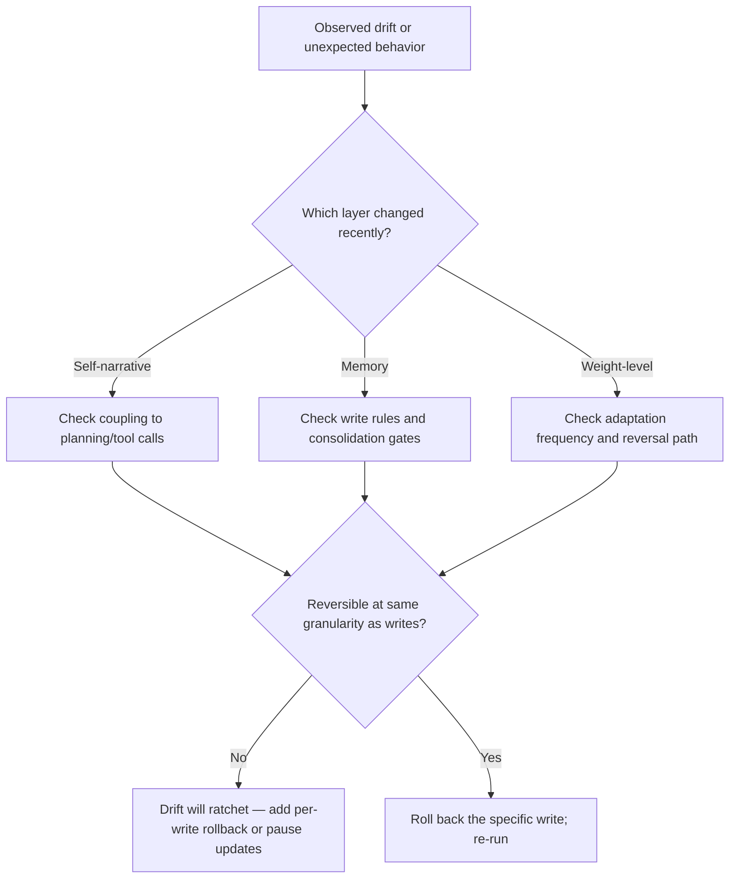

# Layered Mutability: Governing Persistent Self-Modifying Agents

> Persistent agents mutate at five layers with very different speed, coupling, reversibility, and observability — most governance failures come from treating them as one surface.

## The Five Layers

[Tallam, 2026](https://arxiv.org/abs/2604.14717) frames a persistent agent as a stack of mutable layers that all influence future behavior, not just the current prompt:

| Layer | What mutates | Typical update cadence |
|-------|-------------|----------------------|
| Pretraining | Base model weights | Months, vendor-controlled |
| Post-training alignment | RLHF/RLAIF adjustments | Weeks, vendor-controlled |
| Self-narrative | The agent's visible description of itself, surfaced back into its own context | Per session or per turn |
| Memory | Retrieved notes, episodes, conventions written across sessions | Per action |
| Weight-level adaptation | LoRA/SFT updates applied to a deployed agent | Minutes to days |

Three of the five — self-narrative, memory, and weight-level adaptation — now happen *inside the agent's own operating loop*, not only at vendor release time. That shift is what makes the governance problem new.

## Four Dimensions That Decide Governance Load

For each layer, [Tallam](https://arxiv.org/abs/2604.14717) argues governance difficulty rises along four axes:

1. **Speed** — how fast mutations land.
2. **Downstream coupling** — how strongly this layer's state drives future tool calls and planning.
3. **Reversibility** — whether rolling the layer back restores prior behavior.
4. **Observability** — whether an operator can inspect the current state before it fires.

The paper's core observation: the layers that most affect behavior (memory, self-narrative) are often the least inspectable, while the layers humans can inspect most easily (pretraining artifacts, published alignment cards) change slowly enough that inspection rarely matters. This mismatch is the governance gap.

## Compositional Drift, Not Abrupt Misalignment

The dominant failure mode for persistent agents is **compositional drift**: locally reasonable memory writes and self-narrative updates that accumulate into a behavioral trajectory never explicitly authorized ([Tallam, 2026](https://arxiv.org/abs/2604.14717)). Each write looks fine against a local utility signal; the cumulative effect is only evaluated after drift is already visible.

This is distinct from [objective drift](../anti-patterns/objective-drift.md), which is a single-session compression failure where summarization drops constraints. Compositional drift is cross-session and cumulative — reverting the last update does not restore baseline.

An independent framework makes the same argument from a memory-systems angle: [Lam et al., 2026 (SSGM)](https://arxiv.org/abs/2603.11768v1) document how "knowledge degrades through iterative summarization" and propose consistency verification, temporal decay, and dynamic access control *before* memory consolidation.

## Ratchet Effects and Identity Hysteresis

A preliminary experiment in [Tallam, 2026](https://arxiv.org/abs/2604.14717) reverts an agent's visible self-description after memory accumulation and measures whether baseline behavior returns. It does not — the paper reports an estimated **identity hysteresis ratio of 0.68** on that single experiment. Treat this as preliminary evidence that visible-layer rollback does not imply behavioral rollback when memory is tightly coupled to self-narrative, not as a general constant.

The mechanism is a ratchet: writes happen at a fine granularity with local evaluation; rollbacks happen at a coarse granularity with global evaluation. Without a rollback contract that operates at the same granularity as the writes, behavior lags the visible state.

## Applying the Lens



**Practical moves per layer**:

- **Self-narrative** — version every self-description change; keep the prior version loadable; measure behavior before/after revert, not just the visible description.
- **Memory** — apply consolidation gates (consistency, decay, access control) as in [SSGM](https://arxiv.org/abs/2603.11768v1); structure writes so each has a rollback handle; audit the couplings from memory to planning.
- **Weight-level adaptation** — track adaptation frequency; require a reversal path that is tested, not theoretical; treat per-user LoRA as experimental rather than production-default (see [Continual Learning Layers](continual-learning-layers.md)).

## When This Lens Does Not Pay Off

The five-layer framework is overhead for systems where most layers are inert:

- **Stateless or short-session agents** — no cross-session accumulation, so memory and self-narrative collapse. Standard prompt engineering is sufficient.
- **Well-governed memory stores** — teams already running SSGM-style consolidation gates, temporal decay, and versioning see residual drift dominated by retrieval quality rather than layer coupling.
- **Weak self-narrative coupling** — when the agent's self-description does not feed back into tool selection or planning, reverting memory reliably restores behavior and the hysteresis effect does not appear.
- **Single-tenant, single-user agents** — without distinct users and contexts feeding the ratchet, accretion is slow enough to govern with periodic review.

Read the lens as diagnostic: apply it to the layers that actually mutate in your system, not all five by default.

## Example

A persistent coding agent with a `SOUL.md`-style self-narrative and a vector memory of prior sessions. Over two weeks it accumulates notes like "team prefers inline error handling" and updates its self-description to "I favor concise, inline error handling." A reviewer changes the self-description back to neutral:

```diff
- I favor concise, inline error handling.
+ I follow the conventions present in the codebase.
```

Tool-call behavior does not revert. The agent still retrieves the accumulated memory entries about inline error handling and plans around them. The visible layer changed; the coupled layer (memory) did not. A rollback contract at the same granularity as the writes — versioning each memory write and providing a per-write revert — is required to restore baseline, not a self-narrative edit.

## Key Takeaways

- Persistent agents mutate at five layers (pretraining, alignment, self-narrative, memory, weight-level) with different speed, coupling, reversibility, and observability — treat them as distinct governance surfaces.
- The dominant failure mode is compositional drift, not abrupt misalignment: locally reasonable updates that accumulate into behavior no one authorized.
- Rolling back a visible layer does not roll back behavior when coupled layers (especially memory) continue to fire — the hysteresis effect measured in the paper (0.68 on one experiment) is preliminary evidence, not a general constant.
- The lens pays off for long-running multi-tenant agents with coupled self-narrative and memory; it is overhead for stateless or well-governed systems.

## Related

- [Continual Learning for AI Agents: Three Layers of Knowledge Accumulation](continual-learning-layers.md)
- [Agent Memory Patterns: Learning Across Conversations](agent-memory-patterns.md)
- [Objective Drift: When Agents Lose Sight of the Goal](../anti-patterns/objective-drift.md)
- [Security Drift in Iterative LLM-Driven Code Refinement](../security/security-drift-iterative-refinement.md)
- [Memory Synthesis from Execution Logs](memory-synthesis-execution-logs.md)
- [Rollback-First Design: Every Agent Action Should Be Reversible](rollback-first-design.md)
