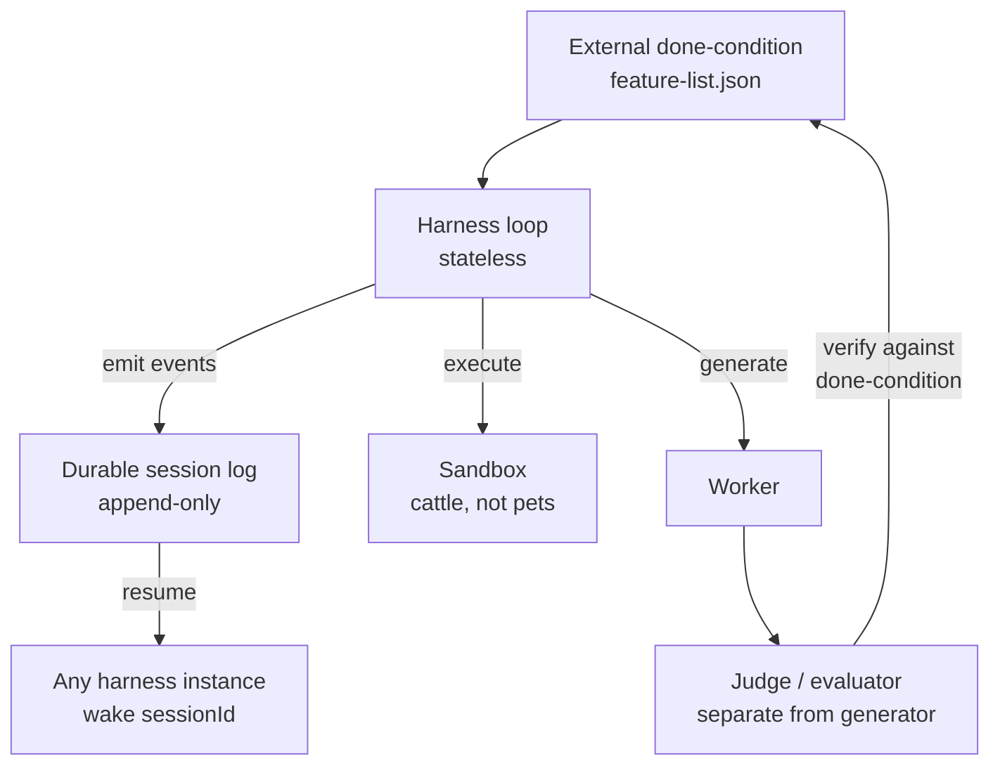

# Long-Running Agents: Durability and Resumability Across Sessions

> A long-running agent keeps making forward progress on a goal across many sessions and many sandboxes — possibly days or weeks — by moving state out of the context window and into durable artifacts the next session can resume from.

## What "Long-Running" Means

Three problems share an operational surface ([Osmani: Long-running Agents, 2026-04-30](https://addyo.substack.com/p/long-running-agents)):

- **Long-horizon reasoning** — planning over many dependent steps. A model story; METR's [task-completion time horizon](https://metr.org/time-horizons/) doubles roughly every seven months.
- **Long-running execution** — a process running for hours or days; the model invoked thousands of times. A harness story.
- **Persistent agency** — identity that outlives any task. A memory story.

This page covers execution — agents that survive session boundaries, sandbox crashes, and HITL pauses.

## Three Walls

Three failure modes show up in every published write-up ([Osmani](https://addyo.substack.com/p/long-running-agents)):

**Finite context.** Even a 1M-token window fills, and [context rot](../context-engineering/context-window-dumb-zone.md) sets in well before the hard cap. A 24-hour run fits no context window on the roadmap.

**No persistent state.** A new session starts blank. Anthropic: *"a software project staffed by engineers working in shifts, where each new engineer arrives with no memory of what happened on the previous shift"* ([long-running Claude](https://www.anthropic.com/research/long-running-Claude)).

**Unreliable self-verification.** Models skew positive on their own work. Without a separate evaluator the agent ships at 30% complete with full confidence.

## The Convergent Design

Anthropic, Cursor, Google, and open-source practitioners have converged on the same shape. Five primitives recur:

### 1. External Done-Condition

Write completion criteria before the agent starts. Anthropic calls it the [feature list](https://www.anthropic.com/engineering/effective-harnesses-for-long-running-agents); Cursor calls it the planner's task spec. On disk so the agent cannot quietly redefine *done* mid-run ([Osmani](https://addyo.substack.com/p/long-running-agents)).

### 2. Durable Session Log

Session state lives outside the harness process — an append-only log of every thought, tool call, and observation. Anthropic exposes `getEvents()` and `wake(sessionId)`: "any Harness instance can pick up any Session and continue from where it left off" ([Managed Agents](https://www.anthropic.com/engineering/managed-agents)). See [Session Harness Sandbox Separation](session-harness-sandbox-separation.md).

### 3. Stateless Harness, Disposable Sandbox

The harness holds no run state; the sandbox is provisioned per session and destroyed after. Crash recovery becomes architectural. Anthropic reports p50 time-to-first-token dropped ~60% and p95 over 90% by starting inference against the session log before the sandbox finishes provisioning ([Managed Agents](https://www.anthropic.com/engineering/managed-agents)). See [Deep Agent Runtime](deep-agent-runtime.md).

### 4. Separate Evaluator

Generation and evaluation run as different roles, sometimes different models. Cursor's production design splits planner / worker / judge after flat coordination and locks both failed; a coding-tuned model proved worse than a general model for *extended autonomous work* because it "tended to stop early and take shortcuts" ([Cursor: Scaling Long-Running Coding](https://cursor.com/blog/scaling-agents)).

### 5. Checkpoint Cadence

Write intermediate state every N units of work — not every step (waste), not only at the end (catastrophic on failure). [Trajectory logging via progress files](../observability/trajectory-logging-progress-files.md) is the filesystem-only form; managed runtimes ship the same as `thread_id`-keyed checkpoints with run-level cancel/resume.

## Beyond Summarisation: Full Context Resets

Compaction-as-summarisation is not enough at day-plus durations. Anthropic resorts to *full context resets* — the harness tears the session down and rebuilds from a structured handoff file ([Osmani](https://addyo.substack.com/p/long-running-agents)). The [Ralph Wiggum loop](ralph-wiggum-loop.md) is the bash form: every iteration starts fresh and reads the filesystem before acting.

## When the Pattern Is Overhead

The primitives pay when work exceeds a single session. Four conditions where they do not:

- **Short-horizon interactive work.** When the task fits one HITL session, checkpoint/resume adds latency without reliability gain.
- **Pre-PMF or small-scope agents.** A scoped service credential and session timeout are smaller and more portable before scale or compliance forces the trade-off ([Agent Stack Bets](agent-stack-bets.md)).
- **Underspecified done-conditions.** Without external completion criteria a long run amplifies self-grading harm.
- **Unbounded session log.** Append-only logs grow linearly; long sessions force compaction with irreversible discards ([Managed Agents](https://www.anthropic.com/engineering/managed-agents)).

## Open Problems

Four areas remain unsolved ([Osmani](https://addyo.substack.com/p/long-running-agents)):

- **Cost.** Without budgets and [circuit breakers](../observability/circuit-breakers.md), an agent can burn a week's API spend in an afternoon.
- **Security.** Credentials and shell access yield a much larger attack surface than a chat session; brain/hands separation is part of the answer.
- **Alignment drift.** Goals get summarised and re-summarised and lose fidelity. Hooks and judges defend; nothing eliminates.
- **Verification.** Auditing 24 hours of autonomous activity is a human-time problem; structured artifacts (PRs, commits, test runs) make it tractable.

Anthropic's [Project Vend](https://www.anthropic.com/research/project-vend-1) — a Claude instance running a vending business for a month — "failed in informative ways," the early catalogue for week-plus coherence failures.

## Example

Anthropic's published [long-running coding harness](https://www.anthropic.com/engineering/effective-harnesses-for-long-running-agents) is the reference structure. Two agents and three artifacts:

- **Initializer agent** — runs once. Sets up the environment, expands the prompt into a structured `feature-list.json` (every feature marked failing initially), writes `init.sh` for future sessions to bootstrap from.
- **Coding agent** — woken repeatedly. Each session reads `claude-progress.txt`, runs `git log` to see prior commits, picks one feature, implements, runs tests, updates progress, commits with a descriptive message.
- **Test ratchet** — *"it is unacceptable to remove or edit tests because this could lead to missing or buggy functionality"* sits in the prompt to block the very common failure of an agent deleting failing tests to make them pass.

The plain-bash equivalent is the [Ralph loop](https://ghuntley.com/ralph/): a `for` loop that picks the next task from `prd.json`, builds a prompt, calls the agent, runs checks, appends to `progress.txt`, and updates the task list. Same shape, no managed runtime — state lives in three files on disk.

## Key Takeaways

- A long-running agent is one whose run survives session boundaries, sandbox crashes, and human-in-the-loop pauses by moving state out of the context window into durable artifacts.
- Three walls — finite context, no persistent state, unreliable self-grading — force the same convergent design across Anthropic, Cursor, Google, and Ralph-style open-source practice.
- Five primitives recur: external done-condition, durable session log, stateless harness with disposable sandbox, separate evaluator, deliberate checkpoint cadence.
- Compaction-as-summarisation is not enough at day-plus durations; full context resets driven by a structured handoff file are part of the operational shape.
- The pattern is overhead for short-horizon work, pre-PMF agents, underspecified tasks, and unbounded session logs — apply it when uninterrupted units of work genuinely exceed a single session.
- Cost, security, alignment drift, and human verification of 24-hour activity remain open; budgets, circuit breakers, and structured artifacts are the current answers.

## Related

- [Session Harness Sandbox Separation](session-harness-sandbox-separation.md)
- [Deep Agent Runtime](deep-agent-runtime.md)
- [Agent Harness: Initializer and Coding Agent](agent-harness.md)
- [The Agent Stack Bet](agent-stack-bets.md)
- [The Ralph Wiggum Loop](ralph-wiggum-loop.md)
- [Trajectory Logging via Progress Files](../observability/trajectory-logging-progress-files.md)
- [Circuit Breakers for Agent Loops](../observability/circuit-breakers.md)
- [Durable Interactive Artifacts](durable-interactive-artifacts.md)
