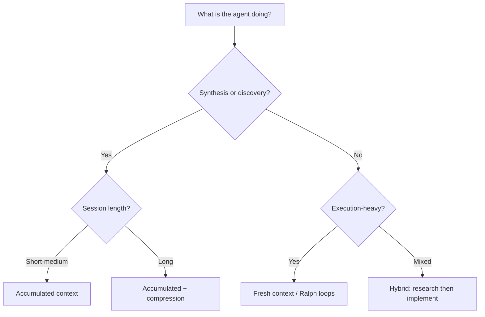
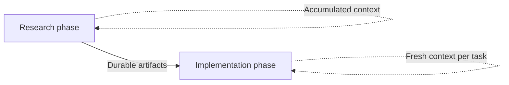

# Loop Strategy Spectrum: Accumulated, Compressed, and Fresh Context

> Not all agent loops should manage context the same way. Accumulated-context loops suit synthesis tasks; fresh-context loops suit execution tasks. Within-session compression sits between them. Choose based on the workload, not habit.

## The Decision

The loop strategy spectrum is a three-way framework for choosing how context carries between iterations of a long-running agent workflow: accumulated context, within-session compression, or fresh context per iteration. The right choice depends on whether the workload is synthesis-heavy, execution-heavy, or mixed.

| Strategy | Context model | Best for | Primary risk |
|----------|--------------|----------|-------------|
| Accumulated context | Single session, growing context | Synthesis, cross-referencing, discovery | Context rot degrades reasoning |
| Within-session compression | Single session with compaction/offloading | Medium-horizon mixed tasks | Lossy compression, objective drift |
| Fresh context (Ralph loops) | Clean slate per iteration, state on disk | Execution-heavy, unattended workflows | Fragmented research coherence |

These are not competing philosophies. They are tools for different workloads, and they compose well in hybrid workflows.

## Accumulated-Context Loops

The agent stays in a single session, building on everything it has seen. Each iteration reads prior results and accumulated artifacts without resetting.

Karpathy's [autoresearch](https://github.com/karpathy/autoresearch) is the canonical example. The agent modifies `train.py`, runs a 5-minute experiment, evaluates the result via `val_bpb`, keeps or discards, and repeats. It reads prior experiment history, Git history (successful commits), and current code to decide what to try next. The autoresearch README targets roughly 12 experiments per hour — enough to run hundreds of iterations over a multi-day session.

**Why it works for synthesis**: the agent needs to cross-reference findings, spot patterns across experiments, and avoid repeating failed approaches. Accumulated context enables this naturally.

**Why it breaks for long runs**: [context rot](../context-engineering/context-window-dumb-zone.md) -- reasoning quality degrades as the window fills. Anthropic identifies this as a "performance gradient" that appears "across all models." BABILong benchmarks show reasoning tasks retain only [10-20% effective context](../context-engineering/context-window-dumb-zone.md) at high fill levels. Karpathy noted this failure mode directly: as sessions lengthened, the agent began producing spurious correlations requiring manual correction.

## Within-Session Compression

Rather than resetting context, compress it. Offload large tool responses to disk, summarise conversation history, keep the session alive but leaner.

[LangChain's Deep Agents](https://blog.langchain.com/context-management-for-deepagents/) implements three tiers: offload responses above 20K tokens, offload large inputs at 85% capacity, summarise history. [Manus](https://manus.im/blog/Context-Engineering-for-AI-Agents-Lessons-from-Building-Manus) takes a different approach -- reciting objectives via `todo.md` at the end of context to maintain focus, treating the filesystem as "the ultimate context."

This is a middle ground. The session continues without the hard reset of a Ralph loop, but accumulated noise gets pruned. The risk is lossy compression: summaries that drop decision rationale cause [objective drift](../anti-patterns/objective-drift.md).

For a detailed treatment, see [Context Compression Strategies](../context-engineering/context-compression-strategies.md).

## Fresh-Context Loops (Ralph Loops)

Each iteration starts a clean context window, reads persistent state from disk, completes one bounded task, writes results back, and restarts. State lives in files, not in conversation history.

This eliminates context rot by design. Failed iterations leave disk state at the last successful write -- the next cycle continues cleanly.

The trade-off: the agent cannot cross-reference findings from prior iterations except through what was explicitly written to disk. Research coherence depends entirely on the quality of persisted artifacts.

For the full pattern, see [The Ralph Wiggum Loop](ralph-wiggum-loop.md).

## Choosing a Strategy

## Hybrid: Research Then Implement

A hybrid approach combines both strategies across phases, matching each phase to the workload it handles best.

**Phase 1 -- Research** (accumulated context): The agent explores, investigates, and synthesises. Findings are written to durable artifacts: markdown documents, specs, [feature lists](../instructions/feature-list-files.md).

**Phase 2 -- Implementation** (fresh context): Each implementation task starts a clean session, reads the research artifacts, and executes one bounded unit of work.

Anthropic's [multi-agent research system](https://www.anthropic.com/engineering/multi-agent-research-system) implements this at scale. The LeadResearcher agent accumulates context until the window exceeds 200K tokens, then spawns fresh subagents with clean contexts for parallel investigation. Subagents return condensed findings for synthesis. This is accumulated context at the orchestrator level with fresh context at the worker level.

OpenAI's [agent-first codebase approach](https://alexlavaee.me/blog/openai-agent-first-codebase-learnings) uses a similar pipeline: research artifacts feed into specs, specs feed into [feature lists](../instructions/feature-list-files.md), feature lists feed into bounded implementation sessions. Each phase generates durable artifacts that contextualize subsequent phases.

## Example

A code-quality agent runs nightly over a large repository. It needs to scan files, identify issues, and apply fixes across hundreds of modules.

**Research phase** (accumulated context): The agent reads existing lint configs, prior issue reports, and a sample of files to understand the codebase's patterns. It produces a prioritised issue list as a durable artifact.

**Implementation phase** (fresh context per module): Each module fix starts a clean session, reads the issue list and the target module, applies fixes, writes results back to disk. Context rot cannot accumulate because each session is bounded.

If this were a single accumulated-context run, the agent would degrade after dozens of modules — BABILong-style context rot would cause it to miss or duplicate fixes. If it used Ralph loops for the research phase, it would lose cross-file pattern recognition. The hybrid matches the workload: synthesis needs accumulated context; execution needs fresh context.

## Key Takeaways

- Each strategy has a primary risk: context rot (accumulated), lossy compression (within-session), fragmented coherence (fresh). Choose based on which risk matters least for the workload.
- Hybrid workflows -- research with accumulated context, then implement with fresh context -- combine the strengths of both strategies.
- The choice is workload-dependent, not ideological. Match the strategy to the task.

## Related

- [The Ralph Wiggum Loop](ralph-wiggum-loop.md)
- [Agent Self-Review Loop](agent-self-review-loop.md)
- [Agent Harness](agent-harness.md)
- [Agent Loop Middleware](agent-loop-middleware.md)
- [Agent-First Software Design](agent-first-software-design.md)
- [Steering Running Agents: Mid-Run Redirection and Follow-Ups](steering-running-agents.md)
- [Context Compression Strategies](../context-engineering/context-compression-strategies.md)
- [Context Window Dumb Zone](../context-engineering/context-window-dumb-zone.md)
- [Objective Drift](../anti-patterns/objective-drift.md)
- [Model a Single Agent Turn as Many Inference and Tool-Call Iterations](agent-turn-model.md)
- [Agentic Flywheel: Self-Improving Agent Systems](agentic-flywheel.md)
- [Wink: Classifying and Auto-Correcting Coding Agent Misbehaviors](wink-agent-misbehavior-correction.md)
- [Session Initialization Ritual: How Agents Orient Themselves](session-initialization-ritual.md)
- [Temporary Compensatory Mechanisms](temporary-compensatory-mechanisms.md)
- [Heuristic-Based Effort Scaling in Agent Prompts](heuristic-effort-scaling.md)
- [Agent Backpressure: Automated Feedback for Self-Correction](agent-backpressure.md)
- [Convergence Detection in Iterative Refinement](convergence-detection.md)
- [Evaluator-Optimizer Pattern](evaluator-optimizer.md)
- [Cognitive Reasoning vs Execution: A Two-Layer Agent Architecture](cognitive-reasoning-execution-separation.md)
- [Agent Composition Patterns: Chains, Fan-Out, Pipelines, Supervisors](agent-composition-patterns.md)
- [Memory Synthesis from Execution Logs](memory-synthesis-execution-logs.md)
- [Agent Memory Patterns: Learning Across Conversations](agent-memory-patterns.md)
