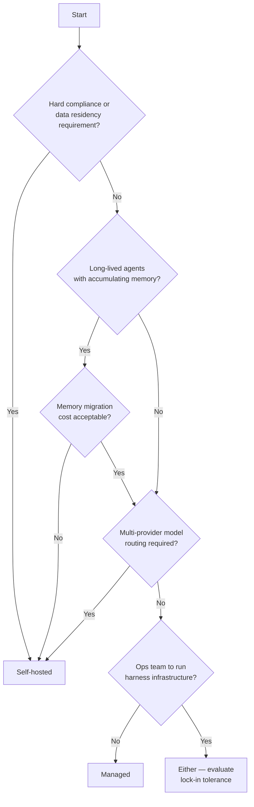

# Managed vs Self-Hosted Agent Harness

> Choose between a managed agent service and a self-hosted harness based on four concrete signals: compliance requirements, memory ownership, model routing flexibility, and ops capacity.

## The Decision

Managed agent services — [Claude Managed Agents](https://platform.claude.com/docs/en/managed-agents/overview) — provide a pre-built harness, sandboxed execution, and hosted infrastructure in exchange for vendor coupling. Self-hosted open-source harnesses — [LangChain Deep Agents Deploy](https://blog.langchain.com/deep-agents-deploy-an-open-alternative-to-claude-managed-agents/), Cursor's self-hosted cloud agents — trade ops burden for control over data, model selection, and accumulated [agent memory](agent-memory-patterns.md).

The choice mirrors the classic SaaS vs on-prem decision but with a compounding factor: agents accumulate memory over time. Locking memory behind a proprietary API raises migration cost with every session.

## The Four Signals

### 1. Compliance and Data Residency

Hard regulatory constraints that mandate data never leave your network force self-hosted deployment regardless of other factors. Cursor's self-hosted cloud agents (March 2026) address this directly: "your codebase, build outputs, and secrets all stay on internal machines running in your infrastructure" with "tool calls handled locally" — capability-equivalent to hosted, but with no data crossing Cursor's boundary ([Cursor changelog](https://cursor.com/changelog)).

Managed services run workloads on vendor infrastructure. If your threat model includes vendor access to execution artifacts, managed is not an option.

### 2. Memory Ownership

Harnesses are coupled to memory management. An agent harness "is intimately tied to memory — a key role of the harness is to manage context" ([LangChain, April 2026](https://blog.langchain.com/deep-agents-deploy-an-open-alternative-to-claude-managed-agents/)). When an agent learns from interactions — adapting to user preferences, accumulating domain knowledge, building an internal model of your codebase — that memory accumulates inside the harness.

With a managed service, that memory sits behind the provider's API. Migration means resetting learned state and starting over — a cost that grows with every session. With a self-hosted harness, memory lives in your own databases and persists through vendor changes.

This is the strongest argument for self-hosting when agents are long-lived or customer-facing, not just for batch tasks.

### 3. Model Routing Flexibility

Managed services vary: Claude Managed Agents uses Anthropic models exclusively; Amazon Bedrock AgentCore supports multiple providers including OpenAI and Gemini ([AWS, 2026](https://aws.amazon.com/blogs/machine-learning/amazon-bedrock-agentcore-is-now-generally-available/)). The pattern holds at the platform layer — each managed service constrains you to its approved roster, even if that roster spans providers. Self-hosted harnesses eliminate the roster entirely and can route across any provider. Deep Agents Deploy supports OpenAI, Google, Anthropic, Azure, Bedrock, Fireworks, Baseten, Open Router, and Ollama — switchable per deployment or per task ([LangChain, April 2026](https://blog.langchain.com/deep-agents-deploy-an-open-alternative-to-claude-managed-agents/)).

If your use case requires multi-model routing, cost-based routing across providers, or the ability to migrate models without re-platforming, self-hosted gives you that flexibility. If one provider's flagship model covers your workload, managed removes the routing overhead.

### 4. Ops Capacity

Self-hosted requires deploying and operating the harness, the orchestration layer, sandboxes, and the memory stores. Deep Agents Deploy reduces this by bundling deployment behind a single `deepagents deploy` command that provisions a multi-tenant, horizontally scalable server with 30+ endpoints — but you still own the infrastructure ([LangChain, April 2026](https://blog.langchain.com/deep-agents-deploy-an-open-alternative-to-claude-managed-agents/)).

Managed services — Claude Managed Agents in particular — handle all of this: "no need to build your own agent loop, sandbox, or tool execution layer" ([Anthropic, 2026](https://platform.claude.com/docs/en/managed-agents/overview)). The trade-off is losing the ability to customize those layers.

## Decision Flow

## The Hybrid Pattern

Cursor's self-hosted cloud agents (March 2026) demonstrate a hybrid: managed orchestration and agent definitions hosted by Cursor; execution and tool calls running on customer infrastructure. You get the managed control plane without placing code, secrets, or build artifacts on vendor machines.

This is the pattern to consider when compliance concerns are about execution artifacts specifically, not orchestration metadata.

## Key Takeaways

- Compliance and data residency are hard constraints — evaluate them first; other factors only matter if you have a choice
- Memory accumulation behind a proprietary API compounds lock-in over time — this is the structural difference from classic SaaS vs on-prem
- Multi-model routing flexibility requires self-hosted; managed services bind you to their provider's model set
- The hybrid model (managed control plane, self-hosted execution) reduces ops burden while keeping execution artifacts on your infrastructure

## Related

- [Harness Engineering](harness-engineering.md) — the discipline of designing agent environments for reliable output
- [Agent Harness: Initializer and Coding Agent](agent-harness.md) — the two-phase harness pattern for long-running work
- [Cursor Self-Hosted Cloud Agents](../tools/cursor/self-hosted-cloud-agents.md) — hybrid deployment: managed orchestration, self-hosted execution
- [Cost-Aware Agent Design](cost-aware-agent-design.md) — routing by complexity, relevant when multi-provider routing is in scope
- [Cross-Vendor Competitive Routing](cross-vendor-competitive-routing.md) — assigning competing agents to the same task, a self-hosted-only pattern
- [Session Harness Sandbox Separation](session-harness-sandbox-separation.md) — the three-primitive architecture inside either deployment mode
