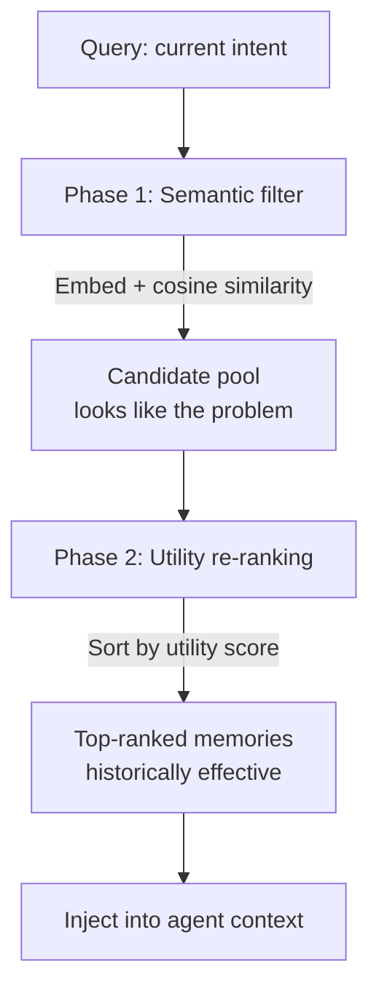

# Memory Reinforcement Learning (MemRL)

> Assign and update utility scores to stored episodic memories so retrieval favors historically effective solutions, not just semantically similar ones.

## The Problem with Semantic-Only Retrieval

Standard RAG retrieves memories by embedding distance — the most semantically similar past experience surfaces as context. This assumes that *similar* implies *useful*, which fails when an agent has encountered the same problem class before and tried approaches that looked right but consistently produced poor outcomes.

These are **distractor memories**: entries that rank highly by cosine similarity but represent approaches with a bad performance history. Retrieving them does not just waste context — it actively misleads the agent toward known-failed paths.

MemRL addresses this by making *historical effectiveness* a first-class retrieval signal ([Zhang, Wang et al., 2026 — arXiv:2601.03192](https://arxiv.org/abs/2601.03192)).

## Memory Entry Structure

Each MemRL entry holds three fields:

| Field | Content |
|-------|---------|
| **Intent** | Embedded representation of the original query or goal |
| **Experience** | The solution trace — the steps attempted and their outcomes |
| **Utility** | A learned score reflecting historical performance, updated from outcome signals |

The utility score starts at a neutral value and evolves over time. Entries are never discarded purely by age; their utility score governs whether they appear in retrieval results.

## Two-Phase Retrieval

Retrieval separates semantic matching from effectiveness ranking:



**Phase 1 (semantic filter)** uses standard embedding distance to retrieve a candidate pool of entries whose intent representations are close to the current query. This narrows the search space without making the effectiveness judgment yet.

**Phase 2 (utility re-ranking)** sorts the candidate pool by utility score. Entries with high utility — those that have produced successful outcomes in the past — surface above candidates with identical semantic similarity but poor performance history.

The two phases together solve what neither solves alone: semantic filtering without utility re-ranking promotes distractors; utility filtering alone, without semantic gating, would retrieve effective-but-irrelevant past experiences.

## Utility Score Updates

Utility scores update via temporal difference learning after each episode resolves:

```
mem.utility += learning_rate × (reward - mem.utility)
```

A successful outcome (`reward` above threshold) pulls the score up. A failure pulls it down. Over multiple episodes, scores converge toward the true average effectiveness of each stored approach for its problem class.

This is reinforcement learning applied to the memory index rather than to model weights. The base model never changes — there is no fine-tuning step, no catastrophic forgetting risk, and no retraining cost ([arXiv:2601.03192](https://arxiv.org/abs/2601.03192)). The same family of approaches — verbal reinforcement learning over an episodic memory buffer — was shown by Reflexion to lift HumanEval pass@1 from a GPT-4 baseline of 80% to 91% without modifying model weights ([Shinn et al., 2023 — arXiv:2303.11366](https://arxiv.org/abs/2303.11366)).

## Relation to Fine-Tuning and Standard RAG

| Approach | What updates | Catastrophic forgetting | Cost |
|----------|-------------|------------------------|------|
| Fine-tuning (SFT/RL) | Model weights | Yes — prior capability can degrade | High |
| Standard RAG | External corpus | No | Low |
| MemRL | Memory utility scores | No | Low |

MemRL occupies the space between the two: it enables continuous improvement from outcome signals like reinforcement learning, without modifying the model. The base model's reasoning capability is the stable substrate; the utility layer provides the adaptive signal. This matches the [context layer](continual-learning-layers.md) in the three-layer continual learning taxonomy — the cheapest and most reversible update target.

A predecessor approach, Reflexion ([Shinn et al., 2023 — arXiv:2303.11366](https://arxiv.org/abs/2303.11366)), demonstrated that verbal RL on episodic memory — storing natural-language reflections rather than numeric utility scores — could lift HumanEval pass@1 from 80% (GPT-4 baseline) to 91%. MemRL extends this by replacing verbal reflection with quantitative utility scores, enabling retrieval-time re-ranking rather than context-stuffing.

## Limitations

- **Requires reliable outcome signals.** Utility updates depend on consistent success/failure signals. Tasks where "success" is ambiguous or hard to measure automatically produce noisy utility estimates that degrade retrieval quality.
- **Cold-start problem.** With few stored episodes, the utility layer has no meaningful signal. Early performance is effectively standard RAG. Improvements compound only after enough episodes to establish a meaningful score distribution.
- **Memory storage grows continuously.** Without explicit pruning or consolidation, the memory bank expands with every episode. High-utility memories accumulate alongside low-utility ones; storage and indexing cost scales with volume.
- **Not suited for highly diverse problem spaces.** If task distribution is broad enough that each problem is essentially unique, utility scores from past episodes transfer poorly and the re-ranking step adds little over pure semantic retrieval.

## Example

An agent repeatedly handles database migration tasks. Early on, it stores an experience where it applied a particular lock-escalation approach to handle schema changes — the approach looked reasonable (high semantic similarity to "schema migration") but consistently caused downtime in production environments.

**Without utility re-ranking:**
Each time a schema migration task arrives, the lock-escalation episode ranks near the top by embedding distance. The agent re-applies it, the outcome fails, and the pattern repeats.

**With MemRL:**
After several failed outcomes, the lock-escalation entry accumulates a low utility score. Even though it still ranks high on semantic similarity in Phase 1 (it passes the candidate filter), Phase 2 drops it below entries that represent the zero-downtime migration approach, which has accumulated higher utility from successful episodes. The agent retrieves the better approach instead.

## Key Takeaways

- Semantic similarity is a proxy for relevance, not effectiveness — distractor memories with high embedding similarity but poor history mislead agents toward known-failed approaches.
- MemRL's two-phase retrieval separates the semantic filter (finding relevant candidates) from the effectiveness ranking (surfacing historically useful ones).
- Utility scores update from outcome signals using temporal difference learning; the base model is never modified.
- The approach requires reliable outcome signals and sufficient episode volume — cold-start and reward signal definition are the primary engineering challenges.

## Related

- [Episodic Memory Retrieval](episodic-memory-retrieval.md) — retrieval mechanics for episodic memory using trigger, context, and outcome indexing
- [Subtask-Level Memory for Software Engineering Agents](subtask-level-memory.md) — granularity-aligned retrieval that prevents cross-phase contamination
- [Agent Memory Patterns: Learning Across Conversations](agent-memory-patterns.md) — scope-based memory architecture covering episodic and working memory
- [Continual Learning for AI Agents](continual-learning-layers.md) — three-layer taxonomy: model, harness, and context as independent update targets
- [Memory Synthesis from Execution Logs](memory-synthesis-execution-logs.md) — extracting causal lessons from agent execution traces
- [Generative Agents Memory Stream](generative-agents-memory-stream.md) — recency/relevance/importance scoring over an episodic observation stream
- [Memory Transfer Learning](memory-transfer-learning.md) — cross-domain reuse of stored memories and when utility scores transfer poorly
- [Retrieval-Augmented Agent Workflows](../context-engineering/retrieval-augmented-agent-workflows.md) — on-demand context retrieval patterns
