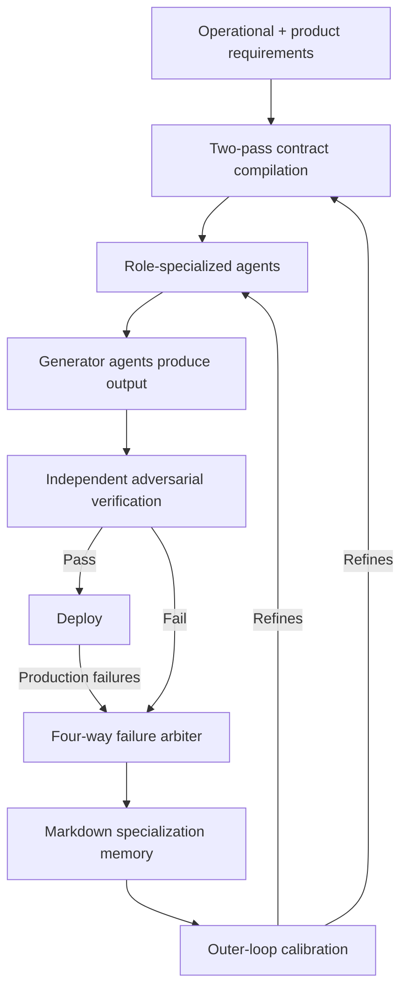

# Meta-Engineering Harness for Production AI-Native Software Delivery

> Compose contract compilation, role-specialized agents, adversarial verification, and outer-loop calibration into one harness — for continuous AI-native production above a throughput threshold.

## When This Architecture Applies

The meta-engineering harness is a *production-scale* architecture. It pays back only when four conditions hold simultaneously, per the deployment report in [Sengupta et al., May 2026](https://arxiv.org/abs/2605.25665):

- **Continuous production, not project work** — the same system delivers many features over months or years, not a one-shot build.
- **Feature throughput is enough to amortise the outer loop** — the calibration mechanism only pays back across many features; below roughly ten features per quarter, the failure-classification pipeline costs more than it saves.
- **Multi-agent token-cost overhead is acceptable** — multi-agent systems use about 15x more tokens than chat, 4x more than single-agent ([Anthropic Engineering](https://www.anthropic.com/engineering/multi-agent-research-system)). The harness assumes the per-feature inference budget can absorb that.
- **Requirements settle before generation** — the two-pass contract compiler assumes contracts are stable enough to compile against. Weekly product pivots make contracts stale faster than calibration can refine them.

Below this threshold, simpler architectures — single-agent harnesses, [sprint contracts](sprint-contracts.md) per task, [research-plan-implement](../workflows/research-plan-implement.md) loops — deliver better cost-per-feature.

## The Four Mechanisms

### 1. Two-Pass Contract Compilation

Requirements compile into explicit, machine-readable contracts *before* any agent generates code. The two passes exist because operational requirements (latency, error budgets, observability) and product requirements (user-visible behaviour) carry different trade-off boundaries — one pass cannot reconcile both without losing structure ([Sengupta et al., 2026](https://arxiv.org/abs/2605.25665)).

This is broader than the per-task [sprint contracts](sprint-contracts.md) pattern. Sprint contracts scope one chunk of work; the meta-engineering harness compiles the entire feature surface into contracts subsequent agent work checks against. Without pre-generation contracts, the verifier scores against generator output and falls into the rationalisation failure documented in the sprint contracts research.

### 2. Role-Specialized Agents

Work routes through agents with exclusive scopes — see [specialized agent roles](specialized-agent-roles.md) for the mechanism. The meta-engineering harness extends this with explicit handoff schemas between roles, addressing the accountability and context-fragmentation problems documented in [traceability research on role-specialized pipelines](https://arxiv.org/abs/2510.07614).

### 3. Independent and Adversarial Verification

Verification runs as a separate role with no access to the generator's reasoning. The harness includes what the authors call a "four-way failure arbiter" — a structured handler for the canonical disagreement outcomes between independent verifiers and generators ([Sengupta et al., 2026](https://arxiv.org/abs/2605.25665)).

Critic-builder separation favours false positives over false negatives ([Adversarial Code Review pattern](https://asdlc.io/patterns/adversarial-code-review/)) — the opposite asymmetry from a single agent reviewing its own work. But role separation alone is not sufficient: framing a change as bug-free reduces LLM vulnerability detection by 16–93%, with false negatives increasing sharply while false positives change little ([arxiv 2603.18740](https://arxiv.org/abs/2603.18740)). The contract is load-bearing — it gives the verifier something independent to check against that no upstream framing can defeat.

### 4. Outer-Loop Calibration via Failure Classification

Production failures feed back into structural improvements to contracts and verification boundaries, not per-feature patches — the [incident-to-eval synthesis](../verification/incident-to-eval-synthesis.md) discipline applied at architecture level.

The deployment report's payments case study is the worked example: 17 features over several weeks surfaced contract incompleteness and verification-boundary gaps that the calibration loop turned into targeted architectural improvements ([Sengupta et al., 2026](https://arxiv.org/abs/2605.25665)). Without the calibration loop the same work would have produced 17 one-off patches.

The substrate is persistent markdown memory with "specialization records" — agents track their own domain expertise on disk, structurally the same as [persona-as-code](persona-as-code.md) and [agent memory patterns](agent-memory-patterns.md). The harness's contribution is wiring memory back into the outer loop so improvements compound.

## Why It Works

The harness relocates rigor from the generator to the surrounding system. Contracts make requirements legible to verification; role separation prevents evaluator drift toward approval; outer-loop calibration turns each production failure into a structural improvement rather than a one-off patch.

This matches the broader [harness engineering](harness-engineering.md) thesis ([Fowler/Bockeler](https://martinfowler.com/articles/exploring-gen-ai/harness-engineering.html)): the system around the model is the primary engineering surface, not the prompts. Where single-task harnesses optimise for one feature at a time, the meta-engineering harness optimises the production function across many features — the calibration loop is the part that earns the "meta" prefix.

The contract-compilation step is load-bearing. Without explicit pre-generation contracts, the verifier scores against generator output (the failure mode the [sprint contracts](sprint-contracts.md) page documents). With them, role separation produces an asymmetric error profile that favours catching bugs over missing them ([Adversarial Code Review](https://asdlc.io/patterns/adversarial-code-review/)).

## When This Backfires

- **Below the throughput threshold** — for fewer than roughly ten features per quarter, the outer-loop calibration mechanism costs more than the failures it prevents. A single-agent harness with manual review delivers better cost-per-feature.
- **Heavy interdependencies between features** — multi-agent role separation imposes coordination overhead that exceeds parallelism benefit for tightly-coupled codebases. Coding tasks "have fewer parallelizable opportunities than research" ([Anthropic Engineering](https://www.anthropic.com/engineering/multi-agent-research-system)).
- **Frequent requirement churn** — the two-pass contract compilation assumes contracts settle before generation. Weekly product pivots make contracts stale faster than calibration can refine them.
- **Cost-constrained deployments** — the 4–15x token-cost multiplier vs single-agent ([Anthropic Engineering](https://www.anthropic.com/engineering/multi-agent-research-system)) makes the architecture unsuitable when per-feature inference budgets are tight.
- **Adversarial-verification false-negative trap** — role separation alone does not defeat confirmation bias. Without contracts to anchor the verifier, upstream framing ("this change is bug-free") reduces detection rates by 16–93% ([arxiv 2603.18740](https://arxiv.org/abs/2603.18740)).
- **No comparison baseline in the source report** — the deployment of 17 features in the [originating paper](https://arxiv.org/abs/2605.25665) does not include a single-agent A/B baseline. Treat the architecture as a candidate at production scale, not an empirically-proven default.

## Key Takeaways

- The harness is a composite architecture, not a single pattern — its value comes from integrating contract compilation, role specialization, adversarial verification, and outer-loop calibration into one feedback loop.
- The qualifying conditions matter more than the mechanisms. Apply it when continuous production, feature throughput, and cost tolerance all clear the threshold — and not before.
- Contracts are load-bearing. Role separation alone does not defeat confirmation bias; the verifier needs an independent target.
- Outer-loop calibration is the part that earns the "meta" prefix. Without it, the architecture is just a multi-agent pipeline.
- The originating deployment is small (17 features, no baseline). Treat the architecture as a structurally-grounded candidate, not an empirically-proven default.

## Related

- [Sprint Contracts](sprint-contracts.md) — per-task evaluator agreements; the constituent mechanism the meta-engineering harness scales up.
- [Specialized Agent Roles](specialized-agent-roles.md) — the role-specialization mechanism this harness extends with handoff schemas.
- [Harness Engineering](harness-engineering.md) — the underlying thesis: the system around the model is the primary engineering surface.
- [Incident-to-Eval Synthesis](../verification/incident-to-eval-synthesis.md) — the calibration discipline that converts production failures into structural improvements.
- [Agentic Flywheel: Self-Improving Agent Systems](agentic-flywheel.md) — closed-loop self-improvement, a narrower variant of the same outer-loop pattern.
