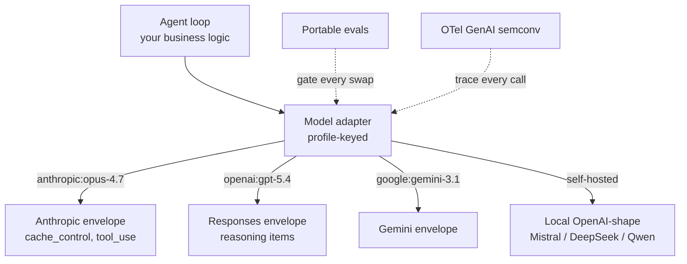

# Model-Neutral Agent Architecture

> A model-neutral agent architecture pays back faster than cloud neutrality when frontier capability churns quarterly and portable evals gate every swap.

A model-neutral agent architecture treats the backing model as a swappable component behind a provider-agnostic harness — prompt schemas, tool schemas, middleware, and evals belong to the team; the model is configuration. Cloud neutrality stopped at the contract, but "agent neutrality has to follow the request" because labs are "leapfrogging each other every quarter, often every month" while application teams move clouds "maybe once every few years" ([LangChain, June 2026](https://blog.langchain.com/model-neutrality)).

The bet is conditional. It pairs with [The Agent Stack Bet](agent-stack-bets.md) (platform-layer bets), [Per-Model Harness Tuning](per-model-harness-tuning.md) (the spatial mechanic that keeps neutrality from collapsing to the LCD), and [Managed vs Self-Hosted Harness](managed-vs-self-hosted-harness.md) (the deployment decision that determines whether the harness surface exists at all).

## When the Bet Pays

Four conditions must hold together. Miss one and the abstraction is overhead.

- **Cross-vendor capability is churning at least quarterly.** As of 2026-06 "Anthropic is currently the model to reach for on coding, though OpenAI is closing the gap, and OpenAI is ahead on multimodal. The rankings shift every few months" ([LangChain](https://blog.langchain.com/model-neutrality)). When rankings are stable, the swap option is theoretical and the abstraction is dead weight.
- **The team owns a portable eval suite.** The swap mechanism is the eval, not the abstraction — "every time you change a prompt, swap a model version, or add a tool, your eval suite should run automatically" with regression gates in CI ([Braintrust](https://www.braintrust.dev/articles/best-ai-evals-tools-cicd-2025)). Without measurement, "the right to switch" is just hope.
- **The workload is not bound to a single vendor's native capability.** Anthropic's `cache_control` breakpoints, OpenAI's Responses reasoning items, and provider-specific extended-thinking conventions do not round-trip through a Chat-Completions LCD ([Multi-Shape BYOK Provider](multi-shape-byok-provider.md)). Workloads dominated by these features pay a capability tax that the multiplier discount cannot recover.
- **The harness is yours to declare neutrality on.** Provider-managed surfaces — Copilot cloud agent, Claude Managed Agents — expose vendor-side routing ([Auto Model Selection](auto-model-selection.md)) and remove the layer this pattern would attach to.

## The Three-Property Neutral Harness

LangChain's definition of a neutral harness is three properties — none alone is sufficient:

| Property | What it means | Why all three matter |
|----------|----------------|---------------------|
| **Open source** | Every line of code is readable and forkable | Closed agent frameworks shipped by a model lab are not neutral regardless of marketing |
| **Multi-model out of the box** | One agent definition; every provider first-class | No provider owns the abstraction; the SDK is not a re-labelled vendor harness |
| **Profile-aware, not lowest-common-denominator** | Per-model prompt, tool, and middleware deltas | Capability is preserved per backend instead of flattened to the shared subset |

[LangChain](https://blog.langchain.com/model-neutrality) is explicit: "Neutrality is not the obligation to pretend every model is interchangeable. The right to switch. Not the requirement to flatten." The profile-aware property is what closes the LCD trap that doomed naive "OpenAI-compatible" adapters — see [Multi-Shape BYOK Provider](multi-shape-byok-provider.md) for the per-endpoint shape declaration that preserves cache_control, reasoning items, and native tool blocks across three concurrent envelope contracts.

The profile-aware property is also empirically load-bearing. LangChain's deepagents profiles produced a 10-20 point tau2-bench jump per model when the harness applied model-keyed deltas — Codex went 33% to 53%, Opus 4.7 went 43% to 53% ([LangChain](https://blog.langchain.com/tuning-deep-agents-different-models)). A neutral harness without profiles converges on the LCD by default.

## Where the Abstraction Boundary Belongs

The seam sits at the **model invocation**, not at the agent loop:



Three things stay on the team's side of the seam:

- **Tool and prompt schemas** declared once; per-model deltas applied as profile records ([Per-Model Harness Tuning](per-model-harness-tuning.md)).
- **Eval suite** that runs on every swap and gates regression. Without portable evals the swap is unmeasured and the neutrality property does not actually pay back.
- **Observability** instrumented against OpenTelemetry GenAI semconv so traces stay vendor-agnostic ([digitalapplied](https://www.digitalapplied.com/blog/agent-observability-2026-evals-traces-cost-guide)).

Three things stay on the model's side of the seam:

- **Envelope shape** — Chat Completions vs Responses vs Messages — declared per endpoint, not auto-detected ([Multi-Shape BYOK Provider](multi-shape-byok-provider.md)).
- **Reasoning-trace conventions and tool-call shapes** — these are model-specific training-distribution artefacts; the harness exposes them as profile fields, not as one universal schema.
- **Native acceleration features** — `cache_control` breakpoints, Batch API, extended-thinking caching — kept native rather than abstracted; the harness routes around models that don't support them rather than down-translating.

## Why It Works

The mechanism is **rate-of-change asymmetry between architectural layers**. Lock-in cost over time is `(cost-per-swap) × (swaps-per-time)`. Cloud lock-in had high cost-per-swap (re-platforming) but very low frequency (contract cycles, outages — "once every few years"). Model lock-in has lower cost-per-swap (re-prompt, re-tune) but much higher frequency (frontier rankings shifting quarterly to monthly). The integral over `cost × frequency` is therefore larger on the model axis even though cost-per-swap is smaller, which inverts where to invest neutrality first ([LangChain](https://blog.langchain.com/model-neutrality)). The "labs are selling commodities, locking you in at the tooling layer" framing is the same play AWS, Azure, and GCP ran with CloudFormation, ARM templates, and Vertex — Terraform won by being the neutral layer one step up. Claude Agent SDK, OpenAI Agents API, and Vertex AI Agent Builder are "all the same shape" and have no commercial incentive to make competitors' models feel first-class ([LangChain](https://blog.langchain.com/model-neutrality)). The profile-aware property is the engineering escape from the LCD trap: per-model deltas as declarative overrides ([Per-Model Harness Tuning](per-model-harness-tuning.md)) preserve capability while keeping the swap seam shallow.

## When This Backfires

The bet inverts inside the source's own carve-out and several adjacent conditions:

- **Single-CLI agent platforms whose value is depth of integration with one harness.** Claude Code itself, the in-IDE Copilot CLI bound to GitHub's roster, and other lab-shipped tools are products *of* a single harness — portability is a cost they will never recover.
- **Pre-eval-suite teams.** Without portable evals the swap is unmeasured. Teams discover that "portability" is a property of the eval suite, not the abstraction, and switch providers anyway at the cost of an eval rewrite ([Braintrust](https://www.braintrust.dev/articles/best-ai-evals-tools-cicd-2025)).
- **Workloads heavy on `cache_control` or extended-thinking caching.** Cross-provider feature decay is concrete: extended thinking and prompt caching "don't mix well across providers — if you're running multi-provider, disable extended thinking in caching-critical paths for now, as Anthropic Direct handles it cleanly, but Bedrock, Vertex, and older model versions each fail differently, and none of it is documented" ([mager.co](https://www.mager.co/blog/2026-04-29-claude-prompt-caching/)). An LCD abstraction silently drops cache breakpoints, costing more per request than the discount it pretended to preserve.
- **Regulated workloads pinned to a model version.** The swap option is removed by policy; portability machinery is pure overhead, the same way [Harness Impermanence](harness-impermanence.md) flags removability machinery as dead weight on pinned deployments.
- **Pre-PMF startups.** Iteration speed beats portability before product-market fit — the same call [Agent Stack Bets](agent-stack-bets.md) makes for stack bets in general.
- **Provider-managed cloud agents.** Copilot cloud agent and Claude Managed Agents expose [Auto Model Selection](auto-model-selection.md) inside the vendor's pool; the operator has no harness surface to declare neutrality on.
- **Naive LCD abstractions that lose what they pretended to preserve.** A unified API that normalises every provider to the shared subset trades portability for capability — frontier features like reasoning items and native tool blocks disappear from the abstraction, and "the right to switch" becomes "the requirement to flatten" ([LangChain](https://blog.langchain.com/model-neutrality)).

## Example

A team running [LangChain deepagents](https://docs.langchain.com/oss/python/deepagents/overview) splits responsibility cleanly across the seam. The harness, the eval suite, and the OTel instrumentation belong to the team. The model is configuration:

```python
from deepagents import create_deep_agent, HarnessProfile, register_harness_profile

# Profile-aware, not LCD: per-model deltas applied at construction
register_harness_profile(
    "openai:gpt-5.4",
    HarnessProfile(
        system_prompt_suffix=(
            "Before any tool call, decide ALL files and resources "
            "you will need. Batch independent reads into parallel calls."
        ),
        excluded_tools={"file_edit"},  # apply_patch wins for Codex
    ),
)

register_harness_profile(
    "anthropic:claude-opus-4-7",
    HarnessProfile(
        system_prompt_suffix=(
            "<tool_result_reflection>"
            "After receiving tool results, reflect on quality and "
            "determine optimal next steps before proceeding."
            "</tool_result_reflection>"
        ),
    ),
)

# The same agent definition, every provider first-class
agent = create_deep_agent(
    model="anthropic:claude-opus-4-7",  # swap to "openai:gpt-5.4" or "google:gemini-3.1"
    tools=[...],
    middleware=[...],
)
```

The CI gate runs the team's portable eval suite against both providers on every PR. A swap from Anthropic to OpenAI is one line plus an eval pass — not a rewrite. Deep Agents Deploy supports OpenAI, Google, Anthropic, Azure, Bedrock, Fireworks, Baseten, Open Router, and Ollama on the same agent definition ([LangChain](https://blog.langchain.com/deep-agents-deploy-an-open-alternative-to-claude-managed-agents/)). A LiteLLM bridge gives Claude Agent SDK the same swap surface across providers when teams want to stay closer to a lab-shipped SDK ([LiteLLM](https://docs.litellm.ai/docs/tutorials/claude_agent_sdk)).

## Key Takeaways

- Model neutrality is a *conditional* architectural bet — it pays when cross-vendor capability churns quarterly and the team has portable evals; it inverts on single-CLI platforms, pre-eval-suite teams, and workloads bound to vendor-native features.
- The mechanism is rate-of-change asymmetry: model swaps happen far more often than cloud swaps, so the lock-in integral is larger on the model axis even though each swap is cheaper ([LangChain](https://blog.langchain.com/model-neutrality)).
- A neutral harness is three properties together — open source, multi-model out of the box, and *profile-aware not lowest-common-denominator*. Profiles are empirically load-bearing: 10-20 point tau2-bench deltas per model from declarative overrides ([LangChain](https://blog.langchain.com/tuning-deep-agents-different-models)).
- The abstraction boundary belongs at the model invocation, not the agent loop — prompt and tool schemas, evals, and OTel-shaped traces stay on your side; envelope shape, reasoning conventions, and native acceleration features stay on the model's side.
- The swap mechanism is the eval suite. Without portable evals, neutrality is theoretical and the abstraction is dead weight.

## Related

- [The Agent Stack Bet](agent-stack-bets.md) — four enterprise platform bets; this page is the underlying portability-priority claim those bets trade against.
- [Per-Model Harness Tuning](per-model-harness-tuning.md) — the spatial mechanic that makes profile-aware neutrality work; the per-model delta surface this pattern depends on.
- [Managed vs Self-Hosted Harness](managed-vs-self-hosted-harness.md) — the deployment decision tree; multi-model routing flexibility shows up there as one of five signals.
- [Multi-Shape BYOK Provider](multi-shape-byok-provider.md) — the per-endpoint envelope declaration that preserves capability across three concurrent shapes, closing the LCD trap.
- [Cross-Vendor Competitive Routing](cross-vendor-competitive-routing.md) — fan-out across vendors when capability differentiation is the signal; a downstream pattern that a neutral harness makes addressable.
- [Harness Impermanence](harness-impermanence.md) — the temporal counterpart for handling model-version upgrades; both disciplines invert on pinned deployments.
