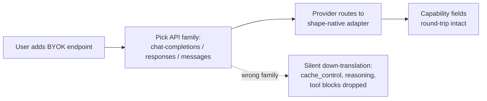

# Multi-Shape BYOK Provider

> One BYOK provider that natively speaks Chat Completions, Responses, and Messages — declared per endpoint — replaces one-off "OpenAI-compatible" adapters that silently down-translate capability.

A multi-shape BYOK provider exposes a single configuration surface that supports several LLM API envelope shapes — `chat-completions`, `responses`, `messages` — and lets the operator declare which envelope each configured endpoint speaks. VS Code 1.121 ships this design as the Custom Endpoint provider: "We now ship a new BYOK provider, the Custom Endpoint provider, that lets you plug any Chat Completions, Responses, or Messages-compatible endpoint into Copilot Chat from a single configuration" ([VS Code 1.121 release notes](https://code.visualstudio.com/updates/v1_121)). The provider replaces the legacy single-shape `customoai`, "which only supported Chat Completions and is now marked for deprecation" ([VS Code 1.121 release notes](https://code.visualstudio.com/updates/v1_121)).

## The Three-Shape Surface

The pattern names three envelope families because capability lives in the envelope, not the URL:

| API family | Envelope owner | Capability shape that does not round-trip cleanly |
|------------|----------------|---------------------------------------------------|
| `chat-completions` | OpenAI Chat Completions | The historical lowest common denominator — what most "compatibility" adapters speak |
| `responses` | OpenAI Responses | Reasoning items, server-side state, and other Responses-only fields the adapter must preserve |
| `messages` | Anthropic Messages | `cache_control` breakpoints, native `tool_use`/`tool_result` blocks, extended-thinking content |

The shape is user-declared, not auto-detected: "When you add a model from this provider, you can pick which API family it belongs to (`chat-completions`, `responses`, or `messages`)" ([VS Code 1.121 release notes](https://code.visualstudio.com/updates/v1_121)). A mis-declaration silently degrades capability with no in-IDE failure, which is why this pattern only pays off in concert with the BYOK telemetry contract ([BYOK Model Token Visibility](../observability/byok-model-token-visibility.md)) — the telemetry surface is how a wrong-shape endpoint becomes visible.



## Why It Works

Capability is encoded in the request/response envelope, not in the endpoint URL. When the IDE speaks the model's native envelope, capability-bearing fields round-trip without lossy translation; when it down-translates to a single common shape, fields the wrapper does not know about are silently dropped. A single-shape "OpenAI-compatible" adapter forces every model behind it through Chat Completions, which has no slot for Anthropic's `cache_control` breakpoints, no slot for Responses' reasoning items, and no native shape for Anthropic `tool_use`/`tool_result` blocks. Moving the shape choice out of the URL ("which adapter parses this?") into a per-endpoint declaration ("which shape does this endpoint speak?") is the smallest change that preserves capability across three concurrent envelope contracts — and it is the same per-endpoint capability-declaration pattern used for explicit gateway capability flags ([Gateway Model Routing](gateway-model-routing.md)).

## When This Backfires

- **Single-vendor team that only ever speaks one envelope.** Three code paths where one would do; the legacy `customoai` adapter was strictly smaller surface for these teams. The provider abstraction only pays off when the BYOK pool actually spans shapes.
- **Channel maturity (resolved at 1.122).** At 1.121 the provider was Insiders-only: "The Custom Endpoint provider is currently in preview and only available in VS Code Insiders" ([VS Code 1.121 release notes](https://code.visualstudio.com/updates/v1_121)). VS Code 1.122 then moved it to the stable channel — "The Custom Endpoint provider is now available in VS Code Stable" ([VS Code 1.122 release notes](https://code.visualstudio.com/updates/v1_122)) — so the preview-gating caveat no longer applies on current stable. Teams pinned to an older release should still confirm the provider is present before building workflows on it.
- **Gateway already normalises to one shape.** If a fronting gateway terminates the multi-shape problem before the IDE — the contract documented for Anthropic-compatible gateways ([Gateway Model Routing](gateway-model-routing.md)) — IDE-side multi-shape selection just relocates the translation point without removing it.
- **Wrong-shape declaration.** The "pick the API family" step is user-declared, not auto-detected ([VS Code 1.121 release notes](https://code.visualstudio.com/updates/v1_121)). A user who picks the wrong family for their endpoint gets silently degraded behaviour. Without the BYOK telemetry surface that landed in 1.120 ([VS Code 1.120 release notes](https://code.visualstudio.com/updates/v1_120) via [BYOK Model Token Visibility](../observability/byok-model-token-visibility.md)), the mis-declaration may not surface for many turns.
- **Capability assumption only holds when shape matches model.** Picking `chat-completions` for an Anthropic endpoint still loses `cache_control` and native tool-block shapes regardless of which provider class is wrapping it. Multi-shape buys preservation only when the operator picks the shape *native to the model* — which assumes the operator knows that mapping.

## Example

Configuring three BYOK endpoints under one provider in VS Code 1.121 (Insiders), each declared with its native envelope:

```text
Add model → Provider: Custom Endpoint
  Endpoint 1: https://gpt.internal.example/v1
    API family: chat-completions
    → Used for legacy OpenAI-shaped routes
  Endpoint 2: https://reasoning.internal.example/v1
    API family: responses
    → Reasoning items + server-side state round-trip
  Endpoint 3: https://claude.internal.example/v1
    API family: messages
    → cache_control + tool_use blocks round-trip
```

The same gateway host can front all three if it terminates each envelope natively; the IDE side keeps the shape choice explicit at the per-endpoint level.

## Key Takeaways

- A multi-shape BYOK provider exposes Chat Completions, Responses, and Messages as named API families at one configuration surface, replacing the single-shape "OpenAI-compatible" adapter pattern that defaulted every BYOK endpoint to Chat Completions ([VS Code 1.121 release notes](https://code.visualstudio.com/updates/v1_121)).
- The mechanism is envelope-preserves-capability: shape-specific fields (`cache_control`, reasoning items, native tool blocks) round-trip only through the native shape, so the per-endpoint family declaration is the smallest unit of BYOK config that does not lose capability.
- Shape declaration is user-explicit, not auto-detected — pair it with BYOK telemetry so wrong-shape endpoints become visible.
- Skip the provider when only one envelope is in use, when a gateway already normalises shape upstream, or when the available channel is preview-only and the team cannot tolerate Insiders gating.
- The provider abstraction sits orthogonally to the gateway (which centralises auth and discovery) and the telemetry contract (which makes the BYOK route observable) — not in place of either.

## Related

- [Gateway Model Routing](gateway-model-routing.md) — the gateway/discovery layer that publishes the model catalogue; multi-shape BYOK sits in front of the gateway choice and declares which envelope reaches the model.
- [BYOK Model Token Visibility](../observability/byok-model-token-visibility.md) — the BYOK telemetry contract that makes a wrong-shape endpoint observable; the multi-shape provider depends on it for the silent-degradation failure mode.
- [Auto Model Selection](auto-model-selection.md) — vendor-side routing policy across a fungible pool; complementary to per-endpoint shape declaration on self-managed BYOK routes.
- [Per-Model Harness Tuning](per-model-harness-tuning.md) — declarative model-keyed overrides for prompt/tool/middleware; the same per-target capability-declaration discipline applied inside the harness.
- [Cross-Vendor Competitive Routing](cross-vendor-competitive-routing.md) — fan-out across vendors when capability-preservation across envelopes is the bottleneck; the provider abstraction is the prerequisite that makes those routes addressable from one harness.
