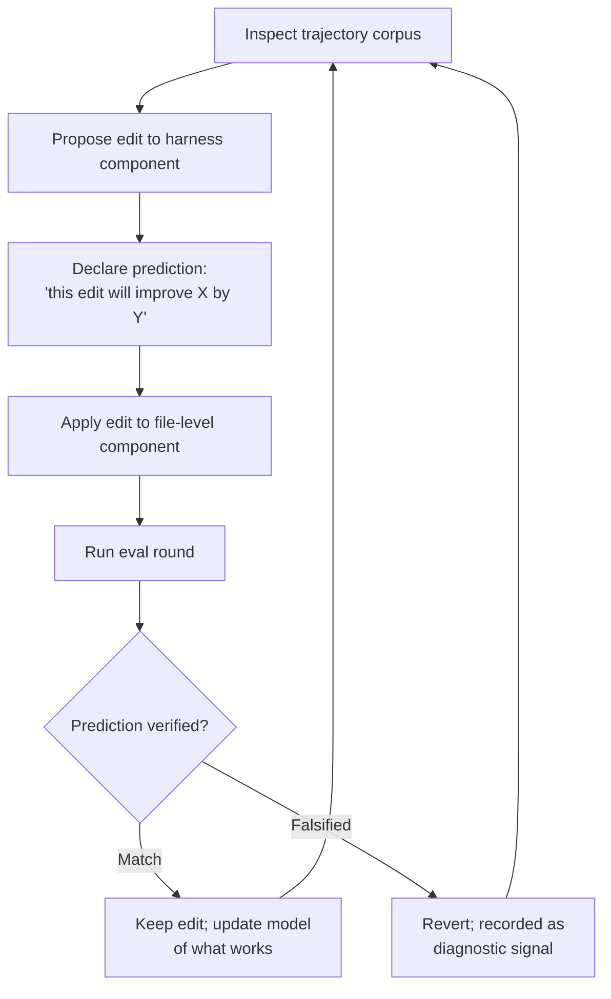

# Observability-Driven Harness Evolution

> Pair every harness edit with a self-declared prediction, then verify the prediction against the next round's task-level outcome. The mismatch — not the score — drives convergence.

## The Mechanism

Autonomous harness evolution fails the same way: an agent edits prompts, tools, or middleware, scores degrade, and no one knows which edit caused which delta. Trajectories run into millions of tokens and edits compound. Without per-edit attribution, the loop collapses into trial-and-error.

Agentic Harness Engineering (AHE) instruments the loop with three observability pillars so each edit becomes a falsifiable contract ([Lin et al., 2026](https://arxiv.org/abs/2604.25850)):

| Pillar | What it makes legible | Effect on the loop |
|--------|----------------------|--------------------|
| **Component observability** | Every editable harness element has a file-level representation; the action space is explicit and revertible | Edits are scoped and rollback is one operation |
| **Experience observability** | Multi-million-token trajectories distilled into a layered, drill-down evidence corpus | The evolving agent can actually consume past runs as evidence |
| **Decision observability** | Each edit ships with a self-declared prediction, verified against the next round's outcomes | Per-edit attribution; predictions either match or falsify |



## Why Predictions Convert Noise to Signal

Score-only loops produce one bit per round: better or worse. With a predicted outcome, each round produces two bits — score direction and prediction accuracy — and the second bit attributes the change to the agent's mental model rather than to chance.

A score improvement with a falsified prediction signals an accidental win: the edit worked for a reason the agent did not understand. A score regression with a matched prediction signals the agent correctly anticipated the regression — useful for ruling out a hypothesis. This is the same logic as [hypothesis-driven debugging](hypothesis-driven-debugging.md) applied to harness mutations: the hypothesis is the prediction, the eval round is the experiment, and the mismatch is the diagnostic.

Reflective optimization without this discipline collapses on defective seeds. [Gao et al., 2026](https://arxiv.org/abs/2603.18388) measured GEPA dropping accuracy from 23.81% to 13.50% on GSM8K when the seed prompt was poor — opaque, label-free trajectories cannot escape local optima. Decision observability is the interpretable trace that opaque optimizers lack.

## Empirical Result

Ten AHE iterations lifted pass@1 on Terminal-Bench 2 from 69.7% to 77.0%, surpassing the human-designed Codex-CLI harness (71.9%) and self-evolving baselines ACE and TF-GRPO ([Lin et al., 2026](https://arxiv.org/abs/2604.25850)). The frozen harness transferred without re-evolution: top aggregate success on SWE-bench-verified at 12% fewer tokens than the seed, and +5.1 to +10.1pp gains across three alternate model families on Terminal-Bench 2 — evidence that the evolved components encode general engineering experience rather than benchmark-specific tuning.

For comparison, LangChain's manually-driven harness changes on Terminal Bench 2.0 moved scores from 52.8% to 66.5% ([LangChain, 2026](https://blog.langchain.com/improving-deep-agents-with-harness-engineering/)). AHE's contribution is automating that loop without losing attribution.

## Relationship to Adjacent Patterns

| Pattern | Scope | Driver |
|---------|-------|--------|
| [Harness Engineering](harness-engineering.md) | Discipline of designing agent environments | Human-led, ongoing |
| [Harness Hill-Climbing](harness-hill-climbing.md) | One-variable-at-a-time search using eval scores | Human-driven, no predictions |
| [Agentic Flywheel](agentic-flywheel.md) | Closed-loop self-improvement at high level | Mixed autonomy tiers |
| [Self-Rewriting Meta-Prompt Loop](self-rewriting-meta-prompt-loop.md) | Prompt edits only | Autonomous, weight-free |
| **Observability-driven evolution** | Full harness, file-level components | Autonomous, prediction-verified |
| [Runtime Scaffold Evolution](runtime-scaffold-evolution.md) | In-session tool synthesis | Autonomous, ephemeral |

Hill-climbing isolates one variable per iteration so attribution is mechanical; AHE isolates predictions per edit so attribution is semantic. The two are compatible — hill-climbing's discipline of single-variable change reduces the surface area each prediction must cover.

## When This Backfires

- **Defective seed harness** — the prediction-verification loop assumes the agent's prior model is roughly correct; on a degenerate seed the same opacity that traps GEPA can trap AHE. A pre-loop validator on the seed is required, not just a per-edit gate.
- **Weak benchmarks** — verified predictions only matter against an eval that captures real failure modes. A benchmark that rewards surface patterns lets the loop converge to a local maximum that fails in production. Rotate eval tasks; see [incident-to-eval synthesis](../verification/incident-to-eval-synthesis.md).
- **Sub-frontier models** — making accurate predictions about edits to your own harness is meta-reasoning. AHE was evaluated on frontier models; weaker models would likely produce miscalibrated predictions that degrade signal quality, mirroring the model-capability threshold seen in [runtime scaffold evolution](runtime-scaffold-evolution.md).
- **Narrow-scope agents** — building file-level component representations, layered trajectory corpora, and prediction registries is infrastructure work. For small task sets, manual edits reach good-enough faster.

## Example

A team running an autonomous coding agent observes that pass@1 on their internal eval suite has plateaued at 64%. They wire AHE around the existing harness:

*Component observability* — each prompt fragment, tool description, and middleware hook becomes a file in `harness/components/`. Edits are git commits; rollbacks are reverts.

*Experience observability* — a trajectory pipeline distills each agent run into a hierarchical record: per-task summary at the top, per-turn rationale below, full token stream at the leaves. The evolving agent reads the top two layers by default and drills down only on flagged failures.

*Decision observability* — when the evolving agent proposes editing the pre-completion checklist to add an "import-cycle check," it writes a prediction:

```yaml
edit_id: 2026-04-30-checklist-import-cycle
component: harness/components/precompletion-checklist.md
prediction:
  metric: pass@1
  direction: increase
  magnitude_pp: "+1.5 to +3.0"
  confidence: medium
  rationale: "12% of failed runs in last 50 traces hit circular imports
  that completion left in place; checklist gate should catch them."
```

The next eval round scores 67.1% — within the predicted range. The edit is kept and the prediction-accuracy log is updated. A subsequent edit predicts +5pp from a tool description change but scores −0.4pp; the edit is reverted and the falsified prediction is recorded as a diagnostic signal that the agent's model of tool selection is incomplete.

After ten such cycles, attribution is preserved end-to-end: every retained edit has a verified prediction; every reverted edit has a logged falsification.

## Key Takeaways

- The unique mechanism is **predictions paired with edits**, not the loop itself — AHE's contribution is per-edit attribution, not autonomy
- Component observability (file-level representation) and revertible edits are prerequisites — without them, predictions cannot be scoped to a single change
- Verified-prediction discipline is the interpretable trace that opaque reflective optimizers ([Gao et al., 2026](https://arxiv.org/abs/2603.18388)) lack
- Empirical evidence is on frontier models against held-out benchmarks; defective seeds, weak benchmarks, and sub-frontier models are documented failure modes for related autonomous loops
- Combine with single-variable discipline from [harness hill-climbing](harness-hill-climbing.md) — narrow edits make narrow predictions, narrow predictions are easier to falsify

## Related

- [Harness Engineering](harness-engineering.md) — manual harness discipline that AHE automates
- [Harness Hill-Climbing](harness-hill-climbing.md) — eval-driven local search, one-variable-at-a-time, human-driven
- [Agentic Flywheel](agentic-flywheel.md) — closed-loop self-improvement framework that AHE instantiates with observability pillars
- [Self-Rewriting Meta-Prompt Loop](self-rewriting-meta-prompt-loop.md) — autonomous prompt rewriting (subset of harness components)
- [Runtime Scaffold Evolution](runtime-scaffold-evolution.md) — ephemeral in-session tool synthesis
- [Hypothesis-Driven Debugging](hypothesis-driven-debugging.md) — same predict-then-verify logic applied to bug fixes
- [Rollback-First Design](rollback-first-design.md) — reversibility as a precondition for the loop
- [Incident-to-Eval Synthesis](../verification/incident-to-eval-synthesis.md) — sourcing eval tasks from real failures so verified predictions track production reality
