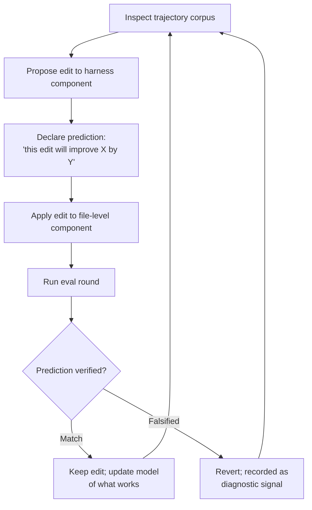

# Observability-Driven Harness Evolution

> Pair every harness edit with a self-declared prediction, then verify it against the next round's outcome. The mismatch, not the score, drives convergence.

## The mechanism

Autonomous harness evolution fails the same way every time. An agent edits prompts, tools, or middleware, scores drop, and no one knows which edit caused the change. Trajectories run into millions of tokens and edits compound. Without per-edit attribution, the loop collapses into trial-and-error.

Agentic Harness Engineering (AHE) instruments the loop with three observability pillars, so each edit becomes a falsifiable contract ([Lin et al., 2026](https://arxiv.org/abs/2604.25850)):

| Pillar | What it makes legible | Effect on the loop |
|--------|----------------------|--------------------|
| Component observability | Every editable harness element has a file-level representation; the action space is explicit and revertible | Edits are scoped and rollback is one operation |
| Experience observability | Multi-million-token trajectories distilled into a layered, drill-down evidence corpus | The evolving agent can consume past runs as evidence |
| Decision observability | Each edit ships with a self-declared prediction, verified against the next round's outcomes | Per-edit attribution; predictions either match or falsify |


```mermaid
graph TD
    A[Inspect trajectory corpus] --> B[Propose edit to harness component]
    B --> C[Declare prediction:<br/>'this edit will improve X by Y']
    C --> D[Apply edit to file-level component]
    D --> E[Run eval round]
    E --> F{Prediction verified?}
    F -->|Match| G[Keep edit; update model<br/>of what works]
    F -->|Falsified| H[Revert; recorded as<br/>diagnostic signal]
    G --> A
    H --> A
```

## Why predictions convert noise to signal

Score-only loops produce one bit per round: better or worse. A predicted outcome produces 2 bits — score direction and prediction accuracy — and the second bit attributes the change to the agent's mental model rather than to chance.

An improvement with a falsified prediction signals an accidental win: the edit worked for a reason the agent did not understand. A regression with a matched prediction means the agent correctly anticipated it, which helps rule out a hypothesis. This is [hypothesis-driven debugging](hypothesis-driven-debugging.md) applied to harness mutations: the prediction is the hypothesis, the eval round is the experiment, the mismatch is the diagnostic.

Reflective optimization without this discipline collapses on defective seeds. [Gao et al., 2026](https://arxiv.org/abs/2603.18388) measured GEPA dropping GSM8K accuracy from 23.81% to 13.50% on a poor seed prompt — opaque, label-free trajectories cannot escape local optima. Decision observability is the interpretable trace such optimizers lack.

## Empirical result

Ten AHE iterations lifted pass@1 on Terminal-Bench 2 from 69.7% to 77.0%, surpassing the human-designed Codex-CLI harness (71.9%) and self-evolving baselines ACE and TF-GRPO ([Lin et al., 2026](https://arxiv.org/abs/2604.25850)). The frozen harness transferred without re-evolution: top aggregate success on SWE-bench-verified at 12% fewer tokens than the seed, and +5.1 to +10.1pp gains across three alternate model families — evidence that the evolved components encode general engineering experience, not benchmark-specific tuning.

For comparison, LangChain's manually-driven changes on Terminal Bench 2.0 moved scores from 52.8% to 66.5% ([LangChain, 2026](https://blog.langchain.com/improving-deep-agents-with-harness-engineering/)). AHE automates that loop without losing attribution.

## Relationship to adjacent patterns

| Pattern | Scope | Driver |
|---------|-------|--------|
| [Harness Engineering](harness-engineering.md) | Discipline of designing agent environments | Human-led, ongoing |
| [Harness Hill-Climbing](harness-hill-climbing.md) | One-variable-at-a-time search using eval scores | Human-driven, no predictions |
| [Agentic Flywheel](agentic-flywheel.md) | Closed-loop self-improvement at high level | Mixed autonomy tiers |
| [Self-Rewriting Meta-Prompt Loop](self-rewriting-meta-prompt-loop.md) | Prompt edits only | Autonomous, weight-free |
| Observability-driven evolution | Full harness, file-level components | Autonomous, prediction-verified |
| [Runtime Scaffold Evolution](runtime-scaffold-evolution.md) | In-session tool synthesis | Autonomous, ephemeral |

Hill-climbing isolates one variable per iteration so attribution is mechanical; AHE isolates predictions per edit so attribution is semantic. The two are compatible — single-variable change reduces the surface area each prediction must cover.

## When this backfires

- Defective seed harness — the loop assumes the agent's prior model is roughly correct. On a degenerate seed, the same opacity that traps [GEPA](gepa-reflective-prompt-evolution.md) can trap AHE. You need a pre-loop validator on the seed, not just a per-edit gate.
- Weak benchmarks — verified predictions only matter against an eval that captures real failure modes. A benchmark that rewards surface patterns lets the loop converge to a local maximum that fails in production. Rotate eval tasks; see [incident-to-eval synthesis](../verification/incident-to-eval-synthesis.md).
- Sub-frontier models — predicting edits to your own harness is meta-reasoning. AHE was evaluated on frontier models; weaker ones would likely produce miscalibrated predictions that degrade signal, mirroring the capability threshold in [runtime scaffold evolution](runtime-scaffold-evolution.md).
- Narrow-scope agents — file-level component representations, layered trajectory corpora, and prediction registries are infrastructure work. For small task sets, manual edits reach good-enough faster.

## Example

A team's autonomous coding agent has plateaued at 64% pass@1 on their internal eval suite. They wire AHE around the existing harness:

Component observability — each prompt fragment, tool description, and middleware hook becomes a file in `harness/components/`. Edits are git commits; rollbacks are reverts.

Experience observability — a pipeline distills each run into a hierarchical record: per-task summary on top, per-turn rationale below, full token stream at the leaves. The agent reads the top two layers and drills down only on flagged failures.

Decision observability — proposing an "import-cycle check" for the pre-completion checklist, the agent writes a prediction:

```yaml
edit_id: 2026-04-30-checklist-import-cycle
component: harness/components/precompletion-checklist.md
prediction:
  metric: pass@1
  direction: increase
  magnitude_pp: "+1.5 to +3.0"
  confidence: medium
  rationale: "12% of failed runs in last 50 traces hit circular imports
  that completion left in place; checklist gate should catch them."
```

The next round scores 67.1% — within range; the edit is kept and the accuracy log updated. A later edit predicts +5pp from a tool-description change but scores −0.4pp; it is reverted, the falsified prediction logged as a signal that the agent's model of tool selection is incomplete. After ten cycles, every retained edit has a verified prediction and every reverted edit a logged falsification.

## Key Takeaways

- The unique mechanism is predictions paired with edits, not the loop — the contribution is per-edit attribution, not autonomy
- Component observability and revertible edits are prerequisites: without them, predictions cannot be scoped to a single change
- Verified-prediction discipline is the interpretable trace that opaque reflective optimizers ([Gao et al., 2026](https://arxiv.org/abs/2603.18388)) lack
- Evidence is on frontier models against held-out benchmarks; defective seeds, weak benchmarks, and sub-frontier models are documented failure modes
- Combine with single-variable discipline from [harness hill-climbing](harness-hill-climbing.md) — narrow edits make narrow predictions, which are easier to falsify

## Related

- [Harness Engineering](harness-engineering.md) — manual harness discipline that AHE automates
- [Harness Hill-Climbing](harness-hill-climbing.md) — eval-driven local search, one-variable-at-a-time, human-driven
- [Agentic Flywheel](agentic-flywheel.md) — closed-loop self-improvement framework that AHE instantiates with observability pillars
- [Self-Rewriting Meta-Prompt Loop](self-rewriting-meta-prompt-loop.md) — autonomous prompt rewriting (subset of harness components)
- [Runtime Scaffold Evolution](runtime-scaffold-evolution.md) — ephemeral in-session tool synthesis
- [Hypothesis-Driven Debugging](hypothesis-driven-debugging.md) — same predict-then-verify logic applied to bug fixes
- [Rollback-First Design](rollback-first-design.md) — reversibility as a precondition for the loop
- [Incident-to-Eval Synthesis](../verification/incident-to-eval-synthesis.md) — sourcing eval tasks from real failures so verified predictions track production reality
